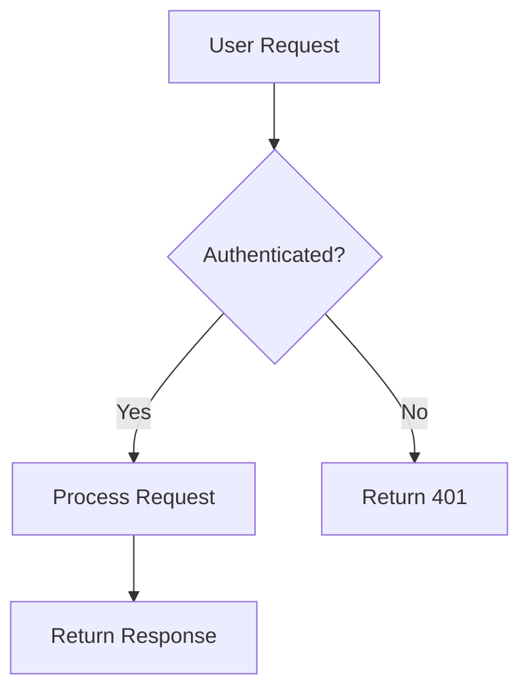
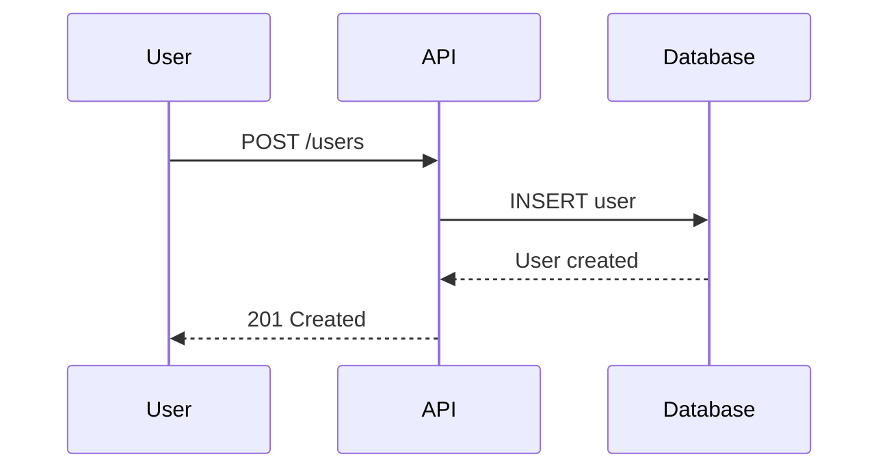
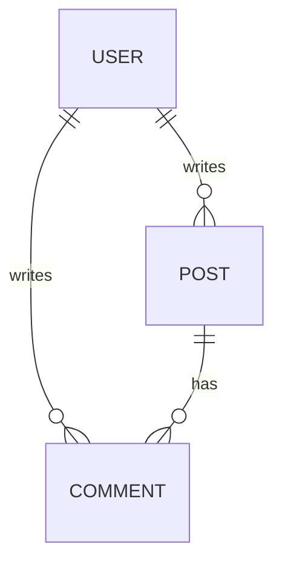

# Markup Languages

> The bridge between human intent and machine execution

Among all technology categories, **text and markup languages are the most AI-friendly**. They almost perfectly match how LLMs were trained — on text that describes structure, configuration, and data.

## Why Markup Languages Excel with AI

These languages share a critical role:

> They serve as the **intermediate representation layer** between natural language and executable systems.

- Markdown transforms **ideas** into structured documents
- JSON/YAML transforms **descriptions** into configuration
- Schema transforms **intent** into verifiable constraints
- Mermaid transforms **concepts** into visualizations

## AI-Friendly Markup Technologies

| Technology | Why It's AI-Friendly |
|------------|---------------------|
| **Markdown** | Human + AI dual readable; structure IS semantics; minimal syntax |
| **YAML** | Declarative config; key-value semantics are clear; Kubernetes native |
| **JSON** | Structured data; minimal ambiguity; universal interchange format |
| **JSON Schema** | Type constraints for AI generation; validates output automatically |
| **Zod** | Schema as TypeScript code; type-safe at runtime and compile time |
| **Mermaid** | NL → diagram has high success rate; instant visual feedback |
| **CSV** | Atomic row structure; easy to generate and parse tabular data |

## Markdown — The Universal Language

Markdown is AI's native documentation language. Its simplicity makes it ideal for:

### Documentation Generation

```markdown
# API Reference

## Authentication

All requests require a Bearer token in the `Authorization` header.

### Endpoints

| Method | Path | Description |
|--------|------|-------------|
| GET | /users | List all users |
| POST | /users | Create a user |
| GET | /users/:id | Get user by ID |

### Example Request

\`\`\`bash
curl -X GET https://api.example.com/users \
  -H "Authorization: Bearer <token>"
\`\`\`
```

**Why AI loves it:**
- Headers create natural hierarchy
- Code blocks preserve formatting
- Tables organize structured information
- Links and references are explicit

### Prompt Engineering

Markdown is the lingua franca of AI prompts:

```markdown
## Task
Generate a React component for a user profile card.

## Requirements
- Display avatar, name, and bio
- Include edit button for own profile
- Use Tailwind CSS for styling

## Constraints
- Must be accessible (ARIA labels)
- Must be responsive
```

## YAML — Configuration as Code

YAML's indentation-based syntax is both human-readable and AI-friendly:

```yaml
# docker-compose.yml - AI generates this easily
version: '3.8'
services:
  app:
    build: .
    ports:
      - "3000:3000"
    environment:
      - DATABASE_URL=postgres://db:5432/app
    depends_on:
      - db

  db:
    image: postgres:15
    environment:
      POSTGRES_DB: app
      POSTGRES_PASSWORD: secret
    volumes:
      - postgres_data:/var/lib/postgresql/data

volumes:
  postgres_data:
```

**Use cases where AI excels:**
- Docker Compose configurations
- Kubernetes manifests
- CI/CD pipelines (GitHub Actions, GitLab CI)
- Application config files

## JSON — The Data Interchange Standard

JSON's strict structure minimizes ambiguity:

```json
{
  "user": {
    "id": "usr_123",
    "name": "Alice",
    "email": "alice@example.com",
    "roles": ["admin", "editor"],
    "settings": {
      "theme": "dark",
      "notifications": true
    }
  }
}
```

**Why AI loves it:**
- No ambiguous syntax
- Self-describing structure
- Universal parser support
- Direct mapping to programming objects

## JSON Schema — Constraints for Generation

JSON Schema tells AI exactly what to generate:

```json
{
  "$schema": "http://json-schema.org/draft-07/schema#",
  "type": "object",
  "properties": {
    "name": {
      "type": "string",
      "minLength": 1,
      "maxLength": 100
    },
    "email": {
      "type": "string",
      "format": "email"
    },
    "age": {
      "type": "integer",
      "minimum": 0,
      "maximum": 150
    }
  },
  "required": ["name", "email"]
}
```

**AI workflow**: Describe data requirements → Generate schema → Validate all outputs

## Zod — Schema as TypeScript

Zod brings schema validation into TypeScript with full type inference:

```typescript
import { z } from 'zod'

// Define schema - AI generates this from requirements
const UserSchema = z.object({
  id: z.string().uuid(),
  name: z.string().min(1).max(100),
  email: z.string().email(),
  age: z.number().int().min(0).optional(),
  role: z.enum(['admin', 'user', 'guest']),
  createdAt: z.date(),
})

// TypeScript type is inferred automatically
type User = z.infer<typeof UserSchema>

// Validation with detailed errors
const result = UserSchema.safeParse(data)
if (!result.success) {
  console.error(result.error.issues)
}
```

**Why AI loves it:**
- Single source of truth for types and validation
- Runtime checking with compile-time inference
- Composable schemas (`.extend()`, `.pick()`, `.omit()`)
- Natural fit for API boundaries

## Mermaid — Diagrams from Text

Mermaid converts natural language descriptions into visual diagrams:

### Flowcharts



### Sequence Diagrams



### Entity Relationships



**AI workflow**: Describe system → Generate Mermaid → Instant visual verification

## CSV — Tabular Data Simplified

CSV's atomic row structure is perfect for data generation:

```csv
id,name,email,role,created_at
1,Alice,alice@example.com,admin,2024-01-15
2,Bob,bob@example.com,user,2024-01-16
3,Charlie,charlie@example.com,user,2024-01-17
```

**Use cases:**
- Test data generation
- Data migration
- Report exports
- Seed data for databases

## Best Practices

import { Callout } from 'nextra/components'

<Callout type="tip">
**Use markup languages as AI interfaces.** Instead of asking AI to generate code directly, first generate the specification in a markup format, then generate implementation.
</Callout>

### The Specification-First Pattern

```
1. Describe feature in natural language
     ↓
2. AI generates YAML/JSON specification
     ↓
3. Human reviews and adjusts spec
     ↓
4. AI generates code from verified spec
```

This two-step process catches errors earlier and produces more accurate results.

## The Bigger Picture

Markup languages let AI go beyond code generation:

| Input | Output | Example |
|-------|--------|---------|
| Feature description | API specification | NL → OpenAPI YAML |
| Data requirements | Schema definition | NL → JSON Schema |
| System architecture | Visual diagram | NL → Mermaid |
| Config requirements | Deployment file | NL → docker-compose |

They're the **glue** in AI-assisted DevOps, documentation, and data pipelines.

## Summary

Markup languages are AI's natural habitat because they:

- ✅ Bridge human intent and machine execution
- ✅ Have minimal syntax with maximum semantics
- ✅ Provide instant visual/structural feedback
- ✅ Enable specification-first workflows
- ✅ Scale across documentation, config, and data

Master these formats, and you'll dramatically improve your AI collaboration effectiveness.

