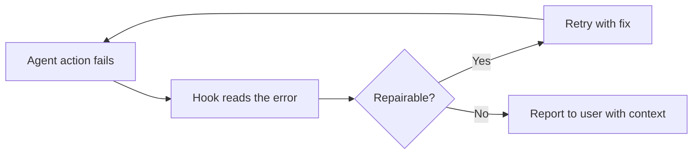

import { Callout, FileTree } from 'nextra/components'

# Hooks: Deterministic Constraints

> Policy, formatting, audit, and safety as executable steps of the agent loop

## Declarative vs Deterministic Constraints

Rules (AGENTS.md, `.mdc` files) are **declarative** constraints: they shape behavior by being words in the context. The agent *may* follow them.

**Hooks** are **deterministic** constraints: they run actual scripts at defined points of the agent loop. The agent *must* pass through them. A hook can block a dangerous command, reformat an edited file, or demand a repair before continuing.

<Callout type="info">
Prompts promise; hooks enforce. In harness terms, hooks are the **control and verification** layer: they complement the declarative configuration layer and close the loop described in [Verify Closed Loop](/en/docs/3-agent-harness/verify-closed-loop).
</Callout>

## Where Hooks Are Configured

<FileTree>
  <FileTree.Folder name=".cursor" defaultOpen>
    <FileTree.File name="hooks.json" />
    <FileTree.Folder name="rules">
      <FileTree.File name="..." />
    </FileTree.Folder>
  </FileTree.Folder>
</FileTree>

Hooks are defined in JSON and communicate with the agent loop over stdio. They can be configured at three levels:

| Level | Location | Scope |
|-------|----------|-------|
| **Project** | `.cursor/hooks.json` | Current codebase (version controlled) |
| **User** | User-level config | All your Cursor projects |
| **Plugins** | Plugin-provided hooks | Extend the loop with packaged behavior |

## Hook Surface Classification

| Category | Hooks | Typical Use |
|----------|-------|-------------|
| **File / Tool** | `preToolUse`, `postToolUse`, `beforeShellExecution`, `afterFileEdit` | Intercept commands before they run; format and lint after edits |
| **Lifecycle** | `beforeSubmitPrompt`, `afterAgentResponse`, `stop`, `preCompact` | Rewrite the prompt, audit responses, trigger repair on stop |
| **Subagent** | `subagentStart`, `subagentStop` | Policy for delegated work (see [Subagents](/en/docs/3-agent-harness/subagents)) |

## Typical Use Cases

### 1. Intercept Destructive Commands

`beforeShellExecution` can block commands the project deems unsafe. Example policy: forbid `rm -rf` outside allowed paths, or block writes to `generated/`.

```json
{
  "version": 1,
  "hooks": {
    "beforeShellExecution": [
      {
        "matcher": "rm -rf",
        "hooks": [
          {
            "type": "command",
            "command": ".cursor/hooks/guard-destructive.sh"
          }
        ]
      }
    ]
  }
}
```

### 2. Format and Lint After Every Edit

`afterFileEdit` runs a formatter/linter on the touched file so the agent's output always conforms:

```json
{
  "version": 1,
  "hooks": {
    "afterFileEdit": [
      {
        "matcher": "*.{ts,tsx}",
        "hooks": [
          {
            "type": "command",
            "command": "npx prettier --write",
            "args": ["{filename}"]
          }
        ]
      }
    ]
  }
}
```

### 3. Stop-Triggered Repair Loop

When the agent stops after a failure, a `stop` hook can surface the error and force a retry — the deterministic counterpart of "please try again":

```json
{
  "version": 1,
  "hooks": {
    "stop": [
      {
        "hooks": [
          {
            "type": "command",
            "command": ".cursor/hooks/repair-or-report.sh"
          }
        ]
      }
    ]
  }
}
```

### 4. Audit and Policy Checks

`postToolUse` or `afterAgentResponse` can log what the agent did, check that no protected path changed, and surface violations in the next turn.

## The Repair Loop

Hooks turn "the agent failed" from an anecdote into an automated loop:



Failure → read error → retry. The retry can load a Skills-based repair workflow (see [Subagents and Skills](/en/docs/3-agent-harness/subagents)) so the fix path itself is standardized.

## Hooks in Cloud Agents

Cloud Agents run the repository's command-based hooks, so cloud work follows the same policy as local work. Enterprise teams can also push team/enterprise hooks for consistent guardrails across every agent session.

<Callout type="warning">
Keep hooks fast and predictable. A hook that hangs or fires randomly becomes noise the agent (and you) learn to ignore — exactly the failure mode deterministic constraints are meant to prevent.
</Callout>

## Reference Sources

- `materials/03-cursor-official/cursor-docs-hooks.md`
- `materials/06-engineering-loop/hooks-and-repair-loop.md`
- `materials/03-cursor-official/cursor-docs-cloud-agents.md`

## Next Steps

Hooks give you deterministic guarantees; [Subagents](/en/docs/3-agent-harness/subagents) give you parallel brains. Then see how all of this closes the [Verify Closed Loop](/en/docs/3-agent-harness/verify-closed-loop).
