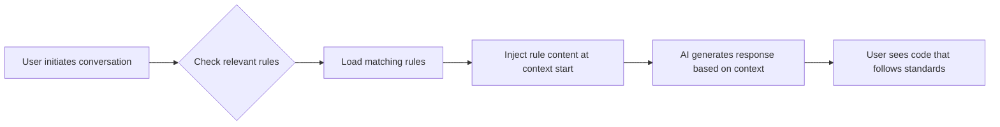

import { Callout, FileTree } from 'nextra/components'

# How Rules Work

> Understanding how project conventions influence agent behavior

## What Are Rules

Rules provide **system-level instructions** for AI Agents. They package prompts, scripts, and other content together, making it easy to manage and share conventions within teams.

<Callout type="info">
Large language models have no memory across completions. Rules provide persistent, reusable context at the **prompt level** — they are injected into the context that shapes every agent response. If you need a more flexible memory system, see [Memory Management](/en/docs/3-agent-harness/memory-management).
</Callout>

## The Four Rule Types in 2026

Cursor supports four types of rules. Note that **AGENTS.md** is no longer an afterthought — as of 2026 it is the cross-tool standard read natively by 20+ tools, and our first recommendation for project-level conventions:

| Rule Type | Storage Location | Scope | Use Case |
|-----------|-----------------|-------|----------|
| **Project Rules** | `.cursor/rules/*.mdc` | Current codebase | Path-specific standards, globs, manual @-mention |
| **User Rules** | Global config | All your Cursor projects | Personal preferences and conventions |
| **Team Rules** | Console managed | All team projects | Enterprise-level standards (Team/Enterprise) |
| **AGENTS.md** | Project root | Current codebase | Cross-tool project contract (stack, commands, conventions) |

**Priority** is: Team Rules → Project Rules → User Rules. For the full story on why AGENTS.md matters and how it composes with Rules, Skills and MCP, see [AGENTS.md Cross-Tool Standard](/en/docs/3-agent-harness/agents-md). This page focuses on the working principles of **Project Rules** (`.cursor/rules/`).

## How Rules Are Applied

When a rule is applied, its content is added to the **beginning** of the model's context. This provides consistent guidance when the agent generates code, understands edits, or follows workflows.



## Project Rules Deep Dive

Project rules live in `.cursor/rules`, are **version controlled**, and are scoped to your codebase.

### Rule Folder Structure

Each rule is a folder containing a `RULE.md` file plus optional supporting files:

<FileTree>
  <FileTree.Folder name=".cursor" defaultOpen>
    <FileTree.Folder name="rules" defaultOpen>
      <FileTree.Folder name="my-rule" defaultOpen>
        <FileTree.File name="RULE.md" />
        <FileTree.Folder name="scripts">
          <FileTree.File name="helper.sh" />
        </FileTree.Folder>
        <FileTree.File name="template.ts" />
      </FileTree.Folder>
    </FileTree.Folder>
  </FileTree.Folder>
</FileTree>

- **`RULE.md`** — main rule file with frontmatter metadata and instructions
- **Scripts and prompts** — other files referenced by the rule (optional)

### Frontmatter Structure

```markdown
---
description: "This rule provides standards for frontend components"
globs: ["src/components/**"]
alwaysApply: false
---

- Define all components using TypeScript
- Components must use PascalCase naming
- Exported functions must specify return types

@component-template.tsx
```

| Field | Type | Description |
|-------|------|-------------|
| `description` | string | Tells the agent when the rule is relevant |
| `globs` | string[] | File matching patterns that limit rule scope |
| `alwaysApply` | boolean | Whether to always include the rule in every session |

## The Four Application Modes

| Mode | Configuration | When Applied |
|------|--------------|--------------|
| **Always Apply** | `alwaysApply: true` | Every chat session |
| **Apply Intelligently** | `alwaysApply: false` + `description` | Agent decides relevance from the description |
| **Apply to Specific Files** | `globs: ["pattern"]` | When files match the pattern |
| **Apply Manually** | No special config | When mentioned with @ in conversation (e.g. `@my-rule`) |

### Minimal Examples

Always active:

```markdown
---
alwaysApply: true
---

# Global Project Rules

## Tech Stack
- React 18 with TypeScript
- Vite as build tool
- TanStack Router for routing
```

File-matched:

```markdown
---
description: "API client development standards"
globs: ["src/clients/**"]
alwaysApply: false
---

# API Rules

- Use axios for HTTP requests
- All API functions must have error handling
```

Manually triggered:

```markdown
---
description: "Template for creating new feature modules"
alwaysApply: false
---

# Feature Template

Use this structure when creating a new feature...
```

Reference it in chat with `@feature-template`.

<Callout type="warning">
If `alwaysApply` is `true`, the rule is included in every session. Otherwise its description is shown to the agent, which decides whether to apply it. Keep `alwaysApply` rules few and short — they consume context every turn.
</Callout>

## Creating Rules

1. **Using Command** — run the `New Cursor Rule` command
2. **Using Settings** — create in `Cursor Settings > Rules, Commands`

Either way creates a rule folder in `.cursor/rules`. You can view all rules and their status in settings.

## Legacy `.cursorrules` Format

The single-file `.cursorrules` format is **legacy**. It still works, but for new work use **Project Rules** or **AGENTS.md**:

| Concern | Recommendation |
|--------|-----------------|
| Need path-specific scoping (globs, four modes) | Migrate to `.cursor/rules/*.mdc` |
| Need cross-tool portability (Codex, Copilot, Windsurf...) | Migrate to `AGENTS.md` at the project root |

Why migrate: the `.cursorrules` file only applies to Cursor, gives you no globs-based scoping, and puts everything in one unmanageable blob. Project Rules give you versioned, granular, path-scoped conventions; AGENTS.md gives you the same conventions everywhere.

## Rule Writing Is Harness Engineering

Rules are the **configuration layer** of your agent harness (see [Harness Engineering](/en/docs/3-agent-harness/harness-engineering)). Before writing new rules, read [Writing Best Practices](/en/docs/3-agent-harness/best-practices); when the project grows, follow [Development Phases](/en/docs/3-agent-harness/development-sequence).

## Next Steps

Now that you understand how rules work, learn [how to write high-quality rules](/en/docs/3-agent-harness/best-practices), or jump to the cross-tool standard: [AGENTS.md](/en/docs/3-agent-harness/agents-md).
