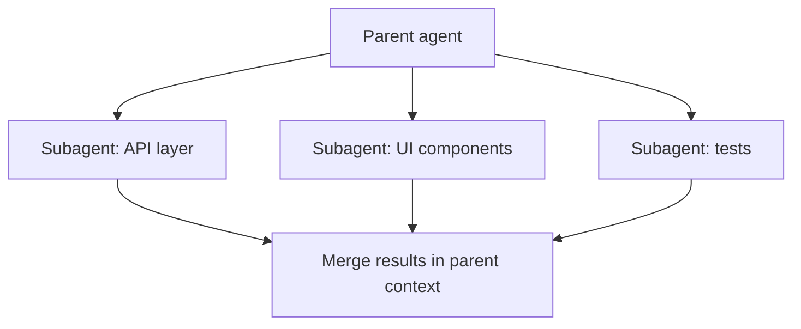

import { Callout, FileTree } from 'nextra/components'

# Subagents

> Independent agents with their own context, working on discrete parts of the parent task

## What Are Subagents

A **subagent** is an independent agent that handles a discrete part of the parent task. It has its own context window, its own prompt, and (optionally) its own tools and model. The parent conversation stays focused while the heavy lifting happens in parallel.

In harness terms, subagents belong to the **orchestration** layer — see [Harness Engineering](/en/docs/3-agent-harness/harness-engineering).

## Built-in Subagents

| Subagent | What It Does |
|----------|--------------|
| `explore` | Searches and summarizes the codebase (read-only) |
| `bash` | Runs shell commands in an isolated session |
| `browser` | Drives the MCP browser for UI inspection and web tasks |

These cover the three most common delegation patterns: answering questions about code, running commands, and looking at pages.

## Custom Subagents

Custom subagents live in `.cursor/agents/`:

<FileTree>
  <FileTree.Folder name=".cursor" defaultOpen>
    <FileTree.Folder name="agents" defaultOpen>
      <FileTree.File name="release-engineer.md" />
      <FileTree.File name="test-writer.md" />
    </FileTree.Folder>
  </FileTree.Folder>
</FileTree>

Each file is Markdown with frontmatter:

```markdown
---
name: release-engineer
description: "Used when preparing a release: version bump, changelog, build and tag."
tools:
  - bash
  - explore
model: gpt-5.6-luna
---

# Release Engineer

You prepare releases for this repository.

1. Read `AGENTS.md` for build and release commands.
2. Bump the version per `docs/releasing.md`.
3. Update the changelog from merged PR titles.
4. Run `pnpm build` and report the artifact path.
5. Never push tags — leave that to the maintainer.
```

| Field | Purpose |
|-------|---------|
| `name` | Identifier used when invoking the subagent |
| `description` | **Decides when the agent gets delegated to** — the parent agent matches tasks against it |
| `prompt` | The subagent's system prompt (the body beyond frontmatter) |
| `tools` | Which tools the subagent may use |
| `model` | Optional model override (cheaper model for narrow tasks) |

<Callout type="info">
The `description` is the delegation contract. Write it the way you would write a rule description: precise about *when* this subagent is the right tool, so the parent agent picks it at the right moment.
</Callout>

## Orchestration Patterns

### Parallel Delegation

Split a large change into independent parts and fan them out:



### Focused Parent Context

While subagents burn their own context on exploration or repetitive work, the parent conversation stays small and focused on direction and integration.

### Specialized Subtasks

Give narrow, well-specified jobs to specialist prompts (test writer, release engineer, ticket summarizer) instead of making the general agent context-switch.

## Costs and Boundaries

- **Isolation has a price.** Delegating a trivial task can be *slower* than just doing it inline — the subagent needs its own setup and handoff. Delegate when parallelism or specialization pays for itself.
- **Context is separate.** Subagents do not share the parent's conversation; you must hand off a complete task description and get results back.
- **Cloud subagents use team MCP servers**, not your local session MCP — configure anything they need at the team level.

## Subagents vs Skills

| Aspect | Subagents | Skills (`SKILL.md`) |
|--------|-----------|---------------------|
| What they are | Independent agents with own context | Reusable instructions + resources loaded on demand |
| When they run | Delegated as separate tasks | Loaded into the current agent when relevant |
| Context | Own context window, results returned | Share the calling agent's context |
| Best for | Parallel work, focused multi-step jobs | Encapsulating a repeatable procedure (review, migration, release) |
| Example | "Explore the API surface and report" | Guide for running the release checklist |

Skills make an agent *able to* do something; subagents make a *separate agent* do something.

## Cloud Subagents

One-liner for the cloud: `/in-cloud` and `/babysit` let a cloud session take over long-running work and watch a PR remotely (e.g., keep re-running CI and report when it's green).

## Reference Sources

- `materials/03-cursor-official/cursor-docs-subagents.md`
- `materials/03-cursor-official/cursor-changelog-subagents-skills.md`
- `materials/03-cursor-official/cursor-docs-cloud-agents.md`

## Next Steps

Subagents are the orchestration half of the loop; [Hooks](/en/docs/3-agent-harness/hooks) are the enforcement half, and [Verify Closed Loop](/en/docs/3-agent-harness/verify-closed-loop) is the finish line every agent must cross.
