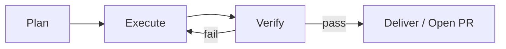

import { Callout } from 'nextra/components'

# Verify Closed Loop

> Plan → Execute → Verify: the cycle that turns agents from generators into engineers

## The Core Narrative

Reliable agent work is a three-phase loop:

| Phase | What Happens | Key Inputs |
|-------|--------------|------------|
| **Plan** | Define scope, constraints, success criteria | Task contract (see [Harness Engineering](/en/docs/3-agent-harness/harness-engineering)) |
| **Execute** | Change code, run tools | The harness layers: rules, tools, hooks |
| **Verify** | Run a unified verify entry or CI; fix on failure | Build/test commands, environment |

Deliver (or open a PR) **only after verification passes**. If verification fails, loop back to Execute and fix — never ship an unverified change.

## Runnable Environment: The Prerequisite for Self-Correction

An agent can only correct itself when it can *see* its own results. That requires:

1. A **runnable environment** — the agent can actually build and run the project.
2. **Explicit build/test commands** — written down where the agent will read them (AGENTS.md / rules).

Without a verification signal, an agent can only "generate and hope": it produces code, cannot tell whether it works, and hands you the gamble. With a signal, the loop above becomes real.

<Callout type="info">
Put the commands in your project contract so every tool finds them: [AGENTS.md Cross-Tool Standard](/en/docs/3-agent-harness/agents-md); wire the deterministic enforcement with [Hooks](/en/docs/3-agent-harness/hooks).
</Callout>

## The Task Contract (Plan)

Before executing, write success criteria down. A minimal task contract:

| Field | Example |
|-------|---------|
| `allowed_paths` | `src/`, `tests/`, `AGENTS.md` |
| `required_checks` | `pnpm lint`, `pnpm test`, `pnpm build` |
| `change_budget` | ≤ 400 lines |
| `non_goals` | No migration of the auth flow |

The contract answers "what does done mean" and "what is out of scope" — the Plan phase's job. Good contracts cannot fix unreadable codebases, and a permissive sandbox cannot compensate for vague success criteria.

## Unified Verify Entry

Spotify's Honk background coding agent shows the pattern at production scale: a single **Verify tool** the agent can call.

- The LLM calls one verify entry point.
- Under the hood it **fans out to the right builder**: Maven, Yarn, Bazel, or custom scripts.
- The agent runtime and the verification runtime are decoupled — verification happens behind an abstraction that can also be CI.

Result: fleets of agents produce PRs continuously, and every PR is only opened after verification passes.

The same idea scales down: give your agent **one command** that runs your checks (`make verify`, `pnpm verify`), instead of making it guess which of five commands reflects the real gate.

## Cloud Verification Chain

Cursor Cloud Agents close the loop in an isolated VM:

1. **Environment snapshot** — capture a reusable `.cursor/environment.json` so every run starts from a known state.
2. **Start the dev server** — the agent brings the app up in the VM.
3. **Browser verification** — click through the UI to verify behavior, not just types.
4. **PR with evidence** — attach screenshots, video, or logs so reviewers (and you) can see what was verified.

Setup is usually done with agent assistance in under 10 minutes. Multi-repo work and local ↔ cloud handoffs are supported.

## The Warning: Weakened Loops

Repositories without tests or standard commands weaken the loop:

- No test suite → nothing for Verify to run → the agent cannot tell if its change broke something.
- No standard commands → every agent guesses which command means "green".

Spotify's Honk team hit exactly this on some data-pipeline codebases: without adequate tests, the verify→fix loop degraded. The fix was investing in the harness (tests + verify tooling), not in better prompts.

**If your repo can't verify itself, agents will deliver unverified work — and you'll be the verification step.**

## Cross-Chapter Connections

- **Chapter 2 — Toolchain** ([Tool Setup](/en/docs/0-tool-setup), [Scaffolding](/en/docs/2-scaffolding)): lint, test, and CI are the raw material of the Verify phase.
- **Chapter 4 — Workflow** ([Workflow](/en/docs/4-workflow)): how the loop fits into daily development.
- **Chapter 5 — Feedback** ([Feedback & Iteration](/en/docs/5-feedback)): verifying results is how feedback becomes data.
- **This chapter — Hooks** ([Hooks: Deterministic Constraints](/en/docs/3-agent-harness/hooks)): hooks automate the repair loop (failure → read error → retry).

## Reference Sources

- `materials/06-engineering-loop/plan-execute-verify-and-environment.md`
- `materials/04-legacy-brownfield/spotify-honk-verify-tool.md`
- `materials/03-cursor-official/cursor-docs-cloud-agents.md`
- `materials/01-harness/optimi-harness-engineering-coding-agents.md`

## Next Steps

You've now covered the whole harness. Take it into practice with [Chapter 4: Workflow](/en/docs/4-workflow).
