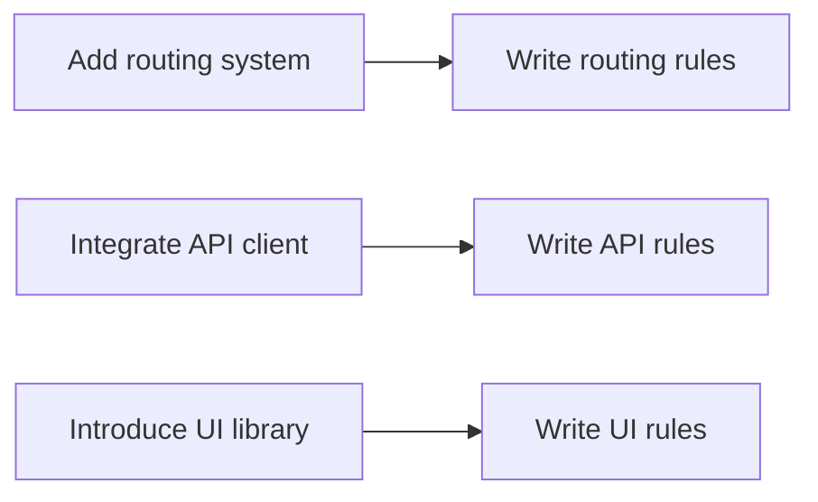

# Rules Development Sequence

> Write the right rules at the right time

## Core Philosophy

Cursor Rules are not something you write once and forget. They are a **system of standards that evolves with your project**.

Many people want to write a perfect set of rules at the project's beginning, only to end up with rules that are either too vague or disconnected from actual architecture. The correct approach is: **Architecture first, rules follow**.

## When to Write Rules

### Phase 1: After Scaffolding is Complete

When you finish project initialization and determine the basic tech stack and directory structure, immediately write **global rules**.

| Timing | Rules to Add |
|--------|--------------|
| Tech stack determined | List all core dependencies (React, TypeScript, Tailwind, etc.) |
| Directory structure determined | Define responsibilities of each directory (pages/, components/, lib/, etc.) |
| Coding standards determined | TypeScript standards, import conventions, naming conventions |
| Toolchain configured | lint, build, test commands |

```markdown
# Example: Global rules to add immediately after project init

## Tech Stack
- Vite + React + TypeScript
- Tailwind CSS + Shadcn/ui
- React Router + Zustand

## Directory Structure
/src/
├── pages/       # Route pages
├── components/  # UI components
├── lib/         # Utilities
├── stores/      # State management
└── types/       # Type definitions

## Quality Standards
- Ensure `npm run lint` and `npm run build` passes before commits
```

> 📖 Reference: [Global Rules Example](/en/rules/vite-shadcnui/global-rules)

### Phase 2: When Architecture Expands

Whenever you add new architectural layers or functional modules to your project, **immediately** write dedicated rules for them.

| Architecture Added | Rule File to Create | Rule Content |
|--------------------|---------------------|--------------|
| Routing system | `routing-rules.mdc` | Page file structure, route protection, auth flow |
| API layer | `api-rules.mdc` | HTTP client, data fetching patterns, error handling |
| UI component library | `ui-rules.mdc` | Component usage standards, icon system, theme config |
| State management | `store-rules.mdc` | Store organization, state update patterns |
| Form handling | `form-rules.mdc` | Form validation, error handling, submission flow |

**Key principle: When architecture decisions land, rules must sync.**



> 📖 Reference: [Routing Rules Example](/en/rules/vite-shadcnui/routing-rules), [API Rules Example](/en/rules/vite-shadcnui/api-rules), [UI Rules Example](/en/rules/vite-shadcnui/ui-rules)

### Phase 3: During Iterative Development

In daily development, when you find AI repeatedly making certain types of mistakes, that's the signal to add rules.

| Problem Found | Rule to Add |
|---------------|-------------|
| AI keeps using wrong date formatting | Add `formatDate()` from `@/lib/date-time-utils.ts` |
| AI uses forbidden components | Add "Do not use Card component unless I request it" |
| AI handles errors incorrectly | Add error handling code examples |
| AI ignores auth checks | Add `<ProtectedRoute>` usage standards |

**Iteration principle: Problem → Rule → Verify → Optimize**

## Rule Maintenance Checklist

Use this checklist to verify your rules are complete:

### Global Rules ✅

- [ ] Is the tech stack list complete?
- [ ] Is the directory structure clear?
- [ ] Are TypeScript standards defined?
- [ ] Are import conventions explained?
- [ ] Are quality check commands configured?

### Feature Rules ✅

- [ ] Are routing/page rules in place?
- [ ] Are API call rules in place?
- [ ] Are UI component rules in place?
- [ ] Are state management rules in place?

### Best Practices ✅

- [ ] Are rule files split by responsibility?
- [ ] Are correct globs used?
- [ ] Does each rule have code examples?
- [ ] Are rules committed to Git?

## Practical Example

Using a typical React project as an example, showing the evolution of rules:

### Day 1: Project Initialization

```bash
# Create project with Vite
npm create vite@latest my-app -- --template react-ts

# Add Shadcn/UI
npx shadcn@latest init
```

**Immediately create**: `global-rules.mdc`

### Week 1: Building Core Architecture

- Configure React Router
- Integrate Okta authentication
- Set up API client

**Add rules**: `routing-rules.mdc`, `api-rules.mdc`

### Week 2: Developing Business Features

- Found AI using wrong icon library
- Found AI not using project's Toast component

**Add rules**: `ui-rules.mdc`

### Continuous Iteration

- Find new problems → Add rules
- Architecture changes → Update rules
- Team feedback → Optimize rules

## Common Mistakes

| Mistake | Correct Approach |
|---------|------------------|
| Trying to write perfect rules from start | Start with 3-5 rules for biggest pain points |
| Writing rules and forgetting them | Rules need continuous updates as project evolves |
| Putting all rules in one file | Split by responsibility, use globs for precise matching |
| Copying generic rules from internet | Only write specific standards unique to your project |

## Next Steps

Sometimes you may need to write rules from scratch for a new tech stack. Next, we'll share [meta prompts for generating Rules](./meta-prompt) to help you quickly generate rule frameworks.

