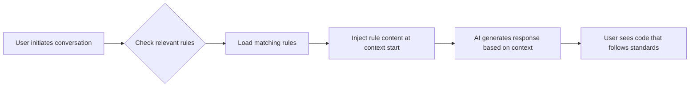

import { Callout, FileTree } from 'nextra/components'

# How Rules Work

> Understanding how project rules influence AI behavior

## What Are Rules

Rules provide system-level instructions for AI Agents. They package prompts, scripts, and other content together, making it easy to manage and share workflows within teams.

Cursor supports four types of rules:

| Rule Type | Storage Location | Scope | Use Case |
|-----------|-----------------|-------|----------|
| **Project Rules** | `.cursor/rules` | Current codebase | Project-specific standards and workflows |
| **User Rules** | Global config | All Cursor projects | Personal preferences and conventions |
| **Team Rules** | Console managed | All team projects | Enterprise-level standards (Team/Enterprise) |
| **AGENTS.md** | Project root | Current codebase | Lightweight Agent instructions |

This article focuses on the working principles of **project rules**.

## How Rules Work

<Callout type="info">
Large language models don't retain memory between completions. Rules provide persistent, reusable context at the **prompt level**. If you need a more flexible memory system, see [Managing Memory with Rules](./memory-management).
</Callout>

When rules are applied, their content is added to the **beginning** of the model's context. This provides consistent guidance for AI when generating code, understanding edits, or assisting with workflows.

### Rule Application Flow



## Project Rules Deep Dive

Project rules are located in the `.cursor/rules` directory, **version controlled**, and scoped to your codebase.

### Why Choose Project Rules

Using project rules allows you to:

- ✅ **Crystallize domain knowledge** - Solidify expertise related to your codebase
- ✅ **Automate workflows** - Standardize project-specific templates and processes
- ✅ **Unify technical decisions** - Ensure consistency in style and architecture
- ✅ **Team collaboration** - Share via Git, onboard new members quickly

### Rule Folder Structure

Each rule folder can contain:

<FileTree>
  <FileTree.Folder name=".cursor" defaultOpen>
    <FileTree.Folder name="rules" defaultOpen>
      <FileTree.Folder name="my-rule" defaultOpen>
        <FileTree.File name="RULE.md" />
        <FileTree.Folder name="scripts">
          <FileTree.File name="helper.sh" />
        </FileTree.Folder>
        <FileTree.File name="template.ts" />
      </FileTree.Folder>
    </FileTree.Folder>
  </FileTree.Folder>
</FileTree>

- **`RULE.md`** — Main rule file with frontmatter metadata and instructions
- **Scripts and prompts** — Other files referenced by the rule (optional)

### Rule File Structure

Each rule corresponds to a folder containing a `RULE.md` file with frontmatter metadata and body content.

```markdown
---
description: "This rule provides standards for frontend components"
globs: ["src/components/**"]
alwaysApply: false
---

- Define all components using TypeScript
- Components must use PascalCase naming
- Exported functions must specify return types

@component-template.tsx
```

#### Frontmatter Field Descriptions

| Field | Type | Description |
|-------|------|-------------|
| `description` | string | Rule description for AI to determine if rule should apply |
| `globs` | string[] | File matching patterns to limit rule scope |
| `alwaysApply` | boolean | Whether to always apply to every chat session |

## Rule Application Methods

You can control how rules are applied via the type dropdown menu:

| Rule Type | Configuration | When Applied |
|-----------|--------------|--------------|
| **Always Apply** | `alwaysApply: true` | Applied to every chat session |
| **Apply Intelligently** | `alwaysApply: false` + `description` | Agent determines relevance based on description |
| **Apply to Specific Files** | `globs: ["pattern"]` | Applied when files match specified patterns |
| **Apply Manually** | No special config | Applied when mentioned with @ in conversation (e.g., `@my-rule`) |

### Practical Examples

#### Global Rules (Always Active)

```markdown
---
alwaysApply: true
---

# Global Project Rules

## Tech Stack
- React 18 with TypeScript
- Vite as build tool
- TanStack Router for routing

## Directory Structure
- `src/pages/` - Page components
- `src/components/` - Reusable components
- `src/clients/` - API clients
```

#### File-Matched Rules (Active for Specific Files)

```markdown
---
description: "API client development standards"
globs: ["src/clients/**"]
alwaysApply: false
---

# API Rules

- Use axios for HTTP requests
- All API functions must have error handling
- Use SWR for data fetching in components
```

#### Manually Triggered Rules

```markdown
---
description: "Template for creating new feature modules"
alwaysApply: false
---

# Feature Template

Use this structure when creating a new feature...
```

Use `@feature-template` in chat to trigger this rule.

## Creating Rules

There are two ways to create rules:

1. **Using Command** - Run the `New Cursor Rule` command
2. **Using Settings** - Create in `Cursor Settings > Rules, Commands`

This creates a new rule folder in `.cursor/rules`. You can view all rules and their status in settings.

## Rule File Format Specification

A `RULE.md` file is a Markdown file with frontmatter metadata and body content.

```markdown
---
description: "This rule provides standards for frontend components and API validation"
globs: ["src/components/**", "src/clients/**"]
alwaysApply: false
---

# Component and API Standards

## Components
- Use functional components with hooks
- Props interface must be exported

## API Validation
- Validate all API responses with zod schemas
```

<Callout type="warning">
If `alwaysApply` is `true`, the rule will be applied to every chat session. Otherwise, the rule's description is provided to Cursor Agent, which decides whether to apply the rule.
</Callout>

## Next Steps

Now that you understand how rules work, learn [how to write high-quality rules](./best-practices).

If your project needs to manage extensive domain knowledge, explore [Managing Memory with Rules](./memory-management).

