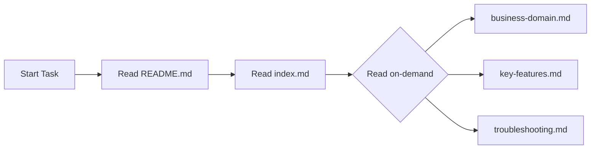

import { Callout, FileTree } from 'nextra/components'

# Managing Memory with Rules

> Build a local knowledge base for progressive disclosure by AI Agent

## Do You Need Memory?

**For most projects, Rules are sufficient.**

| Aspect | Rules | Memory |
|--------|-------|--------|
| **Determinism** | ✅ You know exactly which rules are applied | ⚠️ Agent reads on-demand, may miss some |
| **Use Cases** | Coding standards, tech stack conventions | Business knowledge, troubleshooting history |

Memory is suitable when:
- Extensive business domain knowledge needs AI understanding
- Need to track troubleshooting history
- Want AI to learn from past implementations

<Callout type="info">
Memory uses progressive disclosure—Agent reads based on needs. If certain rules must always apply, use [Always Apply Rules](./how-rules-work#rule-application-methods).
</Callout>

## Our Local Memory Practice

We chose **local files** over embedding solutions:

- **No tool call limits** - Cursor Agent can freely read local files
- **Cost-effective with powerful models** - With Opus models, using more context in one request is economical
- **Version controlled** - Memory evolves with your codebase

### Directory Structure

<FileTree>
  <FileTree.Folder name=".memory" defaultOpen>
    <FileTree.File name="README.md" />
    <FileTree.File name="index.md" />
    <FileTree.File name="business-domain.md" />
    <FileTree.File name="key-features.md" />
    <FileTree.File name="troubleshooting.md" />
  </FileTree.Folder>
</FileTree>

| File | Purpose |
|------|---------|
| `README.md` | **Usage protocol** - Agent learns how to use memory from here |
| `index.md` | Main index linking to all topics |
| `business-domain.md` | Business knowledge (core concepts, business rules) |
| `key-features.md` | Core features and implementation notes |
| `troubleshooting.md` | Common issues and solutions |

## Core Design: File System as Interaction Protocol

**Key insight**: Rules only need to tell Agent "what .memory directory is". The detailed usage protocol lives in `.memory/README.md`.

Benefits:
- ✅ **Rules don't need dynamic maintenance** - Memory usage conventions can evolve independently in .memory
- ✅ **Self-documenting** - Agent naturally gets the latest instructions by reading README.md
- ✅ **Decoupled** - Memory system can expand independently without affecting Rules

### Rules Configuration (Minimal)

```markdown
---
alwaysApply: true
---

# Memory System

This project uses `.memory/` directory as knowledge base.

Before starting complex tasks, read `.memory/README.md` to understand usage.
```

### .memory/README.md (Full Protocol)

````markdown
# Project Memory Knowledge Base

This directory is the project memory, storing knowledge that AI Agent needs.

## 📖 Usage Protocol

### When to Read Memory
- Before starting complex tasks
- When dealing with business logic
- When uncertain about implementation details

### When to Update Memory
- After completing important features
- After solving tricky problems
- When documentation doesn't match reality

### Navigation
- Start from `index.md` for navigation
- Use `[[filename]]` links to jump
- Keep memory concise, avoid redundancy

## 🗂️ Directory Structure

```
.memory/
├── README.md           # This file: usage protocol
├── index.md            # Main index
├── business-domain.md  # Business knowledge
├── key-features.md     # Core features
└── troubleshooting.md  # Common issues
```
````

### .memory/index.md (Navigation Entry)

```markdown
# Project Memory Index

## Business
- [[business-domain]] - Core concepts, business rules

## Features
- [[key-features]] - Key feature implementation notes

## Troubleshooting
- [[troubleshooting]] - Known issues and solutions
```

### .memory/business-domain.md (Business Knowledge Example)

```markdown
# Business Knowledge

## Core Concepts

### User Roles
- **Admin** - Full permissions, can manage other users
- **Editor** - Can create and edit content
- **Visitor** - Read-only access

### Order Status Flow
pending → paid → shipped → delivered
       ↘ cancelled

## Business Rules
- Orders can be cancelled within 30 minutes after payment
- Auto-switch to pre-order when out of stock
- Members get 10% discount
```

## Progressive Disclosure

Agent reads memory incrementally based on task needs:



## Best Practices

| Do | Don't |
|----|-------|
| ✅ Keep each file under 200 lines | ❌ Duplicate content already in Rules |
| ✅ Use clear headers and bullet points | ❌ Store sensitive information |
| ✅ Update memory after important work | ❌ Let files grow too large |

## Next Steps

- [How Rules Work](./how-rules-work) - Understand Rules basics
- [Rules Writing Best Practices](./best-practices) - Write effective Rules
- [Context Management](/en/docs/4-workflow/context-management) - Broader context strategies
