import { Callout } from 'nextra/components'

# Context Management

> Providing precise context to AI is key to high-quality code generation

## Overview

In any Cursor usage mode, the quality of AI-generated code largely depends on the context you provide. This article covers how to effectively manage and provide context, including temporary documents, project knowledge, Memory features, and Prompt techniques.

## Context Sources

```mermaid
flowchart LR
    subgraph Sources["📚 Context Sources"]
        A["@file File reference"]
        B["@folder Folder"]
        C["@codebase Codebase"]
        D["@docs Official docs"]
        E["@web Web search"]
        F["Rules"]
        G["Memory"]
    end
    
    subgraph AI["🤖 Cursor Agent"]
        H[Understand context<br/>Generate code]
    end
    
    A --> H
    B --> H
    C --> H
    D --> H
    E --> H
    F --> H
    G --> H
```



## File References (@file)

The most common way to provide context—directly reference files in your project.

### Reference Methods

```
@src/types/user.ts           # Reference single file
@src/api/                    # Reference entire directory
@package.json                # Reference config file
@specs/001-feature-a/final.md   # Reference requirement doc
```

### Best Practices

| Practice | Description |
|----------|-------------|
| ✅ Precise references | Only reference relevant files, avoid excessive unrelated content |
| ✅ Types first | Prioritize type definition files (`.d.ts`, `types.ts`) |
| ✅ Example references | Reference similar existing implementations as reference |
| ❌ Too many references | Avoid referencing too many files at once, may exceed context limits |

## Temporary Document Management

Task-specific temporary documents that can be archived or deleted after use.

### Recommended Directory Structure

```
specs/                          # Spec and task documents
├── 001-feature-a/
│   ├── draft.md               # Requirement draft
│   ├── final.md               # Refined solution
│   ├── design.png             # Design mockup
│   ├── api-spec.md            # API specification
│   └── example-response.json  # Sample data
├── 002-feature-b/
│   └── ...
└── _archive/                  # Archive for completed tasks
    └── ...
```

### Document Types

| Type | Purpose | Example Content |
|------|---------|-----------------|
| `draft.md` | Record initial thoughts and requirements | Feature description, expected behavior, uncertain points |
| `final.md` | AI-refined detailed solution | Tech choices, implementation steps, code structure |
| `design.png` | UI design or flowcharts | Figma exports, flowchart screenshots |
| `api-spec.md` | API specification | Interface definitions, request/response examples |
| `*.sql` | Database related | Example queries, schema design |
| `*.json` | Sample data | API response examples, config samples |

### Usage Example

```
@specs/001-user-auth/final.md Implement user authentication according to this solution
@specs/001-user-auth/api-spec.md Implement the API following this specification
```

## Project Knowledge Base

Long-term maintained project documentation for all tasks to reference.

### Recommended Structure

```
docs/                          # Project knowledge base
├── architecture.md            # Architecture overview
├── coding-style.md            # Coding standards
├── api-conventions.md         # API conventions
├── database-schema.md         # Database design
├── deployment.md              # Deployment process
└── examples/
    ├── crud-api.ts            # CRUD API example
    ├── form-component.tsx     # Form component example
    └── test-utils.ts          # Test utility example
```

### Integration with Rules

Project knowledge can be referenced in Rules for automatic AI compliance:

```markdown
---
description: "API development standards"
globs: ["src/api/**"]
alwaysApply: false
---

# API Development Standards

Follow conventions in @docs/api-conventions.md

- Use RESTful style
- Unified error handling format
- Reference @docs/examples/crud-api.ts implementation pattern
```

## Cursor Memory

<Callout type="info">
**Learn More**: We have a dedicated article on [Managing Memory with Rules](/en/docs/3-cursor-rules/memory-management), including our local memory system practice.
</Callout>

### What is Memory

Cursor Memory allows AI to remember information across sessions, including:
- Project preferences and conventions
- Common implementation patterns
- Your coding style

### Use Cases

| Scenario | Description |
|----------|-------------|
| **Personal preferences** | "I prefer async/await over .then()" |
| **Project conventions** | "This project uses kebab-case for file naming" |
| **Common patterns** | "API errors return `{ error: string, code: number }`" |

### Difference from Rules

| Dimension | Rules | Memory |
|-----------|-------|--------|
| Storage location | Project `.cursor/rules/` | Cursor cloud or local `.memory/` |
| Sharing scope | Team (via Git) | Team-shareable (local) or Personal (cloud) |
| Management | File-based | File or AI auto-managed |
| Use case | Project standards | Domain knowledge, troubleshooting history |
| Determinism | ✅ High - You know what's applied | ⚠️ Low - Agent reads on-demand |

<Callout type="info">
**Our recommendation:** For most projects, Rules are sufficient. If you have extensive domain knowledge that needs progressive disclosure by AI, consider using a [local memory system](/en/docs/3-cursor-rules/memory-management).
</Callout>

## Prompt Techniques

Good prompts significantly improve AI output quality.

### Structured Prompts

```markdown
## Task
[Clearly describe what to do]

## Context
- @src/types/user.ts User type definitions
- @src/api/auth.ts Existing auth logic

## Requirements
1. Use TypeScript
2. Add error handling
3. Write unit tests

## Reference
Follow @src/api/product.ts implementation style
```

### Common Prompt Patterns

#### 1. Implement New Feature

```
@specs/001-feature/final.md
Implement [feature name] according to this solution:
1. Follow existing code style
2. Add type definitions
3. Include error handling
```

#### 2. Fix Bug

```
@src/api/user.ts
The fetchUser function at line 42 returns undefined when user doesn't exist,
should throw 404 error. Please fix and add corresponding tests.
```

#### 3. Code Refactoring

```
@src/utils/helpers.ts
This file has too many functions, please:
1. Split into multiple files by functionality
2. Keep export interface unchanged
3. Add TypeScript types
```

#### 4. Learning & Understanding

```
@src/services/payment.ts
Explain how this payment service works, especially:
1. How it handles concurrent requests
2. Failure retry mechanism
3. Third-party API interactions
```

### Saving and Reusing Prompts

Save commonly used prompt templates in your project:

```
prompts/
├── new-api.md           # New API creation template
├── new-component.md     # New component creation template
├── bug-fix.md           # Bug fix template
└── refactor.md          # Refactoring template
```

## Context Management Checklist

Before starting a task, check the following context:

- [ ] **Type definitions** — Related TypeScript type files
- [ ] **Existing implementations** — Reference code for similar features
- [ ] **API specifications** — Interface definition documents
- [ ] **Design mockups** — UI/UX designs
- [ ] **Business rules** — PRD or business documentation
- [ ] **Test cases** — Existing tests as reference

## Next Steps

After understanding context management, let's dive into [Direct Mode](./direct-mode) usage.

