import { Callout } from 'nextra/components'
import { ChatExample } from '@/components/ChatExample'

# Direct Mode

> Direct chat + @file reference for quick task completion

## Usage Share

**~32%** — The second most commonly used mode in our team

## Mode Overview

Direct Mode is the most intuitive way to use Cursor: describe requirements directly in the chat window, reference relevant files via `@file`, and let AI generate code immediately.

This is the default mode for most people getting started with Cursor. Simple tasks can often be completed in a single interaction.

## Flow Diagram

```mermaid
flowchart LR
    subgraph Story["📋 Story Card"]
        S[Requirement]
    end
    
    subgraph Tasks["📝 Task Breakdown"]
        T1[Task 01]
        T2[Task 02]
        T3[...]
    end
    
    subgraph Dev["👤 Developer"]
        D[Write requirements<br/>Provide context]
    end
    
    subgraph Output["💻 Output"]
        C[Code]
    end
    
    S --> T1
    S --> T2
    S --> T3
    T1 --> D
    D --> C
```



## Use Cases

| Scenario | Example |
|----------|---------|
| **Quick prototype validation** | Rapidly implement a feature prototype to validate ideas |
| **Simple code generation** | Generate clear, well-bounded code snippets |
| **Bug fixes** | Locate and fix known issues |
| **Code reading & review** | Understand code logic, get code explanations |

## Usage Examples

### Example 1: Run tests and fix errors

<ChatExample>
{`Run ./gradlew test then fix all failing tests`}
</ChatExample>

### Example 2: Simple feature implementation

<ChatExample>
{`@src/components/Button.tsx Add loading state to this button component`}
</ChatExample>

### Example 3: Code refactoring

<ChatExample>
{`@src/utils/helpers.ts Convert functions in this file to TypeScript and add type definitions`}
</ChatExample>

### Example 4: Bug fixing

<ChatExample>
{`@src/pages/Login.tsx Users report not being redirected to home page after login, help me find and fix the issue`}
</ChatExample>

## Advantages

- ✅ **Easy to start** — No extra preparation needed, just start chatting
- ✅ **Flexible iteration** — Can continue conversation to modify code
- ✅ **Great for simple tasks** — Complete in a single conversation

## Limitations

<Callout type="warning">
As task complexity increases, Direct Mode reveals these issues:
</Callout>

| Issue | Description |
|-------|-------------|
| **Format constraints** | Chat window makes it hard to format and segment details properly |
| **Token consumption** | Each continued chat consumes a request, using excessive tokens |
| **Context confusion** | Long conversations lead to context confusion, declining quality |
| **Retrieval limitations** | Relies on Agent retrieval capability, some context may not be found |
| **Hard to preserve** | Chat history is difficult to save and reuse, can't form team knowledge |

## Best Practices

### 1. Keep conversations short

```
❌ Complete multiple unrelated tasks in one conversation
✅ Start a new conversation for each task
```

### 2. Provide clear context

<ChatExample>
{`@src/api/user.ts The fetchUser function at line 42 returns undefined when user doesn't exist, should throw 404 error`}
</ChatExample>

### 3. Clarify expected results

<ChatExample>
{`Optimize this component's performance using useMemo to cache computed results and useCallback for event handlers`}
</ChatExample>

### 4. Use @file references effectively

<ChatExample>
{`@src/types/user.ts @src/api/user.ts 
Based on these type definitions, add updateUser function to the api file`}
</ChatExample>

## When to Switch to Other Modes

Consider switching to Document or Draft-Final mode when:

- 🔄 Need repeated modifications, conversation exceeds 5 rounds
- 📚 Need to provide extensive reference documentation
- 🏗️ Task involves multiple files or modules
- 🤔 Uncertain about implementation approach
- 👥 Need to share development thoughts with team members

## Next Steps

When tasks become complex and require structured documentation, refer to [Document Mode](./document-mode).
