import { Callout } from 'nextra/components'
import { ChatExample } from '@/components/ChatExample'

# Document Mode

> Write structured documents, let AI implement code based on the solution

## Usage Share

**~22%** — Suitable for medium complexity tasks

## Mode Overview

The core of Document Mode is: **design first, implement later**. Developers write or generate structured solution documents (solution.md), provide necessary context, then let AI implement code according to the solution.

This mode solves the issues in Direct Mode where it's difficult to format properly and preserve prompts.

## Flow Diagram

```mermaid
flowchart LR
    subgraph Story["📋 Story Card"]
        S[Requirement]
    end
    
    subgraph Tasks["📝 Task Breakdown"]
        T1[Task 01]
        T2[Task 02]
        T3[...]
    end
    
    subgraph Dev["👤 Developer"]
        D[Write/generate<br/>solution documents<br/>Provide context]
    end
    
    subgraph Solution["📄 solution.md"]
        SOL[Technical Solution]
    end
    
    subgraph AI["🤖 Cursor"]
        A[Implement<br/>technical solution]
    end
    
    subgraph Output["💻 Output"]
        C[Code]
    end
    
    S --> T1
    S --> T2
    S --> T3
    T1 --> D
    D --> SOL
    SOL --> A
    A --> C
```



## Use Cases

| Scenario | Description |
|----------|-------------|
| **Requirement→Design→Implement** | Follow standard development process |
| **Control scope before coding** | Define boundaries, prevent AI from over-engineering |
| **Explore technical solutions** | Determine tech choices before coding |
| **Break down complex tasks** | Decompose large tasks into executable steps |

## Document Structure Example

A typical `solution.md` structure:

```markdown
# Feature Name

## Background
Brief description of requirement background and goals

## Technical Solution

### Data Model
- New/modified data structures
- Database schema changes

### API Design
- Interface paths, methods
- Request/response format

### Frontend Implementation
- Component structure
- State management
- Route configuration

## Implementation Steps
1. Step one: xxx
2. Step two: xxx
3. Step three: xxx

## Notes
- Edge case handling
- Error handling strategy
- Performance considerations
```

## Usage Example

### Step 1: Write solution.md

```markdown
# User Avatar Upload Feature

## Background
Users need to be able to upload and change their profile avatar

## Technical Solution

### Backend
- Use AWS S3 for image storage
- Add POST /api/users/avatar endpoint
- Support jpg, png formats, max 5MB

### Frontend
- Add avatar editing to UserProfile component
- Use react-dropzone for file upload handling
- Add image cropping functionality

## Implementation Steps
1. Configure S3 bucket and IAM permissions
2. Implement backend upload endpoint
3. Implement frontend upload component
4. Add image cropping functionality
5. Integration testing
```

### Step 2: Reference document for AI implementation

<ChatExample>
{`@prds/avatar-upload/solution.md 
Following this solution, first implement the backend upload endpoint`}
</ChatExample>

### Step 3: Implement step by step

<ChatExample>
{`@prds/avatar-upload/solution.md 
Continue implementing the frontend upload component`}
</ChatExample>

## Advantages

Compared to Direct Mode, Document Mode solves these issues:

| Direct Mode Issue | Document Mode Solution |
|-------------------|------------------------|
| Hard to format in chat window | Use Markdown files, clear structure |
| Hard to preserve prompts | Documents can be version controlled, shared with team |
| Context easily missed | Documents can include complete context |
| Hard to reuse | Similar features can reuse document templates |

## Document Writing Tips

### 1. Provide specific technical details

```markdown
❌ "Use appropriate method to store images"
✅ "Use AWS S3 for image storage, bucket name is xxx-avatars"
```

### 2. Include code examples

```markdown
## API Response Format

​```json
{
  "success": true,
  "data": {
    "avatarUrl": "https://xxx.s3.amazonaws.com/avatars/123.jpg"
  }
}
​```
```

### 3. Clarify edge cases

```markdown
## Error Handling
- File too large: Return 413, message "File size cannot exceed 5MB"
- Unsupported format: Return 400, message "Only jpg, png formats supported"
- Upload failed: Return 500, log error, message "Upload failed, please retry"
```

### 4. Reference existing code

```markdown
## Reference Implementation
- Reference file upload logic in @src/api/upload.ts
- Reuse cropping component @src/components/ImageCropper.tsx
```

## When to Use Document Mode

<Callout type="info">
**Good fit for Document Mode:**
- ✅ Requirements are clear, solution is well-defined
- ✅ Need to provide API docs, SDK examples, and other reference materials
- ✅ Task can be broken into clear steps
- ✅ Want to preserve development docs for team reference
</Callout>

<Callout type="warning">
**Not ideal for Document Mode:**
- ❌ Uncertain about technical solution, need AI to help design
- ❌ Unfamiliar domain, need AI to supplement context

These situations are better suited for [Draft-Final Mode](./draft-final-mode).
</Callout>

## Next Steps

When you're uncertain about the technical solution and need AI to help refine it, refer to [Draft-Final Mode](./draft-final-mode).
