import { Callout } from 'nextra/components'
import { ChatExample } from '@/components/ChatExample'

# Draft-Final Mode

> Draft first, AI refines the solution, precise code generation

## Usage Share

**~36%** — The most used mode in our team

## Mode Overview

Draft-Final Mode is our team's most recommended approach for complex tasks. Core workflow:

1. **Draft** — Developer writes a rough requirement description
2. **Final** — AI refines it into a detailed technical solution using context retrieval, Rules, and MCP tools
3. **Code** — AI generates code according to the Final solution

This mode gives developers global visibility before code generation, allowing solution adjustments before implementation.

## Flow Diagram

```mermaid
flowchart LR
    subgraph Story["📋 Story Card"]
        S[Requirement]
    end
    
    subgraph Tasks["📝 Task Breakdown"]
        T1[Task 01]
        T2[Task 02]
        T3[...]
    end
    
    subgraph Dev["👤 Developer"]
        D[Write brief requirements<br/>Provide context]
    end
    
    subgraph Draft["📝 draft.md"]
        DR[Requirement Draft]
    end
    
    subgraph AI1["🤖 Cursor"]
        A1[Context retrieval<br/>Rules constraints<br/>MCP tools]
    end
    
    subgraph Final["📄 final.md"]
        F[Complete Technical Solution]
    end
    
    subgraph AI2["🤖 Cursor"]
        A2[Implement<br/>technical solution]
    end
    
    subgraph Output["💻 Output"]
        C[Code]
    end
    
    S --> T1
    S --> T2
    S --> T3
    T1 --> D
    D --> DR
    DR --> A1
    A1 --> F
    F --> A2
    A2 --> C
```



## Use Cases

| Scenario | Description |
|----------|-------------|
| **Requirement→Design→Implement** | Complete development workflow |
| **More control before coding** | Review solution before generating code |
| **Complex feature development** | Systematic implementation of large features |
| **Team collaboration** | Draft records thinking, Final serves as technical spec |

## Why It's the Most Recommended Mode

### Comparison with Document Mode

| Dimension | Document Mode | Draft-Final Mode |
|-----------|--------------|------------------|
| **Solution source** | Developer writes complete solution | AI generates solution based on Draft |
| **Best for** | Clear solution, familiar technology | Uncertain solution, unfamiliar domain |
| **AI involvement** | Only implements code | Participates in solution design + code implementation |
| **Learning value** | Lower | High (learn from AI's solution design) |

### Value of Draft

<Callout type="info">
**Why keep the Draft?**

Draft records the developer's original thinking and requirement understanding, providing valuable team benefits:
- 📚 New members can learn from predecessors' requirement analysis approach
- 🔄 Original requirements can be traced when solutions change
- 👥 Team members can understand the feature's context and rationale
</Callout>

### Efficiency Benefits

In our practice, using Draft-Final Mode:

- **Average 3 requests** to complete a complex task
- **Reduced rework** — Finding issues in Final phase costs less than in code phase
- **Improved consistency** — Final solution ensures implementation matches expectations

## Complete Example

### Step 1: Write draft.md

```markdown
# Order Export Feature

## Requirement
Users want to export order list as Excel file

## Initial Thoughts
- Support time range filtering
- Support selecting export fields
- Need async processing for large data
- Email notification when export completes

## Questions
- Unsure which library to use for Excel generation
- Unsure how to handle async tasks
- Need to consider export permissions
```

### Step 2: Generate final.md

<ChatExample>
{`@prds/order-export/draft.md 
Based on this requirement draft, combined with the project's existing tech stack and code structure,
generate a detailed technical solution, output to @prds/order-export/final.md`}
</ChatExample>

AI will automatically retrieve project context and generate a final.md like this:

```markdown
# Order Export Feature - Technical Solution

## Technology Choices
- Excel generation: Use exceljs (existing project dependency)
- Async tasks: Use existing Bull queue
- File storage: Reuse existing S3 configuration

## Data Model

### ExportTask Table
​```sql
CREATE TABLE export_tasks (
  id SERIAL PRIMARY KEY,
  user_id INTEGER REFERENCES users(id),
  status VARCHAR(20) DEFAULT 'pending',
  file_url TEXT,
  created_at TIMESTAMP DEFAULT NOW()
);
​```

## API Design

### POST /api/orders/export
Create export task

**Request:**
​```json
{
  "startDate": "2024-01-01",
  "endDate": "2024-01-31",
  "fields": ["orderId", "customerName", "amount"]
}
​```

**Response:**
​```json
{
  "taskId": "export_123",
  "status": "pending"
}
​```

### GET /api/orders/export/:taskId
Query export task status

## Implementation Steps

1. Create ExportTask data model
2. Implement export task creation endpoint
3. Implement Bull queue consumer
4. Implement Excel generation logic
5. Implement file upload to S3
6. Implement email notification
7. Implement frontend export button and progress display

## Permission Control
- Reuse existing @middleware/auth.ts authentication middleware
- Add 'order:export' permission check

## Notes
- Maximum 10000 records per export
- Files auto-deleted after 7 days
- Failed tasks auto-retry 3 times
```

### Step 3: Review and Adjust Final

Before generating code, developers can:
- Review if technology choices are appropriate
- Adjust API design
- Add missing edge cases
- Modify implementation step order

### Step 4: Generate Code

<ChatExample>
{`@prds/order-export/final.md 
Following the solution's implementation steps, first complete steps 1-3: data model, API endpoint, and queue consumer`}
</ChatExample>

## Best Practices

### Draft Writing Tips

```markdown
✅ Good Draft
# Feature Name
## Requirement Background (why)
## Core Features (what)
## Initial Thoughts (how - rough ideas)
## Uncertain Points (need AI to supplement)

❌ Bad Draft
- Too simple: Only one sentence
- Too detailed: Written as complete solution (then just use Document Mode)
```

### Final Review Checklist

- [ ] Technology choices align with project standards
- [ ] API design follows RESTful conventions
- [ ] Data model is reasonable
- [ ] Implementation steps are executable
- [ ] Edge cases are fully considered
- [ ] Permissions and security are handled

### File Organization

```
prds/
├── order-export/
│   ├── draft.md          # Original requirement draft
│   ├── final.md          # AI-refined technical solution
│   └── api-spec.json     # Optional: detailed API spec
├── user-auth/
│   ├── draft.md
│   └── final.md
└── ...
```

## FAQ

### Q: What if the generated Final solution isn't satisfactory?

Continue the conversation to adjust:

<ChatExample>
{`@prds/order-export/final.md 
Change the async task handling in this solution to use Redis instead of Bull, update the solution`}
</ChatExample>

### Q: When to use Document Mode instead of Draft-Final?

When you already have a clear, complete technical solution, using Document Mode directly is more efficient. The value of Draft-Final Mode is letting AI help refine the solution.

### Q: How detailed should the Draft be?

Draft should include:
- Core goals of the requirement
- Your initial approach
- Uncertain points

No need to include complete technical details — that's Final's job.

## Next Steps

After understanding all the modes, let's see how to integrate them into a complete [Workflow Practice](./workflow-practice).
