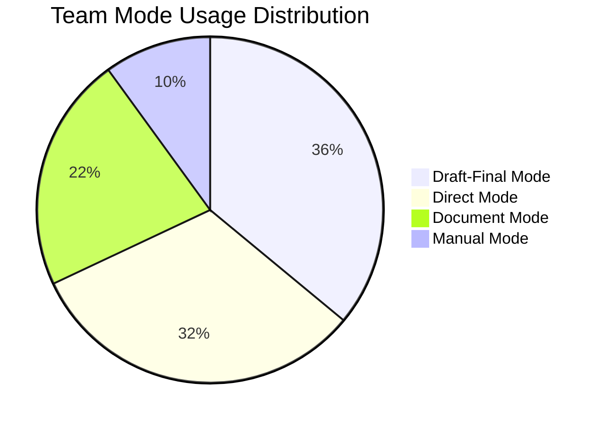
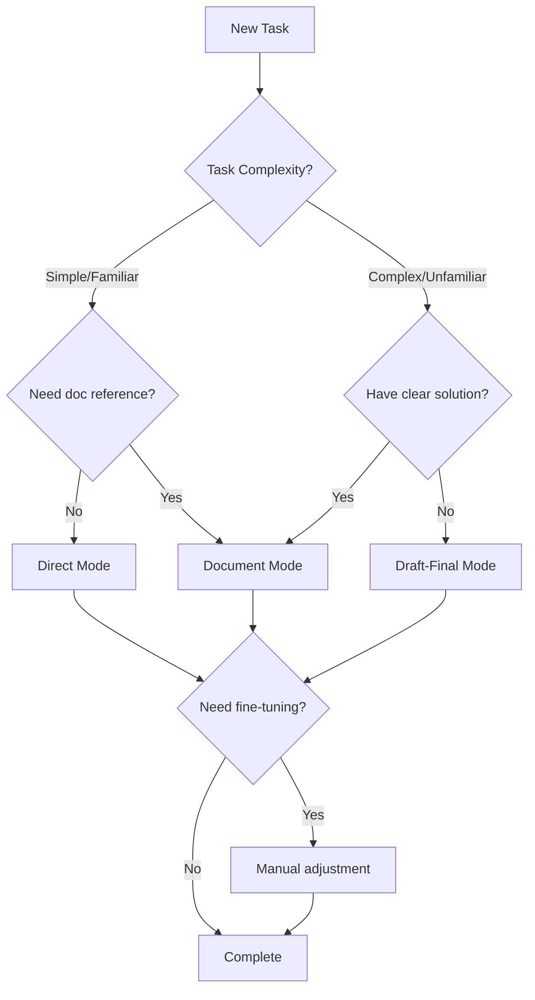

import { Callout } from 'nextra/components'

# Modes Overview

> Understanding the four Cursor usage modes and their adoption in our team

## Four Usage Modes

In our team's daily development, Cursor usage can be categorized into four modes. Each mode has its use cases, and choosing the right mode significantly improves development efficiency.

### Mode Distribution

| Mode | Usage | Key Feature | Use Cases |
|------|-------|-------------|-----------|
| **Manual** | 10% | Traditional manual development | Fine-tuning, configuration changes |
| **Direct** | 32% | Direct chat + `@file` | Quick validation, simple tasks, bug fixes |
| **Document** | 22% | Write structured documents | Complex business logic, design breakdown |
| **Draft-Final** | 36% | Draft → AI refinement → Final | Complex features, unfamiliar domains |

### Manual Mode

Traditional manual development approach. In some scenarios, manual coding is still the most efficient choice:

- **Fine-tuning** — Minor style adjustments, parameter tweaks
- **Configuration changes** — Simple modifications to environment variables, config files
- **Personal preference** — Some developers prefer manual operations for certain tech stacks

### Direct Mode

Describe requirements directly in the chat window, using `@file` to reference relevant files. This is the default way most people use Cursor.

**Use Cases:**
- Quick prototype validation
- Simple refactoring or requirements
- Bug fixes
- Code reading and review

**Detailed Guide:** [Direct Mode](./direct-mode)

### Document Mode

Write structured requirement documents, provide reference materials like API structures and SDK examples, then let AI perform task breakdown and implementation.

**Use Cases:**
- Need to provide complex reference materials (API docs, sample code, etc.)
- Complex business logic development
- Large workload requiring design and breakdown

**Detailed Guide:** [Document Mode](./document-mode)

### Draft-Final Mode

Write a rough draft.md first, let AI retrieve context on its own, refine it into a project-appropriate final.md solution, then generate code.

**Use Cases:**
- Task breakdown for complex business logic
- Development in unfamiliar domains
- Need global visibility before code generation

**Detailed Guide:** [Draft-Final Mode](./draft-final-mode)

## How to Choose a Mode

## Next Steps

When using any mode, you need to provide sufficient context to AI. Learn about [Context Management](./context-management) best practices next.
