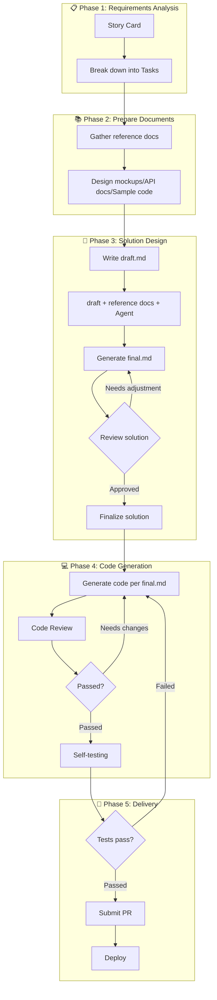

import { Callout, Steps } from 'nextra/components'

# Workflow Practice

> Complete development process from requirements to deployment

## Overview

This article introduces our team's complete workflow, showing how to integrate Cursor's various modes into daily development for efficient, high-quality code delivery.

## Complete Workflow



## Detailed Steps

<Steps>

### Break Down Requirements into Tasks

Start from Story Card, break large requirements into independently completable small tasks.

**Breakdown Principles:**
- Each Task should be independently deliverable
- Single Task development time should be 0.5-2 days
- Dependencies between Tasks should be clear

**Example:**

```
Story: Implement user order management feature

Tasks:
├── Task 1: Order list query API
├── Task 2: Order detail API
├── Task 3: Order list frontend page
├── Task 4: Order detail frontend page
├── Task 5: Order export feature
└── Task 6: Order filtering and sorting
```

### Gather Reference Documents

Prepare necessary reference materials for each Task.

**Common Reference Document Types:**

| Type | Purpose | Example |
|------|---------|---------|
| **API docs** | Interface specifications | Swagger/OpenAPI docs |
| **Design mockups** | UI/UX designs | PNG exports from Figma |
| **Data models** | Database design | ER diagrams, Schema definitions |
| **Sample code** | Reference implementation | Similar existing code |
| **Business docs** | Business rule explanations | PRD, flowcharts |

**File Organization:**

```
specs/
└── order-management/
    ├── 001-order-list/
    │   ├── draft.md
    │   ├── final.md
    │   └── api-spec.yaml
    ├── 002-order-detail/
    │   ├── draft.md
    │   ├── final.md
    │   └── design.png
    └── shared/
        ├── order-schema.sql
        └── business-rules.md
```

### Write draft.md

Record your understanding and initial thoughts about the task.

<Callout type="info">
Draft doesn't need to be perfect. Focus on recording your thinking process and uncertain points.
</Callout>

**Draft Template:**

```markdown
# [Task Name]

## Requirement Background
[Why is this feature needed]

## Core Goals
[What this Task should accomplish]

## Initial Approach
[Your design thoughts]

## References
[Related files, code, documents]

## Uncertain Points
[Content needing AI help to confirm or supplement]
```

### Generate final.md

Use Cursor to refine the draft into a detailed technical solution.

**Prompt Example:**

```
@specs/order-management/001-order-list/draft.md
@specs/order-management/shared/order-schema.sql

Based on the draft and database Schema, generate a detailed technical solution:
1. Specific API design (paths, parameters, responses)
2. Database query approach
3. Pagination and sorting implementation
4. Error handling

Output to @specs/order-management/001-order-list/final.md
```

### Review and Adjust Solution

Before generating code, carefully review final.md.

**Review Checklist:**

- [ ] Technology choices align with project standards
- [ ] API design follows team conventions
- [ ] Data model is reasonable
- [ ] Edge cases are fully considered
- [ ] Performance is acceptable
- [ ] Security issues are handled

**Adjusting Solution:**

```
@specs/order-management/001-order-list/final.md

Please adjust the following:
1. Change pagination to cursor-based pagination
2. Add Redis caching strategy
3. Add permission checking logic

Update final.md
```

### Generate Code per Solution

After confirming the solution, have AI generate code step by step.

**Recommend generating in steps:**

```
@specs/order-management/001-order-list/final.md
Following the solution's implementation steps, first complete step 1: create data model
```

```
@specs/order-management/001-order-list/final.md
Continue with step 2: implement API endpoint
```

<Callout type="warning">
**Don't generate all code at once!** Step-by-step generation helps control quality and catch issues early.
</Callout>

### Code Review

Review after each code generation.

**Review Points:**
- Does code match the solution design
- Does it follow project coding standards
- Are there obvious bugs or performance issues
- Is test coverage sufficient

**Fixing Issues:**

```
@src/api/orders.ts
This endpoint has the following issues:
1. Missing parameter validation
2. Incomplete error handling
Please fix
```

### Self-Testing

Run tests, verify functionality works correctly.

```
Run npm test and fix all failing tests
```

```
@src/api/orders.ts
Add unit tests for this file, covering normal flow and edge cases
```

### Submit PR

After all tests pass, submit code.

```
Based on these changes, generate a clear commit message and PR description
```

</Steps>

## Real-World Case Study

### Case: Implementing Comment Feature

**Step 1: Task Breakdown**

```
Story: Article commenting feature

Tasks:
├── Task 1: Comment API (CRUD)
├── Task 2: Comment list component
├── Task 3: Comment form component
└── Task 4: Comment notification feature
```

**Step 2: Prepare draft.md**

```markdown
# Task 1: Comment API

## Requirement
- Users can post comments on articles
- Support comment replies
- Authors can delete comments

## Initial Thoughts
- Comments stored in separate table
- Use parent_id for reply nesting
- Need to consider comment pagination

## Uncertain
- Nesting level limit?
- Need moderation?
```

**Step 3: Generate final.md**

```
@specs/comment/001-api/draft.md
@src/models/Article.ts
@src/models/User.ts

Based on existing data models, design complete API solution for comment feature, output to final.md
```

**Step 4: Implement Code**

```
@specs/comment/001-api/final.md
Following the solution, first create Comment model
```

## Efficiency Comparison

| Metric | Without Workflow | With This Workflow |
|--------|------------------|-------------------|
| **Rework rate** | High (late discovery of wrong direction) | Low (issues found at solution phase) |
| **Code consistency** | Low (different each time) | High (constrained by final solution) |
| **Knowledge preservation** | None | Yes (draft/final reusable) |
| **New member onboarding** | Slow (no references) | Fast (historical solutions for reference) |
| **Collaboration efficiency** | Low (hard to understand others' thinking) | High (transparent solutions) |

## FAQ

### Q: Does every Task need draft and final?

Not necessarily. Simple tasks can use Direct Mode directly. Suggested criteria:

- **Expected > 30 minutes**: Recommend Draft-Final Mode
- **Involves multiple files**: Recommend Draft-Final Mode
- **Unfamiliar domain**: Recommend Draft-Final Mode

### Q: How does the team share these documents?

- All draft/final files committed to Git repository
- Placed in `specs/` directory, organized by feature
- New members can quickly understand the project by reading historical solutions

### Q: Do solution documents become outdated?

Yes. But this is acceptable:
- Draft records thinking at that time, has historical value
- Final is the solution at implementation time, code is the ultimate truth
- Major changes can be supplemented with new solution documents

### Q: Why not use spec frameworks like OpenSpec or Kiro?

Our approach is inspired by Spec-Driven Development principles, but we've chosen to implement them manually. This gives us better integration with our existing enterprise workflows (Jira, code review processes) and more control over token consumption. See [Why No Spec Framework](./why-no-spec-framework) for a detailed explanation.

## Next Steps

Congratulations on completing this chapter! You've now mastered:

- ✅ Four Cursor usage modes
- ✅ Best practices for knowledge management
- ✅ Complete development workflow

Continue to the next chapter to learn how to collect and leverage feedback to continuously improve your AI-assisted development practice.

