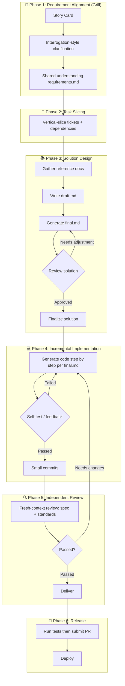

import { Callout, Steps } from 'nextra/components'

# Workflow Practice

> Complete development process from requirement alignment to deployment

## Overview

This article introduces our team's complete workflow: **align requirements first, slice tasks second, then let AI write code**. It stitches the four usage modes, design documents, and the verification loop into one repeatable pipeline, so that "AI writes fast" and "the direction is right" hold at the same time.

The flow borrows two key ideas from mainstream practice:

1. **Grill / interrogation-style alignment**: before writing any doc or code, have the AI interrogate you one question at a time until the vague request becomes an unambiguous shared understanding. Requirement alignment is human-in-the-loop (HITL) and cannot be delegated.
2. **Verification loop**: every stage — alignment, design, implementation, review — has a clear artifact and a checkpoint. Implementation and review use separate contexts, so you never "generate and hope".

<Callout type="info">
This flow is fully consistent with our choice of "no spec framework, manual spec-driven work": Grill alignment, vertical slicing, and draft/final docs are all organized by hand with no framework tools. See [Why We Don't Use Spec Frameworks](./why-no-spec-framework).
</Callout>

## Complete Workflow


```mermaid
flowchart TD
    subgraph Phase0["🎯 Phase 1: Requirement Alignment (Grill)"]
        A[Story Card] --> B[Interrogation-style clarification]
        B --> C[Shared understanding requirements.md]
    end

    subgraph Phase1["🧩 Phase 2: Task Slicing"]
        C --> D[Vertical-slice tickets + dependencies]
    end

    subgraph Phase2["📚 Phase 3: Solution Design"]
        D --> E[Gather reference docs]
        E --> F[Write draft.md]
        F --> G[Generate final.md]
        G --> H{Review solution}
        H -->|Needs adjustment| G
        H -->|Approved| I[Finalize solution]
    end

    subgraph Phase3["💻 Phase 4: Incremental Implementation"]
        I --> J[Generate code step by step per final.md]
        J --> K{Self-test / feedback}
        K -->|Failed| J
        K -->|Passed| L[Small commits]
    end

    subgraph Phase4["🔍 Phase 5: Independent Review"]
        L --> M[Fresh-context review: spec + standards]
        M --> N{Passed?}
        N -->|Needs changes| J
        N -->|Passed| O[Deliver]
    end

    subgraph Phase5["🚀 Phase 6: Release"]
        O --> P[Run tests then submit PR]
        P --> Q[Deploy]
    end
```

## Detailed Steps

<Steps>

### Grill: interrogation-style requirement alignment

Start from the Story Card, but **don't write a solution yet**. Have the Agent interrogate you one question at a time until the requirements are unambiguous.

**Why align first:**

- Pasting requirements straight into generation carries our wording ambiguity, hidden assumptions, and unspoken exceptions into the solution — the most expensive kind of rework;
- When domain vocabulary is inconsistent, AI-generated naming and comments drift apart, making cross-session maintenance harder;
- The output is a **shared requirement understanding**: scope boundaries (what's in / what's out), acceptance criteria, and domain terms — more important than any "perfect plan".

**How (human-in-the-loop, not delegable):**

1. Ask the Agent to **ask one question at a time**, giving its recommended answer and rationale first, then await your confirmation or correction;
2. Interrogate in the order "scope and boundaries → data model and domain terms → acceptance criteria" until no open ambiguity remains;
3. Write the consensus into `specs/<feature>/requirements.md` as the input for the draft.

**Example prompt:**

```
I'm about to build user order management. Don't write code yet.
Start an interrogation-style clarification: ask one question at a time, give your recommended answer and rationale first, then wait for my confirmation before the next question.
Follow this order:
1. Clarify scope and boundaries first (including what is explicitly NOT in scope)
2. Then clarify the data model and domain terms
3. Finally confirm acceptance criteria
Keep going until there's no ambiguity. Then output the consensus as requirements.md.
```

<Callout type="warning">
**Understanding cannot be outsourced**: alignment is human-in-the-loop. The AI surfaces questions and recommends answers, but the final judgment must be yours. Skipping this stage builds draft/final/code on the wrong foundation.
</Callout>

### Slice tasks vertically

After alignment, split the feature into **vertical slices** (tracer bullets) instead of horizontal layers.

**Horizontal slicing (not recommended):**

```
Story: Implement user order management

Tasks:
├── Task 1: All order tables / Schema
├── Task 2: All order APIs
├── Task 3: All frontend pages
└── Task 4: First end-to-end feedback only now
```

**Vertical slicing (recommended):**

```
Story: Implement user order management

Tasks:
├── Task 1: Order list end-to-end (table + API + visible list page)
├── Task 2: Order detail & status flow (schema + API + detail page)
├── Task 3: Order export (API + download interaction)
└── Task 4: Filter & sort (reuse existing slices)
```

**Principles:**

- Each slice is a thin but complete path: database + logic + one visible result;
- Each slice ends with a **visible, testable** artifact that answers "what can I see and what can I test when this is done";
- Organize slices with **blocking dependencies**; independent slices can run in parallel across agents;
- Keep each slice within 0.5-2 days of development.

<Callout type="info">
Vertical slices fit agents naturally: small slices keep the context budget under control (see Smart Zone in Phase 4), and every slice ends with feedback — failures surface early and cost little to fix.
</Callout>

### Gather reference docs

Prepare the reference materials each slice needs.

**Common reference types:**

| Type | Purpose | Example |
|------|---------|---------|
| **API docs** | Interface specifications | Swagger/OpenAPI |
| **Design mockups** | UI/UX designs | Figma exports |
| **Data model** | Database design | ER diagram, Schema definition |
| **Sample code** | Reference implementations | Existing similar features |
| **Business docs** | Business rules | PRD, flowcharts |

**File organization:**

```
specs/
└── order-management/
    ├── requirements.md      # Consensus from Grill
    ├── 001-order-list/
    │   ├── draft.md
    │   ├── final.md
    │   └── api-spec.yaml
    ├── 002-order-detail/
    │   ├── draft.md
    │   ├── final.md
    │   └── design.png
    └── shared/
        ├── order-schema.sql
        └── business-rules.md
```

### Write draft.md and generate final.md

Solution design keeps our **Draft-Final** flow: capture your initial thinking first, then let the AI refine it into a detailed plan.

**Draft template:**

```markdown
# [Task name]

## Background
[Why this feature is needed]

## Core goal
[What this task must achieve]

## Initial approach
[Your design thinking]

## References
[Relevant files, code, docs]

## Open questions
[Things you want the AI to confirm or fill in]
```

<Callout type="info">
A draft doesn't need to be perfect — it records your thinking and open questions. `requirements.md` from the Grill stage is the most direct input here.
</Callout>

**Example prompt for generating final.md:**

```
@specs/order-management/requirements.md
@specs/order-management/001-order-list/draft.md
@specs/order-management/shared/order-schema.sql

Based on the requirement consensus, the draft, and the DB schema, generate a detailed technical solution:
1. Concrete API design (path, params, response)
2. Database query plan
3. Pagination and sorting implementation
4. Error handling

Output to @specs/order-management/001-order-list/final.md
```

**Checklist for reviewing the final plan:**

- [ ] Consistent with the boundaries and acceptance criteria in requirements.md
- [ ] Tech choices follow project conventions
- [ ] API design follows team conventions
- [ ] Data model is sound
- [ ] Edge cases fully considered
- [ ] Performance and security acceptable

### Implement code step by step

After the plan is approved, have the AI generate code in steps, following **small steps + feedback**.

```
@specs/order-management/001-order-list/final.md
Follow the implementation steps in the plan. First complete step 1: create the data model
```

```
@specs/order-management/001-order-list/final.md
Continue to step 2: implement the query API
```

<Callout type="warning">
**Never generate all the code at once!** Step-by-step generation keeps quality under control and surfaces problems early.
</Callout>

**Smart Zone budget:**

A model's capability within one session is not constant: as context grows past a point (roughly the first 40-50% of the window), decision quality drops noticeably. Key points:

| Principle | Practice |
|-----------|----------|
| Slice tasks by budget | One session does one thing; size tasks by the "smart zone" instead of by the window limit |
| **Clear > Compact** | Prefer clearing and starting a fresh session when context nears its limit rather than compacting — compaction deposits "sediment" that pollutes later reasoning |
| Separate implementation and review | Clear after implementing, then review in a brand-new session; don't use one context for both stages |

### Independent review: fresh context + dual-axis review

Do **not** review in the same session you implemented in — Clear, then review in a fresh session.

**Dual-axis review:**

1. **Spec axis**: does the code match the final.md design?
2. **Standards axis**: does it follow project coding conventions, with obvious bugs or poor test coverage?

**Example prompt:**

```
@specs/order-management/001-order-list/final.md
@src/api/orders.ts
Do a dual-axis review of the newly generated code:
1. Does it match the design in final.md
2. Does it follow project conventions, with bugs or performance issues
Give fix suggestions for each issue
```

**Fixing issues:**

```
@src/api/orders.ts
This interface has problems:
1. Missing parameter validation
2. Incomplete error handling
Please fix
```

<Callout type="info">
Review turns verification into an explicit stage of the workflow rather than a verbal promise — consistent with the Plan → Execute → Verify idea in [Chapter 3 · Verification Loop](/en/docs/3-agent-harness/verify-closed-loop).
</Callout>

### Self-test, verify, and deliver

Once all tests pass, commit the code.

```
Run npm test and fix all failing tests
```

```
Based on this change, generate a clear commit message and PR description
```

</Steps>

## Example: implementing comments

**Step 1: Grill alignment**

```
I'm about to add comments to articles. Don't write code yet. Start an interrogation-style clarification:
1. Scope and boundaries
2. Data and terms (comment, reply, author)
3. Acceptance criteria
One question at a time, give a recommended answer before asking me to confirm
```

The consensus that converges (requirements.md):

```markdown
# Comments feature requirement consensus
## Scope
- Publish comments on articles, reply to comments, authors can delete comments
- Not included: comment moderation, profanity filter (phase 2)
## Terms
- Comment / Reply (nested via parent_id)
## Acceptance criteria
- Users can post and see their comments
- Replies display in a nested structure
- Authors can delete comments; child replies remain
```

**Step 2: Vertical slices**

```
Tasks:
├── Task 1: Post comment end-to-end (schema + API + form + list visible)
├── Task 2: Nested reply display (schema + API + UI)
└── Task 3: Author deletion (API + interaction + keep child replies)
```

**Step 3: Solution design**

```
@specs/comment/requirements.md
@specs/comment/001-publish/draft.md
Based on the requirement consensus and existing data models, design the complete API plan for comments and output to final.md
```

**Step 4: Incremental implementation + Step 5: independent review**

Implement step by step per final.md; then Clear and run a dual-axis review (spec + standards) in a fresh session, fix, and run tests.

## Efficiency comparison

| Metric | No process | With this workflow |
|--------|------------|--------------------|
| **Rework rate** | High (wrong direction found late) | Low (issues surface at alignment & design) |
| **Code consistency** | Low (different each time) | High (constrained by final plan) |
| **Requirement consensus** | None (everyone interprets differently) | Shared (requirements.md) |
| **Knowledge retention** | None | Yes (reusable draft/final) |
| **Onboarding** | Slow (no references) | Fast (historical solutions exist) |
| **Collaboration** | Low (hard to follow others' thinking) | High (transparent plans) |

## FAQ

### Q: What's the difference between Grill alignment and draft.md?

Grill aligns on the **requirements** (what to build, what not to build, acceptance criteria); the draft records **solution thinking** (how to build it). Simple tasks can skip Grill and go straight to draft; complex or unfamiliar domains benefit from both.

### Q: Does every task need the full flow?

No. Simple tasks can use Direct mode directly. Suggested criteria:

- **Estimated > 30 minutes**: use Draft-Final mode
- **Spans multiple files**: use Draft-Final mode
- **Unfamiliar domain**: Grill first, then Draft-Final

### Q: How do I choose between Clear and Compact?

Prefer **Clear**: returning to a clean baseline makes behavior predictable. Compact condenses history so you can continue, but it accumulates "sediment" that can pollute later reasoning. Clear at the end of implementation and before review.

### Q: How does the team share these documents?

- Commit all requirements/draft/final files to Git
- Organize them under `specs/` by feature
- New members learn the project by reading historical docs

### Q: Do plan documents become stale?

Yes, and that's acceptable:

- Drafts record the thinking at the time and hold historical value
- final.md is the plan at implementation; the code is the real source of truth
- Major changes can add new plan documents

### Q: Why don't you use OpenSpec, Kiro, or other spec frameworks?

Our approach is inspired by spec-driven development, but we choose to implement the principles manually: Grill alignment, vertical slicing, and draft/final are all hand-organized without framework tooling. This integrates better with our existing enterprise workflow (Jira, code review) and gives finer control over token spend. See [Why We Don't Use Spec Frameworks](./why-no-spec-framework).

## Next Steps

Congratulations — you've finished this chapter! You now know:

- ✅ The four Cursor usage modes
- ✅ Requirement alignment (Grill) and task slicing
- ✅ Knowledge-management best practices
- ✅ A complete development workflow

Continue to the next chapter to learn how to collect and use feedback to keep improving your AI-assisted development practice.

