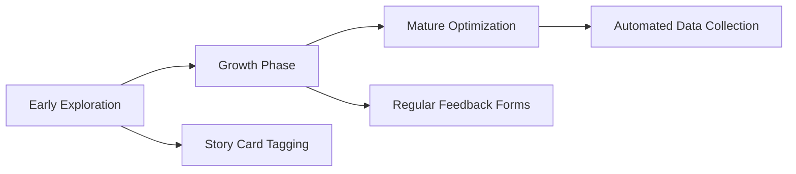

import { Callout, Steps } from 'nextra/components'

# Feedback Collection

> Build feedback channels suited to your team for data-driven improvement

## Stage-Based Feedback Collection

Teams at different stages need different feedback collection approaches. Start lightweight and gradually improve.



## Early Exploration Stage

### Story Card Tagging Method

**Applicable Scenario**: Teams just starting to try AI-assisted development

**Advantages**:
- Zero additional process burden
- Naturally integrates with existing workflow
- Data accumulates naturally with work

<Steps>

### Add Fields to Story Cards

Add a few simple fields in your existing task management system:

| Field | Type | Options |
|-------|------|---------|
| AI Assistance Level | Single Select | High / Medium / Low / None |
| Estimated Time Saved | Number | Hours |
| Main AI Contribution | Single Select | Code Generation / Q&A / Refactoring Suggestions / Other |
| Main Pain Points | Text | Free form |

### Fill In Upon Task Completion

When completing a task, developers spend 30 seconds filling in these fields:

```markdown
## Task: Implement User List Page

- [x] Development complete
- AI Assistance Level: High
- Estimated Time Saved: 2 hours
- Main AI Contribution: Code Generation
- Main Pain Points: Responsive layout needed multiple adjustments
```

### Regular Summary Analysis

Summarize data weekly or bi-weekly to form simple reports:

```markdown
## This Week's AI-Assisted Development Data

- Total tasks: 15
- Tasks using AI assistance: 12 (80%)
- Total estimated time saved: 18 hours
- Common contributions: Code generation (8), Q&A (3), Refactoring suggestions (1)
- Common pain points: Responsive layout, complex state management
```

</Steps>

<Callout type="info">
**Quick Start Tip**: If you use Jira, Linear, or Notion, these tools all support custom fields and can be set up in 5 minutes.
</Callout>

## Growth Phase

### Regular Feedback Forms

**Applicable Scenario**: Team has some AI-assisted development experience, needs more systematic feedback

**Frequency Recommendation**: Bi-weekly or monthly

### Form Design Principles

**1. Keep It Short**

Limit the survey to 10 questions or fewer, completion time under 5 minutes.

**2. Combine Quantitative and Qualitative**

- Quantitative: Ratings, numerical estimates
- Qualitative: Open-ended questions to collect specific cases

**3. Focus on Actionable Feedback**

Every question should guide subsequent improvements.

### Recommended Question List

#### Overall Assessment

```markdown
1. How satisfied are you with current AI-assisted development overall?
   [1-10 slider]

2. Would you recommend using Cursor for development to colleagues?
   [0-10 NPS rating]

3. What percentage of your time did you use Cursor this period?
   [0-30% / 30-50% / 50-70% / 70-90% / 90%+]
```

#### Efficiency Assessment

```markdown
4. Compared to not using AI, how much do you feel coding efficiency improved?
   [No improvement / 10-30% / 30-50% / 50-100% / 100%+ / 200%+]

5. In which types of tasks was AI most helpful? (Multiple choice)
   [ ] UI component development
   [ ] API interface development
   [ ] Business logic implementation
   [ ] Bug fixes
   [ ] Code refactoring
   [ ] Test writing
   [ ] Documentation
   [ ] Other: _____
```

#### Quality Assessment

```markdown
6. How would you rate the quality of AI-generated code?

   Business functionality correctness: [1-5]
   Code readability: [1-5]
   Code maintainability: [1-5]
   Performance: [1-5]
   Security: [1-5]
```

#### Pain Point Collection

```markdown
7. What's the biggest challenge you face when using AI-assisted development?
   [Open text]

8. In which scenarios do you feel AI doesn't perform well enough, worse than manual coding?
   [Open text]
```

#### Improvement Suggestions

```markdown
9. What do you think is most worth improving? (Select up to 3)
   [ ] Prompt quality and templates
   [ ] Cursor Rules enhancement
   [ ] Context management
   [ ] Team knowledge sharing
   [ ] Workflow optimization
   [ ] Training and learning resources
   [ ] Other: _____

10. Please share one memorable AI-assisted development case from this period (good or bad)
    [Open text]
```

### Data Analysis Template

After collecting data, analyze using this template:

```markdown
## [Month] AI-Assisted Development Feedback Analysis

### Participation
- Respondents: X / Total team size Y
- Response rate: Z%

### Core Metrics
- Average satisfaction: X.X / 10 (Change: +/- X.X)
- NPS score: X (Promoters X%, Passives X%, Detractors X%)
- Average usage ratio: XX-YY%

### Efficiency Perception
- People reporting 50%+ efficiency improvement: X%
- Most helpful task types: UI development, API interfaces
- Least helpful task types: Complex business logic

### Quality Ratings
| Dimension | Average Score | Change |
|-----------|---------------|--------|
| Functionality | 4.2 | +0.3 |
| Readability | 3.8 | +0.1 |
| Maintainability | 3.2 | -0.2 |

### Main Pain Points
1. [Pain point 1] - Mentions: X
2. [Pain point 2] - Mentions: Y
3. [Pain point 3] - Mentions: Z

### Improvement Priority
1. [Improvement 1] - Votes: X
2. [Improvement 2] - Votes: Y
3. [Improvement 3] - Votes: Z

### Action Items
- [ ] [Specific action] - Owner: @xxx - Due: Date
```

## Mature Optimization Stage

### Automated Data Collection

**Applicable Scenario**: Team's AI-assisted development practice is mature, needs more precise data

#### Git Commit Correlation Analysis

Add AI assistance markers (e.g., `AI-Assisted: true`) in Git commit messages, then use scripts to track AI-assisted commit ratios and trends.

#### IDE Usage Statistics

Passively collect usage data through IDE extensions:

- **WakaTime**: Automatically track coding time
- **Code Time**: Track coding habits

#### Automated Quality Metrics Tracking

Integrate AI-related quality metrics into CI/CD Pipeline, automatically tracking:
- AI assistance labels in PRs
- Code change volumes
- Subsequent bug correlation tracking

## Feedback Collection Best Practices

### Lower the Barrier to Entry

<Callout type="warning">
**Common Failure Reason**: Survey is too long or complex, developers don't want to fill it out.
</Callout>

- Keep survey under 5 minutes
- Provide default options
- Allow skipping non-required fields
- Mobile-friendly

### Show Feedback Value Promptly

Let the team see changes driven by feedback:

```markdown
## Feedback-Driven Improvement Log

| Date | Feedback Source | Issue | Improvement | Effect |
|------|-----------------|-------|-------------|--------|
| 2024-01 | Monthly survey | Deep component nesting | Updated Rules | Nesting reduced 40% |
| 2024-02 | Story card tags | Missing API error handling | New Prompt template | Rework rate down 25% |
```

### Build Feedback Culture

- **Leadership Example**: Tech leads fill out and share first
- **Public Discussion**: Discuss feedback results in team meetings
- **Reward Participation**: Thank members who provide valuable feedback

### Protect Privacy

- Anonymous option (especially for sensitive questions like satisfaction)
- Aggregate display rather than individual tracking
- Clear data usage purpose

## Tool Recommendations

| Tool | Use | Features |
|------|-----|----------|
| **Google Forms** | Regular surveys | Free, easy to use, supports analysis |
| **Notion** | Task tagging + knowledge base | Good workflow integration |
| **Linear** | Task management + custom fields | Developer-friendly |
| **Airtable** | Data collection and analysis | Flexible data model |
| **WakaTime** | Automatic time tracking | Passive collection, no manual input |

## Next Steps

After starting to collect feedback data, read the [Retrospective Guide](/en/docs/5-feedback/retrospective-practice) to learn how to analyze and leverage this data.

