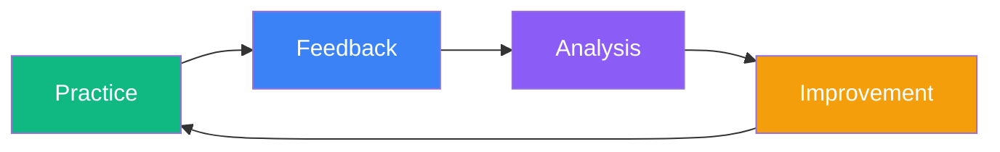

import { Cards } from 'nextra/components'

# Feedback & Iteration

> Continuously iterate to improve AI-assisted effectiveness

AI-assisted development is not a one-time setup. Models evolve, teams grow, and projects change. Establishing effective feedback mechanisms is the key to continuously improving outcomes.

**Teams without feedback**:
- Everyone explores alone, repeatedly stepping on the same pitfalls
- Good practices cannot be documented and shared
- Cursor Rules become bloated with declining effectiveness
- No clarity on how much value AI assistance actually brings

**Teams with feedback mechanisms**:
- Quickly discover AI capability boundaries
- Continuously optimize Prompts and Rules
- Build team-level best practice libraries
- Make data-driven decisions for continuous improvement
## Chapter Contents

<Cards>
  <Cards.Card title="Metrics Framework" href="/en/docs/5-feedback/feedback-metrics" />
  <Cards.Card title="Feedback Collection" href="/en/docs/5-feedback/feedback-collection" />
  <Cards.Card title="Retrospective Guide" href="/en/docs/5-feedback/retrospective-practice" />
  <Cards.Card title="Our Practice Feedback" href="/en/docs/5-feedback/our-feedback" />
</Cards>
