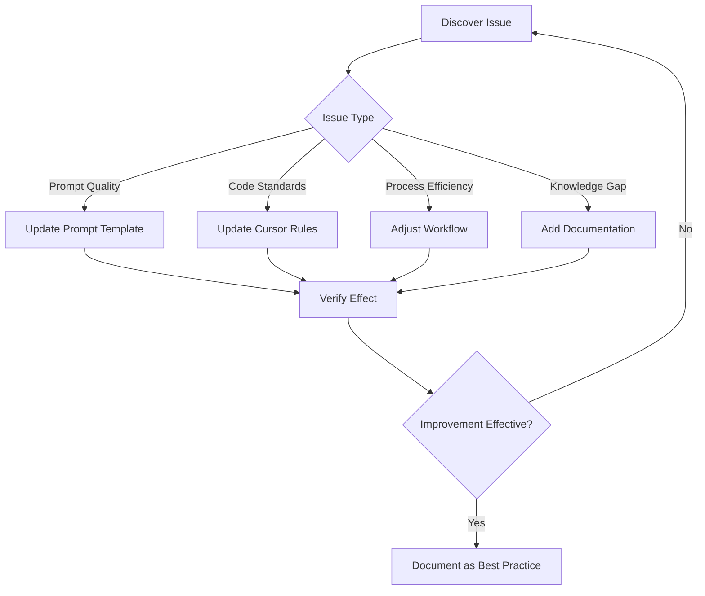

import { Callout, Steps } from 'nextra/components'

# Retrospective Guide

> Establish effective retrospective mechanisms to continuously improve AI-assisted development practices

## Why Retrospectives Matter

AI-assisted development is a continuous learning and optimization process. Retrospectives help you:

- **Discover Patterns**: Identify scenarios where AI excels and struggles
- **Accumulate Experience**: Transform individual experience into team assets
- **Continuous Improvement**: Constantly optimize Prompts, Rules, and workflows
- **Risk Control**: Promptly discover and fix AI-introduced issues

## Retrospective Frequency and Format

### Code Review Level (High Frequency)

**Frequency**: Every PR / Daily

**Purpose**: Quickly identify problem patterns in AI-generated code

<Steps>

### Mark AI-Generated Code

Identify which code is AI-generated during review:

```typescript
// Can mark with comments
// AI-GENERATED: The following code was generated by Cursor

// Or explain in PR description
// 🤖 AI-assisted generated files: src/components/UserCard.tsx
```

### Record Common Issues

Build an issue checklist to track common AI mistakes:

| Issue Type | Frequency | Example | Solution |
|------------|-----------|---------|----------|
| Non-standard naming | High | `getData` vs `fetchUserData` | Update Rules |
| Missing error handling | Medium | Unhandled API exceptions | Add Prompt template |
| Over-abstraction | Medium | Unnecessary factory pattern | Clarify simplicity requirements |

### Update Cursor Rules Promptly

After discovering repeated issues, immediately update Rules:

```markdown
<!-- .cursor/rules/code-style.mdc -->
## Naming Conventions
- API call functions use `fetch` or `get` prefix + resource name
- Examples: fetchUserData, getUserProfile
- Prohibit vague naming like getData, handleClick
```

</Steps>

### Team Level (Regular)

**Frequency**: Bi-weekly / Monthly

**Format**: Team retrospective meeting (15-30 minute dedicated topic)

**Agenda Template**:

```markdown
## AI-Assisted Development Bi-Weekly Retrospective

### 1. Data Review (5 mins)
- Code acceptance rate this period
- Main issue type distribution
- Perceived efficiency improvement

### 2. Experience Sharing (10 mins)
- Excellent case showcase
- Pitfall experience sharing
- Newly discovered efficient patterns

### 3. Improvement Actions (10 mins)
- Rules update suggestions
- Prompt template additions
- Workflow optimization suggestions

### 4. Action Items (5 mins)
- Assign owners
- Set completion dates
```

## Key Retrospective Points

### Scenarios Where AI Performs Well

Identify and record scenarios where AI excels:

```markdown
## AI High-Efficiency Scenarios List

### UI Development
- ✅ Static page layouts
- ✅ Form component generation
- ✅ Style adjustments and responsive design

### Utility Functions
- ✅ Date formatting
- ✅ Data validation
- ✅ String processing

### Documentation
- ✅ API documentation
- ✅ README writing
- ✅ Code comments
```

**Action**: Use AI more boldly in these scenarios, reduce manual intervention.

### Scenarios Where AI Struggles

Similarly record scenarios requiring caution:

```markdown
## AI Caution Scenarios List

### Database Operations
- ⚠️ Complex JOIN queries
- ⚠️ Transaction handling
- ⚠️ Performance optimization

### Business Logic
- ⚠️ Financial calculations
- ⚠️ Permission control
- ⚠️ State machine transitions

### Security Related
- ⚠️ Authentication/Authorization
- ⚠️ Data encryption
- ⚠️ Input validation
```

**Action**: These scenarios need more detailed Prompts, stricter Review, or manual coding.

### Cursor Rules Adjustment Suggestions

Rules optimization points discovered during retrospectives:

<Callout type="info">
**Golden Rule**: If the same problem appears 3+ times, you should update the Rules.
</Callout>

**Adjustment Checklist Template**:

| Issue | Current Rules | Suggested Adjustment | Priority |
|-------|---------------|---------------------|----------|
| Component nesting too deep | No related rule | Add: Max 3 levels of component nesting | P1 |
| Inconsistent variable naming | Has basic rule | Add: Prohibit single-letter variables | P2 |
| Missing type annotations | Has TypeScript rules | Emphasize: All functions must have return types | P1 |

### Workflow Optimization Suggestions

Process improvements based on practice feedback:



## Case Sharing Mechanisms

### Excellent Prompt Case Library

Build a team-shared Prompt template library:

**Example: prompts/ui-component.md**

| Field | Content |
|-------|---------|
| **Scenario** | Generate React UI component |
| **Results** | Acceptance rate 85%+, average 1.5 iterations |

**Prompt Template**:

```text
Based on the following design requirements, generate a React component:
- Component name: [name]
- Functionality: [description]
- UI library: [ui-library]

Requirements:
1. Use TypeScript
2. Component must support className prop
3. Include basic loading and error states
4. Add necessary aria attributes
```

### Effective Workflow Templates

Record validated effective workflows:

**Example: workflows/figma-to-code.md**

**Scenario**: Generate frontend code from Figma designs

**Steps**:
1. Export Figma screenshot (2x resolution recommended)
2. Use Prompt: "Generate React component based on screenshot, use Tailwind CSS"
3. After initial generation, add interaction details
4. Review generated code, focus on:
   - Responsive breakpoints
   - Accessibility attributes
   - Component granularity

**Notes**:
- Complex animations need separate handling
- Icons should use existing project icon library

### Pitfall Records and Solutions

Build a problem knowledge base:

**Example: pitfalls/database-query.md**

| Field | Content |
|-------|---------|
| **Problem** | AI-generated database queries perform poorly with large data volumes |
| **Symptoms** | Page load timeouts, Database CPU spikes |
| **Cause** | AI tends to use ORM convenience methods, ignoring N+1 problems |

**Solution**:

1. Explicitly require performance consideration in Prompts
2. Add Rules (Database queries must):
   - Use eager loading to avoid N+1
   - Add index suggestions for complex queries
   - Large data queries must be paginated
3. Focus on database operations during Review

**Related Files**: `.cursor/rules/database.mdc`

## Continuous Improvement Loop

### Establish Tracking Mechanism

```markdown
## Improvement Tracking Table

| ID | Issue | Improvement | Owner | Status | Verification |
|----|-------|-------------|-------|--------|--------------|
| 001 | Deep component nesting | Update Rules | @Zhang | ✅ Done | Nesting reduced 40% |
| 002 | Missing API error handling | Add Prompt template | @Li | 🔄 In Progress | - |
| 003 | Low test coverage | Add test step to workflow | @Wang | 📋 Pending | - |
```

### Technical Debt Radar

Regularly check technical debt in AI-generated code:

```bash
# Search for code marked as AI technical debt
grep -r "AI-DEBT" src/

# Track quantity trends
echo "This month's AI tech debt: $(grep -r "AI-DEBT" src/ | wc -l)"
```

<Callout type="warning">
If technical debt keeps growing, the Review mechanism may not be strict enough, or certain scenarios may not be suitable for AI generation.
</Callout>

## Retrospective Checklist

Reference the following checklist for each retrospective:

- [ ] Have core metrics changed this period?
- [ ] Which excellent cases are worth sharing?
- [ ] Which problems appeared repeatedly?
- [ ] Do Cursor Rules need updating?
- [ ] Do Prompt templates need additions?
- [ ] Does the workflow need adjustments?
- [ ] Were last retrospective's action items completed? What was the effect?

## Next Steps

Learn how to establish a [feedback collection mechanism](/en/docs/5-feedback/feedback-collection) to systematically collect team feedback data.

