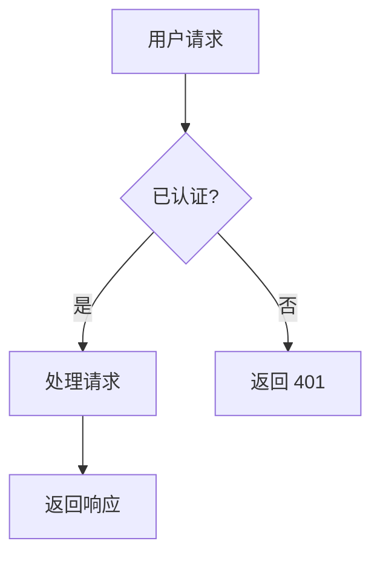
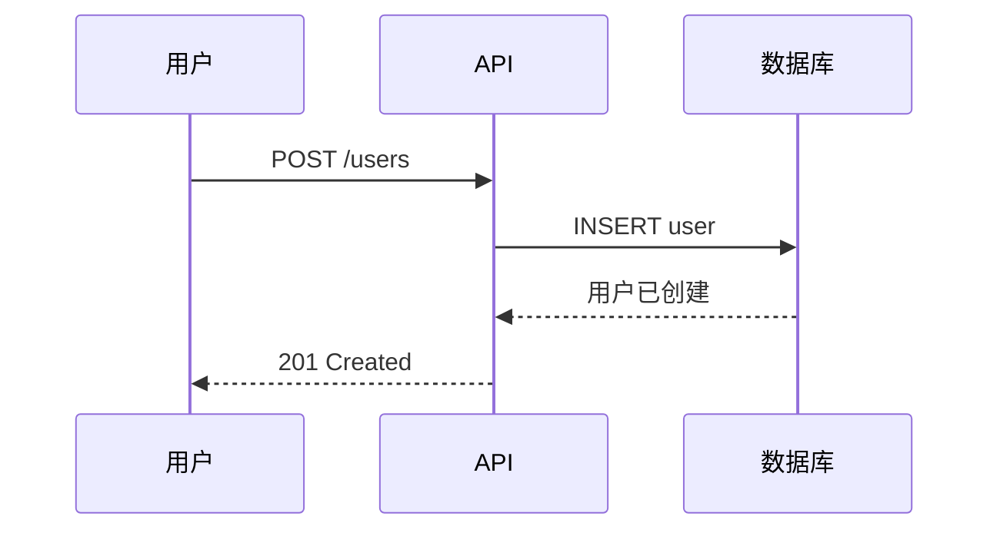
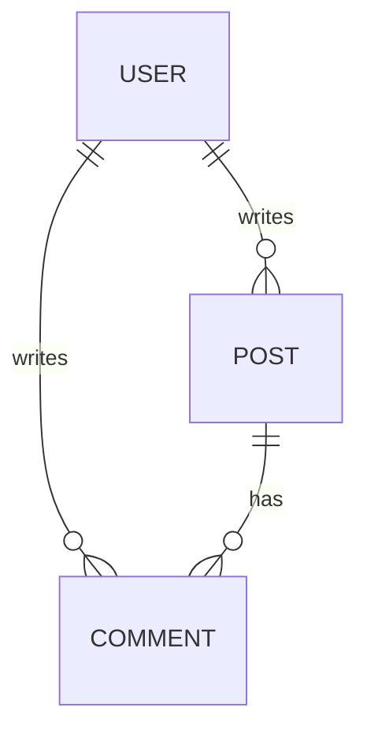

# 标记语言

> 连接人类意图和机器执行的桥梁

在所有技术类别中，**文本和标记语言对 AI 最为友好**。它们几乎完美匹配 LLM 的训练方式——用文本描述结构、配置和数据。

## 为什么标记语言与 AI 配合出色

这些语言承担着关键角色：

> 它们是**自然语言与可执行系统之间的中间表示层**。

- Markdown 把**想法**变成结构化文档
- JSON/YAML 把**描述**变成配置
- Schema 把**意图**变成可校验约束
- Mermaid 把**概念**变成可视化

## AI 友好的标记技术

| 技术 | 为何对 AI 友好 |
|------|---------------|
| **Markdown** | 人机双可读；结构即语义；极简语法 |
| **YAML** | 声明式配置；键值语义清晰；Kubernetes 原生 |
| **JSON** | 结构化数据；最小歧义；通用交换格式 |
| **JSON Schema** | 为 AI 生成提供类型约束；自动校验输出 |
| **Zod** | Schema 即 TypeScript 代码；运行时和编译时类型安全 |
| **Mermaid** | NL → 图表成功率高；即时视觉反馈 |
| **CSV** | 原子行结构；易于生成和解析表格数据 |

## Markdown — 通用语言

Markdown 是 AI 的原生文档语言。其简洁性使其非常适合：

### 文档生成

```markdown
# API 参考

## 认证

所有请求需要在 `Authorization` 头中携带 Bearer token。

### 端点

| 方法 | 路径 | 描述 |
|------|------|------|
| GET | /users | 列出所有用户 |
| POST | /users | 创建用户 |
| GET | /users/:id | 通过 ID 获取用户 |

### 请求示例

\`\`\`bash
curl -X GET https://api.example.com/users \
  -H "Authorization: Bearer <token>"
\`\`\`
```

**为什么 AI 喜欢它：**
- 标题创建自然层级
- 代码块保留格式
- 表格组织结构化信息
- 链接和引用是显式的

### Prompt 工程

Markdown 是 AI 提示的通用语言：

```markdown
## 任务
生成一个用户资料卡片 React 组件。

## 需求
- 显示头像、姓名和简介
- 包含自己资料的编辑按钮
- 使用 Tailwind CSS 样式

## 约束
- 必须可访问（ARIA 标签）
- 必须响应式
```

## YAML — 配置即代码

YAML 的缩进式语法对人和 AI 都友好：

```yaml
# docker-compose.yml - AI 容易生成
version: '3.8'
services:
  app:
    build: .
    ports:
      - "3000:3000"
    environment:
      - DATABASE_URL=postgres://db:5432/app
    depends_on:
      - db

  db:
    image: postgres:15
    environment:
      POSTGRES_DB: app
      POSTGRES_PASSWORD: secret
    volumes:
      - postgres_data:/var/lib/postgresql/data

volumes:
  postgres_data:
```

**AI 擅长的使用场景：**
- Docker Compose 配置
- Kubernetes 清单
- CI/CD 流水线（GitHub Actions、GitLab CI）
- 应用配置文件

## JSON — 数据交换标准

JSON 的严格结构最小化歧义：

```json
{
  "user": {
    "id": "usr_123",
    "name": "Alice",
    "email": "alice@example.com",
    "roles": ["admin", "editor"],
    "settings": {
      "theme": "dark",
      "notifications": true
    }
  }
}
```

**为什么 AI 喜欢它：**
- 无歧义语法
- 自描述结构
- 通用解析器支持
- 直接映射到编程对象

## JSON Schema — 生成约束

JSON Schema 告诉 AI 确切要生成什么：

```json
{
  "$schema": "http://json-schema.org/draft-07/schema#",
  "type": "object",
  "properties": {
    "name": {
      "type": "string",
      "minLength": 1,
      "maxLength": 100
    },
    "email": {
      "type": "string",
      "format": "email"
    },
    "age": {
      "type": "integer",
      "minimum": 0,
      "maximum": 150
    }
  },
  "required": ["name", "email"]
}
```

**AI 工作流**：描述数据需求 → 生成 schema → 自动校验所有输出

## Zod — Schema 即 TypeScript

Zod 将 schema 校验带入 TypeScript，完全类型推断：

```typescript
import { z } from 'zod'

// 定义 schema - AI 从需求生成
const UserSchema = z.object({
  id: z.string().uuid(),
  name: z.string().min(1).max(100),
  email: z.string().email(),
  age: z.number().int().min(0).optional(),
  role: z.enum(['admin', 'user', 'guest']),
  createdAt: z.date(),
})

// TypeScript 类型自动推断
type User = z.infer<typeof UserSchema>

// 带详细错误的校验
const result = UserSchema.safeParse(data)
if (!result.success) {
  console.error(result.error.issues)
}
```

**为什么 AI 喜欢它：**
- 类型和校验的单一数据源
- 运行时检查 + 编译时推断
- 可组合 schema（`.extend()`、`.pick()`、`.omit()`）
- 天然适合 API 边界

## Mermaid — 文本转图表

Mermaid 将自然语言描述转换为可视化图表：

### 流程图



### 时序图



### 实体关系图



**AI 工作流**：描述系统 → 生成 Mermaid → 即时视觉验证

## CSV — 简化的表格数据

CSV 的原子行结构完美适合数据生成：

```csv
id,name,email,role,created_at
1,Alice,alice@example.com,admin,2024-01-15
2,Bob,bob@example.com,user,2024-01-16
3,Charlie,charlie@example.com,user,2024-01-17
```

**使用场景：**
- 测试数据生成
- 数据迁移
- 报表导出
- 数据库种子数据

## 最佳实践

import { Callout } from 'nextra/components'

<Callout type="tip">
**用标记语言作为 AI 接口。** 不要直接让 AI 生成代码，先用标记格式生成规范，再从规范生成实现。
</Callout>

### 规范优先模式

```
1. 用自然语言描述功能
     ↓
2. AI 生成 YAML/JSON 规范
     ↓
3. 人工审查并调整规范
     ↓
4. AI 从验证过的规范生成代码
```

这种两步流程能更早发现错误，产生更准确的结果。

## 更大的图景

标记语言让 AI 超越代码生成：

| 输入 | 输出 | 示例 |
|------|------|------|
| 功能描述 | API 规范 | NL → OpenAPI YAML |
| 数据需求 | Schema 定义 | NL → JSON Schema |
| 系统架构 | 可视化图表 | NL → Mermaid |
| 配置需求 | 部署文件 | NL → docker-compose |

它们是 AI 辅助 DevOps、文档和数据管道中的**粘合剂**。

## 总结

标记语言是 AI 的天然栖息地，因为它们：

- ✅ 桥接人类意图和机器执行
- ✅ 最小语法实现最大语义
- ✅ 提供即时视觉/结构反馈
- ✅ 支持规范优先工作流
- ✅ 跨文档、配置和数据扩展

掌握这些格式，你将大幅提升 AI 协作效率。

