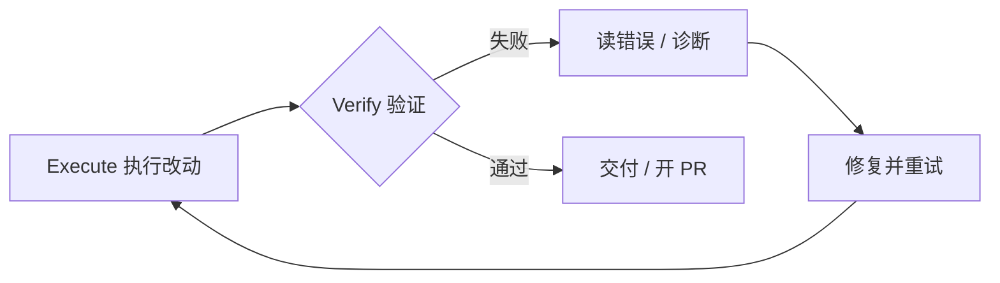

import { Callout, FileTree } from 'nextra/components'

# Hooks 确定性约束

> 不靠 agent 自觉，而是强制执行

## 定位：声明式 vs 确定性

prompt / Rules / AGENTS.md 都是**声明式约束**——它们「告诉」 agent 应该怎么做，最终靠 agent 自觉遵循。Hooks 则是**确定性约束**：策略、格式化、审计、危险操作拦截变成 agent loop 中的**可执行步骤**，由脚本监听 agent 行为并强制介入。

<Callout type="info">
**Harness 视角**：Hooks 属于「控制与验证」层。声明式约束回答「应该做什么」，确定性约束回答「必须做什么、不能做什么」。两者互补——AGENTS.md 写清规范，Hooks 保证关键规范不被绕过。
</Callout>

## 配置

Hooks 用自定义脚本观察、控制、扩展 agent loop，通过 stdio + JSON 通信。配置位置有三处：

- **项目级**：`.cursor/hooks.json`（随仓库提交，团队共享）；
- **用户级**：全局 hooks 配置；
- **Plugins**：插件自带的 hooks。

<FileTree>
  <FileTree.Folder name=".cursor" defaultOpen>
    <FileTree.File name="hooks.json" />
  </FileTree.Folder>
</FileTree>

```json
{
  "hooks": {
    "beforeShellExecution": [{
      "matcher": "rm -rf *",
      "hooks": [{ "type": "command", "command": "node .cursor/hooks/guard.mjs" }]
    }]
  }
}
```

## Hook 面分类

主要 hook 面可分为三类（节选）：

### 文件 / 工具面

| Hook | 触发时机 | 典型用途 |
|------|---------|---------|
| `preToolUse` | 工具调用前 | 拦截危险操作、审批门禁 |
| `postToolUse` | 工具调用后 | 记录、审计工具结果 |
| `beforeShellExecution` | shell 命令执行前 | 拦截 destructive 命令（rm -rf 等） |
| `afterFileEdit` | 文件编辑后 | 跑 formatter、lint、策略检查 |

### 生命周期面

| Hook | 触发时机 | 典型用途 |
|------|---------|---------|
| `beforeSubmitPrompt` | 提交 prompt 前 | 改写 prompt、注入约束 |
| `afterAgentResponse` | agent 回复后 | 审计回复、记录 |
| `stop` | agent 停止时 | 触发 repair loop、上报失败 |
| `preCompact` | 上下文压缩前 | 保存状态、归档关键信息 |

### 子代理面

| Hook | 触发时机 | 典型用途 |
|------|---------|---------|
| `subagentStart` | 子代理启动时 | 注入策略、记录委派 |
| `subagentStop` | 子代理停止时 | 聚合结果、审计子代理工作 |

## 典型用途

### 拦截 destructive 命令

`beforeShellExecution` 可以匹配 `rm -rf`、`git push --force` 等危险命令，命中即拒绝或要求确认——这是把「别乱删文件」从建议变成硬约束的关键手段。

### afterFileEdit 跑 formatter / lint

`afterFileEdit` 在每次文件编辑后自动执行格式化与 lint：

```json
{
  "hooks": {
    "afterFileEdit": [{
      "matcher": "*.{ts,tsx,js,jsx}",
      "hooks": [{ "type": "command", "command": "prettier --write" }]
    }]
  }
}
```

### stop 触发 repair loop

当 agent 停止时（尤其失败后），`stop` hook 可以检查最近的工作是否通过验证；未通过则触发 repair loop 或上报。配合代码库里的 Skills 修复流程，可以把「失败 → 读错误 → 再试」变成自动化的闭环。

## Repair Loop：失败 → 读错误 → 再试

确定性约束的最终目的是支撑一个可靠的 **repair loop**：



Hooks 在其中扮演「验证入口的触发器」：`afterFileEdit` 即时反馈格式问题、`stop` 兜底检查整体验证状态。完整的 Plan → Execute → Verify 叙事见 [验证闭环](/zh/docs/3-agent-harness/verify-closed-loop)。

## Cloud Agents 与 hooks

Cloud Agents 运行在隔离 VM 中，会执行仓库内 `.cursor/hooks.json` 中的 command hooks——这意味着**云端运行与本地策略保持一致**：同样的格式化、审计和拦截规则，无论任务跑在哪里都生效（Enterprise 还可配置 team / enterprise hooks 做策略控制）。

## 下一步

Hooks 提供了「确定性约束」这一层，[Subagents](/zh/docs/3-agent-harness/subagents) 则是「编排层」的独立代理能力；两者配合 [验证闭环](/zh/docs/3-agent-harness/verify-closed-loop) 构成完整的执行-验证体系。

## 参考来源

- materials/03-cursor-official/cursor-docs-hooks.md
- materials/06-engineering-loop/hooks-and-repair-loop.md

