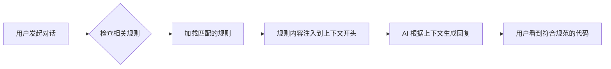

import { Callout, FileTree } from 'nextra/components'

# Rules 的工作原理

> 理解项目规则如何影响 AI 的行为

## 什么是规则

规则为 AI Agent 提供系统级指令。它们将提示词、脚本等内容打包在一起，便于在团队内管理和共享工作流。

Cursor 支持四种类型的规则：

| 规则类型 | 存储位置 | 作用范围 | 适用场景 |
|---------|---------|---------|---------|
| **项目规则** | `.cursor/rules` | 当前代码库 | 项目特定的规范和工作流 |
| **用户规则** | 全局配置 | 所有 Cursor 项目 | 个人偏好和通用约定 |
| **团队规则** | 控制台管理 | 团队所有项目 | 企业级规范（Team/Enterprise） |
| **AGENTS.md** | 项目根目录 | 当前代码库 | 轻量级的 Agent 指令 |

本文重点介绍**项目规则**的工作原理。

## 规则的工作机制

<Callout type="info">
大型语言模型在不同补全之间不会保留记忆。规则在**提示级别**提供持久、可重用的上下文。
</Callout>

当规则被应用后，其内容会被加入到模型上下文的**开头**。这为 AI 在生成代码、理解编辑或协助处理工作流时提供一致的指导。

### 规则应用流程



## 项目规则详解

项目规则位于 `.cursor/rules` 目录中，**受版本控制**，作用范围限定在你的代码库内。

### 为什么选择项目规则

使用项目规则可以：

- ✅ **沉淀领域知识** - 将与代码库相关的专业知识固化
- ✅ **自动化工作流** - 统一项目特定的模板和流程
- ✅ **统一技术决策** - 确保风格和架构的一致性
- ✅ **团队协作** - 通过 Git 共享，新成员快速上手

### 规则文件夹结构

每个规则文件夹可以包含：

<FileTree>
  <FileTree.Folder name=".cursor" defaultOpen>
    <FileTree.Folder name="rules" defaultOpen>
      <FileTree.Folder name="my-rule" defaultOpen>
        <FileTree.File name="RULE.md" />
        <FileTree.Folder name="scripts">
          <FileTree.File name="helper.sh" />
        </FileTree.Folder>
        <FileTree.File name="template.ts" />
      </FileTree.Folder>
    </FileTree.Folder>
  </FileTree.Folder>
</FileTree>

- **`RULE.md`** — 包含 frontmatter 元数据和指令的主规则文件
- **脚本和提示词** — 由该规则引用的其他文件（可选）

### 规则文件结构

每条规则对应一个文件夹，其中包含带有 frontmatter 元数据和正文内容的 `RULE.md` 文件。

```markdown
---
description: "This rule provides standards for frontend components"
globs: ["src/components/**"]
alwaysApply: false
---

- 使用 TypeScript 定义所有组件
- 组件必须使用 PascalCase 命名
- 导出的函数必须指定返回类型

@component-template.tsx
```

#### Frontmatter 字段说明

| 字段 | 类型 | 说明 |
|-----|------|------|
| `description` | string | 规则描述，供 AI 判断是否应用此规则 |
| `globs` | string[] | 文件匹配模式，限定规则作用范围 |
| `alwaysApply` | boolean | 是否始终应用于每个聊天会话 |

## 规则应用方式

通过类型下拉菜单可以控制规则的应用方式：

| 规则类型 | 配置 | 何时应用 |
|---------|------|---------|
| **Always Apply** | `alwaysApply: true` | 应用于每个聊天会话 |
| **Apply Intelligently** | `alwaysApply: false` + `description` | Agent 根据描述判断相关性后应用 |
| **Apply to Specific Files** | `globs: ["pattern"]` | 当文件匹配指定模式时应用 |
| **Apply Manually** | 无特殊配置 | 在对话中被 @ 提及时应用（如 `@my-rule`） |

### 实战示例

#### 全局规则（始终生效）

```markdown
---
alwaysApply: true
---

# Global Project Rules

## Tech Stack
- React 18 with TypeScript
- Vite as build tool
- TanStack Router for routing

## Directory Structure
- `src/pages/` - Page components
- `src/components/` - Reusable components
- `src/clients/` - API clients
```

#### 文件匹配规则（特定文件生效）

```markdown
---
description: "API client development standards"
globs: ["src/clients/**"]
alwaysApply: false
---

# API Rules

- Use axios for HTTP requests
- All API functions must have error handling
- Use SWR for data fetching in components
```

#### 手动触发规则

```markdown
---
description: "Template for creating new feature modules"
alwaysApply: false
---

# Feature Template

Use this structure when creating a new feature...
```

在聊天中使用 `@feature-template` 即可触发此规则。

## 创建规则

有两种方式创建规则：

1. **使用命令** - 运行 `New Cursor Rule` 命令
2. **使用设置** - 在 `Cursor Settings > Rules, Commands` 中创建

这会在 `.cursor/rules` 中创建一个新的规则文件夹。你可以在设置中查看所有规则及其状态。

## 规则文件格式规范

`RULE.md` 文件是一个带有 frontmatter 元数据和正文内容的 Markdown 文件。

```markdown
---
description: "This rule provides standards for frontend components and API validation"
globs: ["src/components/**", "src/clients/**"]
alwaysApply: false
---

# Component and API Standards

## Components
- Use functional components with hooks
- Props interface must be exported

## API Validation
- Validate all API responses with zod schemas
```

<Callout type="warning">
如果 `alwaysApply` 为 `true`，则该规则会应用于每个聊天会话。否则，将把该规则的描述提供给 Cursor Agent，由其决定是否需要应用该规则。
</Callout>

## 规则的最佳实践

理解了工作原理后，在编写规则时需要注意：

- 📏 **控制长度** - 将规则控制在 500 行以内
- 🧩 **拆分规则** - 将较大的规则拆分为多个可组合的规则
- 📝 **提供示例** - 包含具体示例或参考文件
- 🎯 **避免模糊** - 像写清晰的内部文档那样写规则
- ♻️ **复用规则** - 在聊天中重复使用提示时，复用已有规则

## 下一步

现在你已经理解了规则的工作原理，接下来学习[如何编写高质量的规则](./best-practices)。

