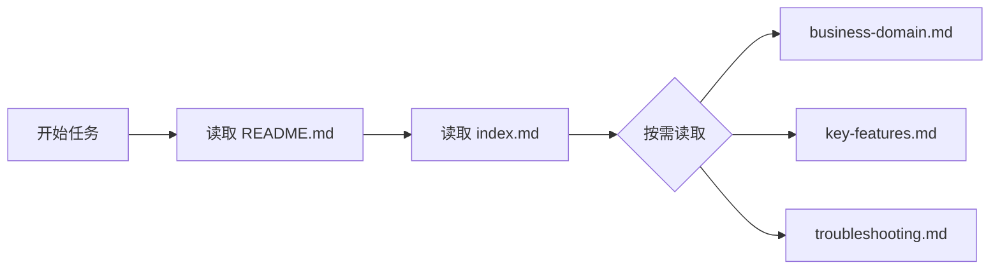

import { Callout, FileTree } from 'nextra/components'

# 使用 Rules 管理记忆

> 构建本地知识库，让 AI Agent 渐进式披露

## 你需要记忆吗？

**对于大多数项目，Rules 就够了。**

| 维度 | Rules | Memory |
|------|-------|--------|
| **确定性** | ✅ 你清楚哪些 Rules 被应用 | ⚠️ Agent 按需读取，可能遗漏 |
| **适用场景** | 编码规范、技术栈约定 | 业务知识、问题排查历史 |

记忆适合这些场景：
- 大量业务领域知识需要 AI 理解
- 需要追踪问题排查历史
- 希望 AI 从过去的实现中学习

<Callout type="info">
记忆是渐进式披露的——Agent 根据需要读取。如果某些规则必须始终生效，请使用 [Always Apply Rules](./how-rules-work#rules-应用方式)。
</Callout>

## 本地记忆实践

我们选择**本地文件**而非嵌入式方案：

- **无工具调用限制** - Cursor Agent 可以自由读取本地文件
- **强模型更划算** - 使用 Opus 模型时，在一次请求中用掉更多上下文更经济
- **版本控制** - 记忆随代码库一起演进

### 目录结构

<FileTree>
  <FileTree.Folder name=".memory" defaultOpen>
    <FileTree.File name="README.md" />
    <FileTree.File name="index.md" />
    <FileTree.File name="business-domain.md" />
    <FileTree.File name="key-features.md" />
    <FileTree.File name="troubleshooting.md" />
  </FileTree.Folder>
</FileTree>

| 文件 | 用途 |
|------|------|
| `README.md` | **使用协议** - Agent 通过这里了解如何使用记忆 |
| `index.md` | 主索引，链接所有主题 |
| `business-domain.md` | 业务知识（核心概念、业务规则） |
| `key-features.md` | 核心功能和实现要点 |
| `troubleshooting.md` | 常见问题与解决方案 |

## 核心设计：文件系统作为交互协议

**关键思想**：Rules 只需告诉 Agent 「.memory 目录是什么」，具体的使用方式在 `.memory/README.md` 中定义。

这样做的好处：
- ✅ **Rules 不需要动态维护** - 记忆的使用规范可以在 .memory 中独立演进
- ✅ **自文档化** - Agent 通过读取 README.md 自然获取最新的使用说明
- ✅ **解耦** - 记忆系统可以独立扩展，不影响 Rules

### Rules 中的配置（极简）

```markdown
---
alwaysApply: true
---

# Memory System

本项目使用 `.memory/` 目录作为知识库。

开始复杂任务前，先阅读 `.memory/README.md` 了解使用方式。
```

### .memory/README.md（完整协议）

````markdown
# Project Memory Knowledge Base

本目录是项目记忆库，用于存储 AI Agent 需要了解的项目知识。

## 📖 使用协议

### 何时读取记忆
- 开始复杂任务前
- 涉及业务逻辑时
- 遇到不确定的实现细节时

### 何时更新记忆
- 完成重要功能后
- 解决棘手问题后
- 发现文档与实际不符时

### 导航方式
- 从 `index.md` 开始导航
- 使用 `[[文件名]]` 链接跳转
- 保持记忆简洁，避免冗余

## 🗂️ 目录结构

```
.memory/
├── README.md           # 本文件：使用协议
├── index.md            # 总索引
├── business-domain.md  # 业务知识
├── key-features.md     # 核心功能
└── troubleshooting.md  # 常见问题
```
````

### .memory/index.md（导航入口）

```markdown
# 项目记忆索引

## 业务
- [[business-domain]] - 核心概念、业务规则

## 功能
- [[key-features]] - 主要功能实现要点

## 问题排查
- [[troubleshooting]] - 已知问题和解决方案
```

### .memory/business-domain.md（业务知识示例）

```markdown
# 业务知识

## 核心概念

### 用户角色
- **管理员** - 全部权限，可管理其他用户
- **编辑者** - 可创建和编辑内容
- **访客** - 只读权限

### 订单状态流转
pending → paid → shipped → delivered
       ↘ cancelled

## 业务规则
- 订单支付后 30 分钟内可取消
- 库存不足时自动转为预售
- 会员享受 9 折优惠
```

## 渐进式披露

Agent 根据任务需要逐步读取记忆：



## 最佳实践

| 推荐 | 避免 |
|------|------|
| ✅ 每个文件不超过 200 行 | ❌ 重复 Rules 中已有的内容 |
| ✅ 使用清晰的标题和要点 | ❌ 存储敏感信息 |
| ✅ 完成重要工作后更新记忆 | ❌ 让文件变得过大 |

## 下一步

- [Rules 的工作原理](./how-rules-work) - 了解 Rules 基础
- [Rules 编写最佳实践](./best-practices) - 编写有效的 Rules
- [上下文管理](/zh/docs/4-workflow/context-management) - 更广泛的上下文策略
