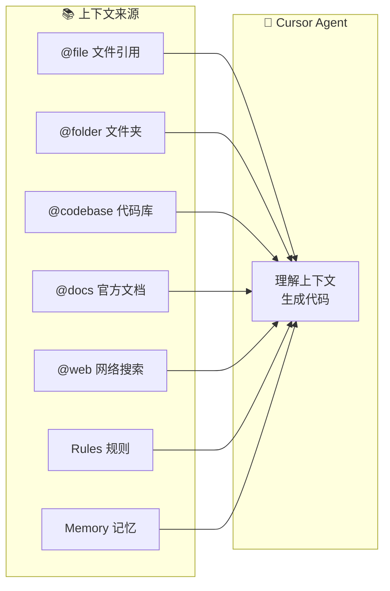

import { Callout } from 'nextra/components'

# 上下文管理

> 为 AI 提供精准的上下文，是高质量代码生成的关键

## 概述

在任何 Cursor 使用模式下，AI 生成代码的质量很大程度上取决于你提供的上下文。本文介绍如何有效管理和提供上下文，包括临时文档、项目知识、Memory 功能和 Prompt 技巧。

## 上下文来源



## 文件引用（@file）

最常用的上下文提供方式，直接引用项目中的文件。

### 引用方式

```
@src/types/user.ts           # 引用单个文件
@src/api/                    # 引用整个目录
@package.json                # 引用配置文件
@specs/001-feature-a/final.md   # 引用需求文档
```

### 最佳实践

| 做法 | 说明 |
|------|------|
| ✅ 精准引用 | 只引用相关文件，避免过多无关内容 |
| ✅ 类型优先 | 优先引用类型定义文件（`.d.ts`、`types.ts`） |
| ✅ 示例引用 | 引用类似功能的现有实现作为参考 |
| ❌ 大量引用 | 避免一次引用过多文件，容易超出上下文限制 |

## 临时文档管理

为任务准备的临时性文档，用完即可归档或删除。

### 推荐目录结构

```
specs/                          # Spec 和任务文档
├── 001-feature-a/
│   ├── draft.md               # 需求草稿
│   ├── final.md               # 完善的方案
│   ├── design.png             # 设计图
│   ├── api-spec.md            # API 规格
│   └── example-response.json  # 示例数据
├── 002-feature-b/
│   └── ...
└── _archive/                  # 已完成任务的归档
    └── ...
```

### 文档类型

| 类型 | 用途 | 示例内容 |
|------|------|----------|
| `draft.md` | 记录初步想法和需求 | 功能描述、期望行为、不确定点 |
| `final.md` | AI 完善后的详细方案 | 技术选型、实现步骤、代码结构 |
| `design.png` | 界面设计或流程图 | Figma 导出、流程图截图 |
| `api-spec.md` | API 规格说明 | 接口定义、请求响应示例 |
| `*.sql` | 数据库相关 | 示例查询、Schema 设计 |
| `*.json` | 示例数据 | API 响应示例、配置示例 |

### 使用示例

```
@specs/001-user-auth/final.md 按照这个方案实现用户认证功能
@specs/001-user-auth/api-spec.md 参考这个 API 规格实现接口
```

## 项目知识库

长期维护的项目文档，供所有任务引用。

### 推荐结构

```
docs/                          # 项目知识库
├── architecture.md            # 架构说明
├── coding-style.md            # 编码规范
├── api-conventions.md         # API 约定
├── database-schema.md         # 数据库设计
├── deployment.md              # 部署流程
└── examples/
    ├── crud-api.ts            # CRUD API 示例
    ├── form-component.tsx     # 表单组件示例
    └── test-utils.ts          # 测试工具示例
```

### 与 Rules 的配合

项目知识库可以在 Rules 中引用，让 AI 自动遵循：

```markdown
---
description: "API development standards"
globs: ["src/api/**"]
alwaysApply: false
---

# API 开发规范

参考 @docs/api-conventions.md 中的约定

- 使用 RESTful 风格
- 统一的错误处理格式
- 参考 @docs/examples/crud-api.ts 的实现模式
```

## Cursor Memory

<Callout type="warning">
**探索中的功能**

目前我们团队还没有大规模使用 Cursor Memory 功能，以下是我们的初步探索。
</Callout>

### Memory 是什么

Cursor Memory 允许 AI 记住跨会话的信息，包括：
- 项目偏好和约定
- 常用的实现模式
- 你的编码风格

### 适用场景

| 场景 | 说明 |
|------|------|
| **个人偏好** | "我喜欢用 async/await 而不是 .then()" |
| **项目约定** | "这个项目使用 kebab-case 命名文件" |
| **常见模式** | "API 错误统一返回 `{ error: string, code: number }`" |

### 与 Rules 的区别

| 维度 | Rules | Memory |
|------|-------|--------|
| 存储位置 | 项目 `.cursor/rules/` | Cursor 云端 |
| 共享范围 | 团队（通过 Git） | 个人 |
| 管理方式 | 文件管理 | AI 自动管理 |
| 适用场景 | 项目规范 | 个人偏好 |

<Callout type="info">
**我们的建议：** 项目规范使用 Rules（可版本控制、团队共享），个人偏好使用 Memory。
</Callout>

## Prompt 技巧

好的 Prompt 能显著提升 AI 的输出质量。

### 结构化 Prompt

```markdown
## 任务
[清晰描述要做什么]

## 上下文
- @src/types/user.ts 用户类型定义
- @src/api/auth.ts 现有的认证逻辑

## 要求
1. 使用 TypeScript
2. 添加错误处理
3. 编写单元测试

## 参考
参考 @src/api/product.ts 的实现风格
```

### 常用 Prompt 模式

#### 1. 实现新功能

```
@specs/001-feature/final.md
按照这个方案实现 [功能名称]，要求：
1. 遵循现有代码风格
2. 添加类型定义
3. 包含错误处理
```

#### 2. 修复 Bug

```
@src/api/user.ts
第 42 行的 fetchUser 函数在用户不存在时返回 undefined，
应该抛出 404 错误。请修复并添加相应的测试。
```

#### 3. 代码重构

```
@src/utils/helpers.ts
这个文件的函数太多了，请：
1. 按功能拆分成多个文件
2. 保持导出接口不变
3. 添加 TypeScript 类型
```

#### 4. 学习理解

```
@src/services/payment.ts
解释这个支付服务的工作流程，特别是：
1. 如何处理并发请求
2. 失败重试机制
3. 与第三方 API 的交互
```

### Prompt 保存与复用

将常用的 Prompt 模板保存在项目中：

```
prompts/
├── new-api.md           # 创建新 API 的 Prompt 模板
├── new-component.md     # 创建新组件的 Prompt 模板
├── bug-fix.md           # Bug 修复的 Prompt 模板
└── refactor.md          # 重构的 Prompt 模板
```

## 上下文管理清单

在开始任务前，检查以下上下文：

- [ ] **类型定义** — 相关的 TypeScript 类型文件
- [ ] **现有实现** — 类似功能的参考代码
- [ ] **API 规格** — 接口定义文档
- [ ] **设计稿** — UI/UX 设计图
- [ ] **业务规则** — PRD 或业务说明
- [ ] **测试用例** — 现有的测试作为参考

## 下一步

了解了上下文管理后，让我们深入学习 [Direct 模式](./direct-mode) 的使用方法。

