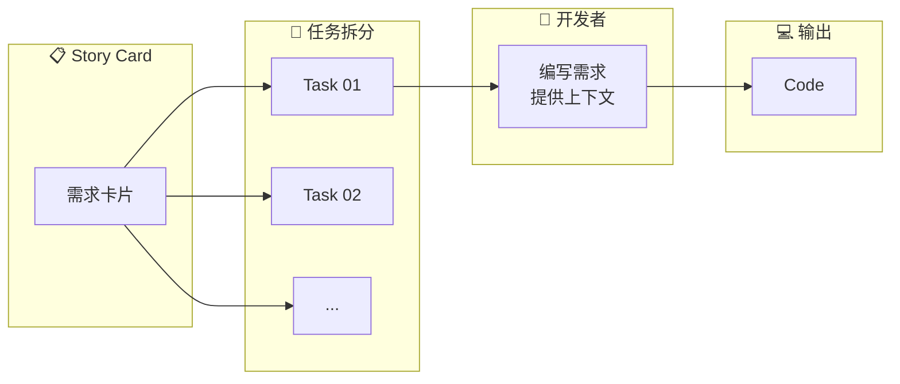

import { Callout } from 'nextra/components'
import { ChatExample } from '@/components/ChatExample'

# Direct 模式

> 直接聊天 + @file 引用，快速完成简单任务

## 使用占比

**约 32%** — 团队中第二常用的模式

## 模式概述

Direct 模式是最直观的 Cursor 使用方式：直接在聊天窗口中描述需求，通过 `@file` 引用相关文件，让 AI 立即生成代码。

这是大多数人上手 Cursor 的默认模式，简单任务通常一次就能完成。

## 流程图



## 适用场景

| 场景 | 示例 |
|------|------|
| **快速原型验证** | 快速实现一个功能原型，验证想法 |
| **简单代码生成** | 生成清晰、边界明确的代码片段 |
| **Bug 修复** | 定位并修复已知问题 |
| **代码阅读与审查** | 理解代码逻辑、获取代码解释 |

## 使用示例

### 示例 1：运行测试并修复错误

<ChatExample>
{`运行 ./gradlew test 然后修复所有失败的测试`}
</ChatExample>

### 示例 2：简单功能实现

<ChatExample>
{`@src/components/Button.tsx 给这个按钮组件添加 loading 状态`}
</ChatExample>

### 示例 3：代码重构

<ChatExample>
{`@src/utils/helpers.ts 把这个文件中的函数改成 TypeScript 并添加类型定义`}
</ChatExample>

### 示例 4：Bug 修复

<ChatExample>
{`@src/pages/Login.tsx 用户反馈登录后没有跳转到首页，帮我找出问题并修复`}
</ChatExample>

## 优势

- ✅ **上手简单** — 无需额外准备，直接开始对话
- ✅ **迭代灵活** — 可以持续对话修改代码
- ✅ **适合简单任务** — 一次对话即可完成

## 局限性

<Callout type="warning">
当任务复杂度增加时，Direct 模式会暴露以下问题：
</Callout>

| 问题 | 说明 |
|------|------|
| **格式受限** | 聊天窗口难以规范地排版和分割细节 |
| **Token 消耗** | 每次继续聊天都消耗一次 request，消耗过多 token |
| **上下文混乱** | 长对话中上下文混乱，质量逐渐下降 |
| **检索局限** | 依赖 Agent 检索能力，某些上下文可能获取不到 |
| **难以沉淀** | 聊天记录难以保存和复用，无法形成团队知识 |

## 最佳实践

### 1. 保持对话简短

```
❌ 在一个对话中完成多个不相关的任务
✅ 每个任务开启新的对话
```

### 2. 提供清晰的上下文

<ChatExample>
{`@src/api/user.ts 第 42 行的 fetchUser 函数在用户不存在时返回了 undefined，应该抛出 404 错误`}
</ChatExample>

### 3. 明确预期结果

<ChatExample>
{`优化这个组件的性能，使用 useMemo 缓存计算结果，使用 useCallback 缓存事件处理函数`}
</ChatExample>

### 4. 善用 @file 引用

<ChatExample>
{`@src/types/user.ts @src/api/user.ts 
基于这些类型定义，在 api 文件中添加 updateUser 函数`}
</ChatExample>

## 何时切换到其他模式

当遇到以下情况时，考虑切换到 Document 或 Draft-Final 模式：

- 🔄 需要反复修改，对话超过 5 轮
- 📚 需要提供大量参考文档
- 🏗️ 任务涉及多个文件或模块
- 🤔 对实现方案不确定
- 👥 需要与团队成员共享开发思路

## 下一步

当任务变得复杂，需要提供结构化文档时，请参考 [Document 模式](./document-mode)。
