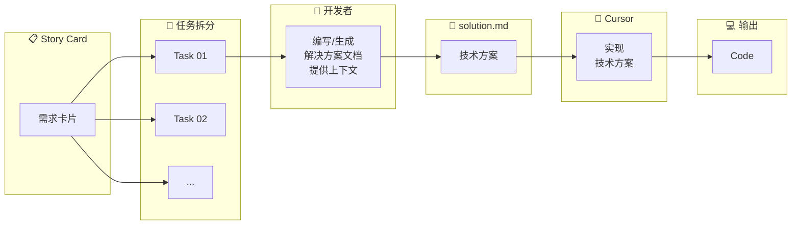

import { Callout } from 'nextra/components'
import { ChatExample } from '@/components/ChatExample'

# Document 模式

> 编写结构化文档，让 AI 基于方案实现代码

## 使用占比

**约 22%** — 适用于中等复杂度的任务

## 模式概述

Document 模式的核心是：**先设计，后实现**。开发者编写或生成结构化的解决方案文档（solution.md），提供必要的上下文，然后让 AI 按照方案实现代码。

这种模式解决了 Direct 模式中难以规范排版和沉淀 Prompt 的问题。

## 流程图



## 适用场景

| 场景 | 说明 |
|------|------|
| **需求→设计→实现** | 遵循标准开发流程 |
| **编码前控制范围** | 明确边界，避免 AI 过度发挥 |
| **探索技术方案** | 在编码前确定技术选型 |
| **拆分复杂任务** | 将大任务分解为可执行步骤 |

## 文档结构示例

一个典型的 `solution.md` 结构：

```markdown
# 功能名称

## 背景
简要描述需求背景和目标

## 技术方案

### 数据模型
- 新增/修改的数据结构
- 数据库 Schema 变更

### API 设计
- 接口路径、方法
- 请求/响应格式

### 前端实现
- 组件结构
- 状态管理
- 路由配置

## 实现步骤
1. 步骤一：xxx
2. 步骤二：xxx
3. 步骤三：xxx

## 注意事项
- 边界情况处理
- 错误处理策略
- 性能考虑
```

## 使用示例

### 步骤 1：编写 solution.md

```markdown
# 用户头像上传功能

## 背景
用户需要能够上传和更换个人头像

## 技术方案

### 后端
- 使用 AWS S3 存储图片
- 新增 POST /api/users/avatar 接口
- 支持 jpg、png 格式，最大 5MB

### 前端
- 在 UserProfile 组件中添加头像编辑功能
- 使用 react-dropzone 处理文件上传
- 添加图片裁剪功能

## 实现步骤
1. 配置 S3 bucket 和 IAM 权限
2. 实现后端上传接口
3. 实现前端上传组件
4. 添加图片裁剪功能
5. 集成测试
```

### 步骤 2：引用文档让 AI 实现

<ChatExample>
{`@prds/avatar-upload/solution.md 
按照这个方案，先实现后端的上传接口`}
</ChatExample>

### 步骤 3：逐步实现

<ChatExample>
{`@prds/avatar-upload/solution.md 
继续实现前端的上传组件`}
</ChatExample>

## 优势

相比 Direct 模式，Document 模式解决了以下问题：

| Direct 模式问题 | Document 模式解决方案 |
|----------------|---------------------|
| 聊天窗口难以规范排版 | 使用 Markdown 文件，结构清晰 |
| Prompt 难以沉淀 | 文档可版本控制，供团队参考 |
| 上下文容易遗漏 | 文档中可包含完整上下文 |
| 难以复用 | 相似功能可复用文档模板 |

## 文档编写技巧

### 1. 提供具体的技术细节

```markdown
❌ "使用合适的方式存储图片"
✅ "使用 AWS S3 存储图片，bucket 名称为 xxx-avatars"
```

### 2. 包含代码示例

```markdown
## API 响应格式

​```json
{
  "success": true,
  "data": {
    "avatarUrl": "https://xxx.s3.amazonaws.com/avatars/123.jpg"
  }
}
​```
```

### 3. 明确边界条件

```markdown
## 错误处理
- 文件过大：返回 413，提示"文件大小不能超过 5MB"
- 格式不支持：返回 400，提示"仅支持 jpg、png 格式"
- 上传失败：返回 500，记录日志，提示"上传失败，请重试"
```

### 4. 引用现有代码

```markdown
## 参考实现
- 参考 @src/api/upload.ts 中的文件上传逻辑
- 复用 @src/components/ImageCropper.tsx 的裁剪组件
```

## 何时使用 Document 模式

<Callout type="info">
**适合 Document 模式的情况：**
- ✅ 需求明确，方案清晰
- ✅ 需要提供 API 文档、SDK 示例等参考材料
- ✅ 任务可以分解为明确的步骤
- ✅ 希望保留开发文档供团队参考
</Callout>

<Callout type="warning">
**不适合 Document 模式的情况：**
- ❌ 对技术方案不确定，需要 AI 协助设计
- ❌ 涉及不熟悉的领域，需要 AI 补充上下文

这些情况更适合使用 [Draft-Final 模式](./draft-final-mode)。
</Callout>

## 下一步

当你对技术方案不确定，需要 AI 协助完善时，请参考 [Draft-Final 模式](./draft-final-mode)。
