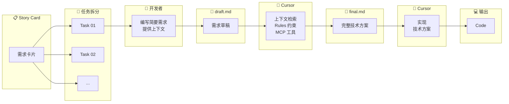

import { Callout } from 'nextra/components'
import { ChatExample } from '@/components/ChatExample'

# Draft-Final 模式

> 草稿先行，AI 完善方案，精准生成代码

## 使用占比

**约 36%** — 团队中使用最多的模式

## 模式概述

Draft-Final 模式是我们团队最推荐的复杂任务处理方式。核心流程：

1. **Draft（草稿）** — 开发者编写粗糙的需求描述
2. **Final（方案）** — AI 基于上下文检索、Rules、MCP 工具，完善成详细的技术方案
3. **Code（代码）** — AI 按照 Final 方案生成代码

这种模式让开发者在生成代码前就拥有全局视野，可以调整方案后再生成代码。

## 流程图



## 适用场景

| 场景 | 说明 |
|------|------|
| **需求→设计→实现** | 完整的开发工作流 |
| **编码前更多控制** | 审查方案后再生成代码 |
| **复杂功能开发** | 大型功能的系统性实现 |
| **团队协作** | Draft 记录思路，Final 作为技术方案 |

## 为什么是最推荐的模式

### 对比 Document 模式

| 维度 | Document 模式 | Draft-Final 模式 |
|------|--------------|-----------------|
| **方案来源** | 开发者手写完整方案 | AI 基于 Draft 生成方案 |
| **适合场景** | 方案清晰、技术熟悉 | 方案不确定、领域不熟悉 |
| **AI 参与度** | 仅实现代码 | 参与方案设计 + 代码实现 |
| **学习价值** | 较低 | 高（可学习 AI 的方案设计） |

### Draft 的价值

<Callout type="info">
**为什么要保留 Draft？**

Draft 记录了开发者的原始思路和需求理解，这对团队有重要价值：
- 📚 新人可以学习前辈的需求分析思路
- 🔄 方案变更时可以追溯原始需求
- 👥 团队成员可以理解功能的来龙去脉
</Callout>

### 效率优势

在我们的实践中，使用 Draft-Final 模式：

- **平均 3 次 request** 即可完成一个复杂任务
- **减少返工** — 在 Final 阶段发现问题，比代码阶段发现成本更低
- **提高一致性** — Final 方案确保实现符合预期

## 完整示例

### 步骤 1：编写 draft.md

```markdown
# 订单导出功能

## 需求
用户希望能够导出订单列表为 Excel 文件

## 初步想法
- 支持按时间范围筛选
- 支持选择导出字段
- 大量数据时需要异步处理
- 导出完成后邮件通知

## 问题
- 不确定用什么库生成 Excel
- 不确定异步任务怎么处理
- 需要考虑导出权限
```

### 步骤 2：生成 final.md

<ChatExample>
{`@prds/order-export/draft.md 
基于这个需求草稿，结合项目现有的技术栈和代码结构，
生成详细的技术方案，输出到 @prds/order-export/final.md`}
</ChatExample>

AI 会自动检索项目上下文，生成类似这样的 final.md：

```markdown
# 订单导出功能 - 技术方案

## 技术选型
- Excel 生成：使用 exceljs（项目已有依赖）
- 异步任务：使用现有的 Bull 队列
- 文件存储：复用现有的 S3 配置

## 数据模型

### ExportTask 表
​```sql
CREATE TABLE export_tasks (
  id SERIAL PRIMARY KEY,
  user_id INTEGER REFERENCES users(id),
  status VARCHAR(20) DEFAULT 'pending',
  file_url TEXT,
  created_at TIMESTAMP DEFAULT NOW()
);
​```

## API 设计

### POST /api/orders/export
创建导出任务

**请求：**
​```json
{
  "startDate": "2024-01-01",
  "endDate": "2024-01-31",
  "fields": ["orderId", "customerName", "amount"]
}
​```

**响应：**
​```json
{
  "taskId": "export_123",
  "status": "pending"
}
​```

### GET /api/orders/export/:taskId
查询导出任务状态

## 实现步骤

1. 创建 ExportTask 数据模型
2. 实现导出任务创建接口
3. 实现 Bull 队列消费者
4. 实现 Excel 生成逻辑
5. 实现文件上传到 S3
6. 实现邮件通知
7. 实现前端导出按钮和进度显示

## 权限控制
- 复用现有的 @middleware/auth.ts 认证中间件
- 添加 'order:export' 权限检查

## 注意事项
- 单次导出最多 10000 条记录
- 文件保留 7 天后自动删除
- 失败任务自动重试 3 次
```

### 步骤 3：审查并调整 Final

在生成代码前，开发者可以：
- 审查技术选型是否合理
- 调整 API 设计
- 补充遗漏的边界情况
- 修改实现步骤的顺序

### 步骤 4：生成代码

<ChatExample>
{`@prds/order-export/final.md 
按照这个方案，先实现第 1-3 步：数据模型、API 接口和队列消费者`}
</ChatExample>

## 最佳实践

### Draft 编写技巧

```markdown
✅ 好的 Draft
# 功能名称
## 需求背景（为什么做）
## 核心功能（做什么）
## 初步想法（怎么做的思路）
## 不确定的点（需要 AI 补充）

❌ 不好的 Draft
- 太简单：只有一句话
- 太详细：写成了完整方案（那就直接用 Document 模式）
```

### Final 审查要点

- [ ] 技术选型是否符合项目规范
- [ ] API 设计是否符合 RESTful 规范
- [ ] 数据模型是否合理
- [ ] 实现步骤是否可执行
- [ ] 边界情况是否考虑完整
- [ ] 权限和安全是否处理

### 文件组织

```
prds/
├── order-export/
│   ├── draft.md          # 原始需求草稿
│   ├── final.md          # AI 完善的技术方案
│   └── api-spec.json     # 可选：详细 API 规格
├── user-auth/
│   ├── draft.md
│   └── final.md
└── ...
```

## 常见问题

### Q: Final 生成的方案不满意怎么办？

可以继续对话调整：

<ChatExample>
{`@prds/order-export/final.md 
这个方案中的异步任务处理改用 Redis 而不是 Bull，更新方案`}
</ChatExample>

### Q: 什么时候用 Document 模式而不是 Draft-Final？

当你已经有清晰、完整的技术方案时，直接使用 Document 模式更高效。Draft-Final 模式的价值在于让 AI 帮你完善方案。

### Q: Draft 需要多详细？

Draft 应该包含：
- 需求的核心目标
- 你的初步思路
- 不确定的点

不需要包含完整的技术细节，那是 Final 的工作。

## 下一步

了解了各种模式后，让我们看看如何将它们整合到完整的[工作流实践](./workflow-practice)中。
