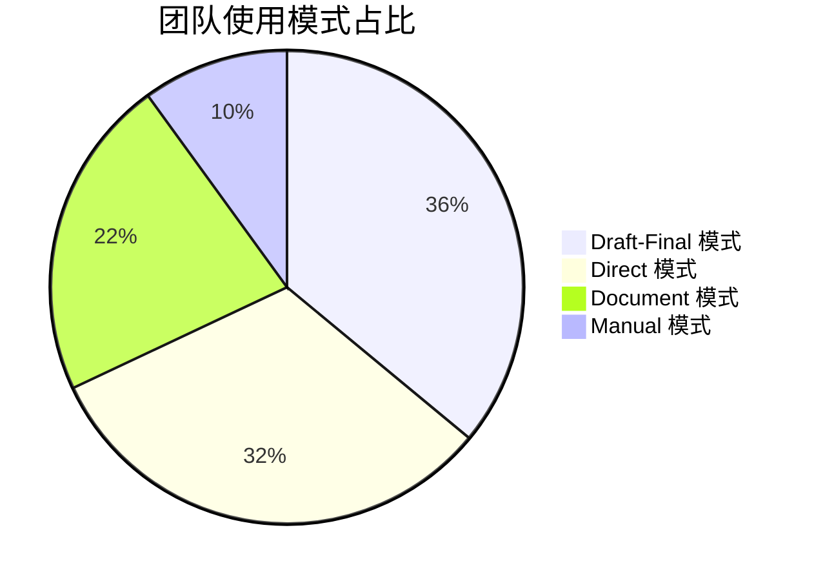

import { Callout } from 'nextra/components'

# 模式总览

> 了解团队中四种 Cursor 使用模式的占比与适用场景

## 四种使用模式

在我们团队的日常开发中，Cursor 的使用方式可以归纳为四种模式。每种模式都有其适用场景，**建议从 Manual 模式开始尝试，逐级升级到更高级的模式，直到找到适合当前任务的最佳方式。**

### 模式占比

| 模式 | 使用占比 | 核心特点 | 适用场景 |
|------|----------|----------|----------|
| **Manual** | 10% | 传统手动开发 | 细节调整、配置修改 |
| **Direct** | 32% | 直接聊天 + `@file` | 快速验证、简单需求、Bug 修复 |
| **Document** | 22% | 编写结构化文档 | 复杂业务、需要设计拆分 |
| **Draft-Final** | 36% | Draft → AI 完善 → Final | 复杂功能、不熟悉领域 |

### Manual 模式（手动模式）

**理念：** 保持开发者对代码的完全掌控，在 AI 工具的辅助下进行传统的手动编码。

**目的：** 
- 对于简单任务，手动实现可能比描述需求更快
- 保持对代码细节的精确控制
- 在熟悉的领域发挥人类的直觉优势

**核心特点：**
传统的手动开发方式，不依赖 AI 生成代码，但可以使用 AI 辅助功能（如代码补全、解释等）。

**适用场景：**
- **细节调整** — 微小的样式修改、参数调整
- **配置修改** — 环境变量、配置文件的简单修改
- **个人习惯** — 某些开发者对特定技术栈更习惯手动操作
- **学习目的** — 希望深入理解每一行代码的实现

<Callout type="info">
当 Manual 模式无法高效完成任务时，考虑升级到 Direct 模式。
</Callout>

### Direct 模式（直接模式）

**理念：** 用自然语言直接表达意图，让 AI 快速理解并实现需求，最小化文档准备时间。

**目的：**
- 快速将想法转化为代码
- 减少在简单任务上的认知负担
- 利用 AI 的代码生成能力处理重复性工作

**核心特点：**
直接在聊天窗口中描述需求，使用 `@file` 引用相关文件。这是大多数人使用 Cursor 的默认方式，也是最直观的 AI 辅助开发方式。

**适用场景：**
- **快速原型验证** — 验证一个技术方案或想法
- **简单重构或需求** — 修改函数名、提取组件、简单的功能添加
- **Bug 修复** — 定位和修复明确的错误
- **代码阅读与审查** — 理解现有代码、生成注释

**详细介绍：** [Direct 模式](./direct-mode)

<Callout type="info">
当需求涉及复杂的参考材料或需要全局设计时，考虑升级到 Document 模式。
</Callout>

### Document 模式（文档模式）

**理念：** 通过结构化文档明确需求边界和技术约束，让 AI 在充分的上下文中进行设计和实现。

**目的：**
- 提供完整的技术上下文（API 文档、SDK 示例等）
- 确保 AI 理解复杂的业务逻辑和技术约束
- 支持任务的系统化拆分和实现
- 生成可复用的项目文档

**核心特点：**
编写结构化的需求文档（PRD），包含背景、目标、API 结构、参考材料等，让 AI 基于完整信息进行任务拆分和代码生成。

**适用场景：**
- **复杂技术集成** — 需要提供 API 文档、SDK 示例等参考材料
- **复杂业务逻辑** — 涉及多个模块、需要完整的技术方案
- **大型功能开发** — 工作量较大，需要设计和任务拆分
- **团队协作** — 文档可以作为团队沟通和评审的基础

**详细介绍：** [Document 模式](./document-mode)

<Callout type="info">
当需求不够清晰，或者对实现方案没有把握时，考虑升级到 Draft-Final 模式。
</Callout>

### Draft-Final 模式（草稿-定稿模式）

**理念：** 先快速记录想法（Draft），让 AI 自主探索项目上下文并完善方案（Final），再进行实现。这是最高级别的协作模式。

**目的：**
- 降低文档编写的前期成本（Draft 可以很粗糙）
- 利用 AI 的上下文理解能力完善技术方案
- 在不熟悉的领域让 AI 主导技术调研和方案设计
- 在代码生成前建立全局视野，避免返工

**核心特点：**
先编写粗糙的 `draft.md`（可以是简单的想法和要求），让 AI 自行获取项目上下文、调研技术方案，完善成适合项目的 `final.md` 解决方案，再进行代码生成。

**适用场景：**
- **复杂业务逻辑的任务拆分** — 需要 AI 帮助设计整体架构
- **不熟悉领域的开发** — 让 AI 调研最佳实践和技术选型
- **需要全局视野** — 在生成代码前确保方案的完整性和可行性
- **探索性开发** — 对最终方案没有明确预期，需要 AI 提供建议

**详细介绍：** [Draft-Final 模式](./draft-final-mode)

<Callout type="warning">
Draft-Final 模式需要更多的 AI 交互轮次和 Token 消耗，但能显著提升复杂任务的成功率。
</Callout>

## 下一步

在使用任何模式时，都需要为 AI 提供足够的上下文。接下来了解[上下文管理](./context-management)的最佳实践。
