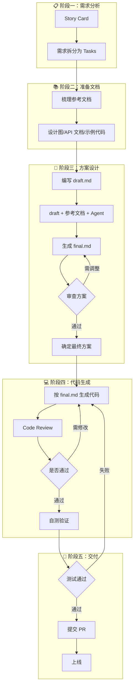

import { Callout, Steps } from 'nextra/components'

# 工作流实践

> 从需求到上线的完整开发流程

## 概述

本文介绍我们团队的完整工作流程，展示如何将 Cursor 的各种模式整合到日常开发中，实现高效、高质量的代码交付。

## 完整工作流



## 详细步骤

<Steps>

### 需求拆分为 Tasks

从 Story Card 开始，将大需求拆分为可独立完成的小任务。

**拆分原则：**
- 每个 Task 应该是可独立交付的
- 单个 Task 的开发时间控制在 0.5-2 天
- Task 之间的依赖关系要清晰

**示例：**

```
Story: 实现用户订单管理功能

Tasks:
├── Task 1: 订单列表查询 API
├── Task 2: 订单详情 API
├── Task 3: 订单列表前端页面
├── Task 4: 订单详情前端页面
├── Task 5: 订单导出功能
└── Task 6: 订单筛选和排序
```

### 梳理参考文档

为每个 Task 准备必要的参考材料。

**常见参考文档类型：**

| 类型 | 用途 | 示例 |
|------|------|------|
| **API 文档** | 接口规格说明 | Swagger/OpenAPI 文档 |
| **设计图** | UI/UX 设计稿 | Figma 导出的 PNG |
| **数据模型** | 数据库设计 | ER 图、Schema 定义 |
| **示例代码** | 参考实现 | 类似功能的现有代码 |
| **业务文档** | 业务规则说明 | PRD、流程图 |

**文件组织：**

```
specs/
└── order-management/
    ├── 001-order-list/
    │   ├── draft.md
    │   ├── final.md
    │   └── api-spec.yaml
    ├── 002-order-detail/
    │   ├── draft.md
    │   ├── final.md
    │   └── design.png
    └── shared/
        ├── order-schema.sql
        └── business-rules.md
```

### 编写 draft.md

记录你对任务的理解和初步想法。

<Callout type="info">
Draft 不需要完美，重点是记录你的思考过程和不确定的点。
</Callout>

**Draft 模板：**

```markdown
# [Task 名称]

## 需求背景
[为什么需要这个功能]

## 核心目标
[这个 Task 要完成什么]

## 初步方案
[你的设计思路]

## 参考
[相关的文件、代码、文档]

## 不确定的点
[需要 AI 帮助确认或补充的内容]
```

### 生成 final.md

使用 Cursor 将 draft 完善为详细的技术方案。

**Prompt 示例：**

```
@specs/order-management/001-order-list/draft.md
@specs/order-management/shared/order-schema.sql

基于 draft 和数据库 Schema，生成详细的技术方案：
1. 具体的 API 设计（路径、参数、响应）
2. 数据库查询方案
3. 分页和排序实现
4. 错误处理

输出到 @specs/order-management/001-order-list/final.md
```

### 审查并调整方案

在生成代码前，仔细审查 final.md。

**审查清单：**

- [ ] 技术选型是否符合项目规范
- [ ] API 设计是否符合团队约定
- [ ] 数据模型是否合理
- [ ] 边界情况是否考虑完整
- [ ] 性能是否可接受
- [ ] 安全问题是否处理

**调整方案：**

```
@specs/order-management/001-order-list/final.md

请调整以下内容：
1. 分页改用 cursor-based pagination
2. 添加 Redis 缓存方案
3. 补充权限检查逻辑

更新 final.md
```

### 按方案生成代码

确认方案后，让 AI 按步骤生成代码。

**建议分步生成：**

```
@specs/order-management/001-order-list/final.md
按照方案的实现步骤，先完成第 1 步：创建数据模型
```

```
@specs/order-management/001-order-list/final.md
继续第 2 步：实现 API 接口
```

<Callout type="warning">
**不要一次生成所有代码！** 分步生成便于控制质量和及时发现问题。
</Callout>

### Code Review

每次代码生成后进行审查。

**Review 要点：**
- 代码是否符合方案设计
- 是否遵循项目编码规范
- 是否有明显的 bug 或性能问题
- 测试覆盖是否充分

**修复问题：**

```
@src/api/orders.ts
这个接口有以下问题：
1. 缺少参数校验
2. 错误处理不完整
请修复
```

### 自测验证

运行测试，验证功能是否正常。

```
运行 npm test 并修复所有失败的测试
```

```
@src/api/orders.ts
为这个文件添加单元测试，覆盖正常流程和边界情况
```

### 提交 PR

所有测试通过后，提交代码。

```
基于这次的修改，生成一个清晰的 commit message 和 PR description
```

</Steps>

## 实际案例

### 案例：实现评论功能

**Step 1: Task 拆分**

```
Story: 文章评论功能

Tasks:
├── Task 1: 评论 API（增删改查）
├── Task 2: 评论列表组件
├── Task 3: 评论表单组件
└── Task 4: 评论通知功能
```

**Step 2: 准备 draft.md**

```markdown
# Task 1: 评论 API

## 需求
- 用户可以对文章发表评论
- 支持评论的回复
- 作者可以删除评论

## 初步想法
- 评论存在单独的表中
- 使用 parent_id 实现回复嵌套
- 需要考虑评论分页

## 不确定
- 嵌套层级限制？
- 是否需要审核？
```

**Step 3: 生成 final.md**

```
@specs/comment/001-api/draft.md
@src/models/Article.ts
@src/models/User.ts

基于现有的数据模型，设计评论功能的完整 API 方案，输出到 final.md
```

**Step 4: 实现代码**

```
@specs/comment/001-api/final.md
按照方案实现评论 API，先创建 Comment 模型
```

## 效率对比

| 指标 | 无流程 | 使用此工作流 |
|------|--------|-------------|
| **返工率** | 高（方向错误发现晚） | 低（方案阶段发现问题） |
| **代码一致性** | 低（每次实现不同） | 高（有 final 方案约束） |
| **知识沉淀** | 无 | 有（draft/final 可复用） |
| **新人上手** | 慢（缺乏参考） | 快（有历史方案参考） |
| **协作效率** | 低（难以理解他人思路） | 高（方案透明） |

## 常见问题

### Q: 每个 Task 都要写 draft 和 final 吗？

不一定。简单任务可以直接使用 Direct 模式。建议的判断标准：

- **预计 > 30 分钟**：建议使用 Draft-Final 模式
- **涉及多个文件**：建议使用 Draft-Final 模式
- **不熟悉的领域**：建议使用 Draft-Final 模式

### Q: 团队如何共享这些文档？

- 所有 draft/final 文件提交到 Git 仓库
- 放在 `specs/` 目录下，按功能组织
- 新成员可以通过阅读历史方案快速了解项目

### Q: 方案文档会过时吗？

会的。但这是可接受的：
- Draft 记录的是当时的思路，有历史价值
- Final 是实现时的方案，代码才是最终真相
- 重大变更时可以补充新的方案文档

### Q: 为什么不使用 OpenSpec 或 Kiro 等 Spec 框架？

我们的方法受规范驱动开发原则的启发，但我们选择手动实现这些原则。这让我们能够更好地与现有的企业工作流（Jira、代码评审流程）集成，并对 Token 消耗有更精细的控制。详见[为什么不用 Spec 框架](./why-no-spec-framework)了解详细解释。

## 下一步

恭喜你完成了本章的学习！你现在已经掌握了：

- ✅ 四种 Cursor 使用模式
- ✅ 知识管理的最佳实践
- ✅ 完整的开发工作流

继续学习下一章，了解如何收集和利用反馈来持续改进你的 AI 辅助开发实践。

