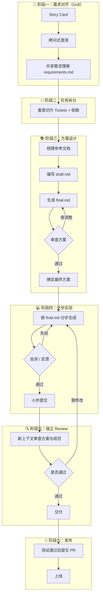

import { Callout, Steps } from 'nextra/components'

# 工作流实践

> 从需求对齐到上线的完整开发流程

## 概述

本文介绍我们团队的完整工作流：**先对齐需求，再切分任务，之后才让 AI 动手**。它把四类使用模式、方案文档和验证闭环串成一条可复制的流水线，目标是让「AI 写得快」与「方向是对的」同时成立。

这条流程借鉴了当前主流实践里的两个关键思想：

1. **Grill / 拷问式对齐**：写任何文档和代码之前，先让 AI 一次一个问题地拷问我们，把模糊诉求变成无歧义的共享理解——需求对齐是人在环（HITL）的，不能外包。
2. **验证闭环**：对齐、方案、实现、Review 每一环都有明确产物和检查点，实现与审查用独立上下文，避免「生成后碰运气」。

<Callout type="info">
这套流程与我们「不依赖 Spec 框架、手动做规范驱动」的取舍完全一致：Grill 对齐、切垂直切片、写 draft/final 都是手动组织，不引入任何框架工具。参见[为什么不用 Spec 框架](./why-no-spec-framework)。
</Callout>

## 完整工作流


```mermaid
flowchart TD
    subgraph Phase0["🎯 阶段一：需求对齐（Grill）"]
        A[Story Card] --> B[拷问式澄清]
        B --> C[共享需求理解 requirements.md]
    end

    subgraph Phase1["🧩 阶段二：任务拆分"]
        C --> D[垂直切片 Tickets + 依赖]
    end

    subgraph Phase2["📚 阶段三：方案设计"]
        D --> E[梳理参考文档]
        E --> F[编写 draft.md]
        F --> G[生成 final.md]
        G --> H{审查方案}
        H -->|需调整| G
        H -->|通过| I[确定最终方案]
    end

    subgraph Phase3["💻 阶段四：分步实现"]
        I --> J[按 final.md 分步生成]
        J --> K{自测 / 反馈}
        K -->|失败| J
        K -->|通过| L[小步提交]
    end

    subgraph Phase4["🔍 阶段五：独立 Review"]
        L --> M[新上下文审查方案与规范]
        M --> N{是否通过}
        N -->|需修改| J
        N -->|通过| O[交付]
    end

    subgraph Phase5["🚀 阶段六：发布"]
        O --> P[测试通过后提交 PR]
        P --> Q[上线]
    end
```

## 详细步骤

<Steps>

### Grill：拷问式需求对齐

从 Story Card 开始，但**先别写方案**。让 Agent 一次一个问题地拷问你，直到需求没有歧义。

**为什么先对齐：**

- 直接贴需求让 AI 生成，会把我们的措辞歧义、隐含假设和「没说出口的例外」直接带进方案，返工成本最高；
- 领域术语不一致时，AI 生成的命名和注释会越来越散，跨会话维护变难；
- 对齐产出的是**共享需求理解**：范围边界（做什么/不做什么）、验收标准、领域术语——比任何「完美计划」都更重要。

**做法（人在环，不可完全委托）：**

1. 让 Agent **一次只问一个问题**，每个问题先给出它的推荐答案和理由，再请你确认或纠正；
2. 按「范围与边界 → 数据与领域术语 → 验收标准」的顺序拷问，直到没有未决歧义；
3. 把共识写进 `specs/<feature>/requirements.md`，作为后续 draft 的输入。

**Prompt 示例：**

```
我准备实现用户订单管理，先不要写代码。
请开始拷问式澄清：一次只问一个问题，每个问题先给出你的推荐答案和理由，等我确认后再问下一个。
按这个顺序：
1. 先澄清范围与边界（包括明确不做什么）
2. 再澄清数据模型与领域术语
3. 最后确认验收标准
直到没有歧义为止。最后把共识整理成 requirements.md 输出。
```

<Callout type="warning">
**理解不能外包**：对齐阶段是人在环的，AI 帮你逼出问题、给出推荐答案，但最终判断必须由人做。这一步跳过了，后面的 draft/final/代码都会在错误的地基上盖楼。
</Callout>

### 垂直切片拆分任务

需求对齐后，把功能拆成**垂直切片**（Tracer Bullet）而不是水平分层。

**水平拆分（不推荐）：**

```
Story: 实现用户订单管理功能

Tasks:
├── Task 1: 全部订单表 / Schema
├── Task 2: 全部订单 API
├── Task 3: 全部前端页面
└── Task 4: 才第一次看到端到端效果
```

**垂直拆分（推荐）：**

```
Story: 实现用户订单管理功能

Tasks:
├── Task 1: 订单列表端到端（表 + API + 列表页可见可查）
├── Task 2: 订单详情与状态流转（表扩展 + API + 详情页）
├── Task 3: 订单导出（API + 下载交互）
└── Task 4: 筛选排序（复用已有切片）
```

**原则：**

- 每个切片都是「薄而完整」的一条路径：数据库 + 逻辑 + 一个可见结果；
- 每个切片结束时有**可见、可测**的产物，回答「做完我能看到什么、能测什么」；
- 用 **blocking 依赖** 组织切片，无依赖的切片可并行跑多个 Agent；
- 单切片开发时间控制在 0.5-2 天。

<Callout type="info">
垂直切片天然适合 Agent：切片小、上下文预算可控（见阶段四的 Smart Zone），每片结束都有反馈信号，失败早、纠错成本低。
</Callout>

### 梳理参考文档

为每个切片准备必要的参考材料。

**常见参考文档类型：**

| 类型 | 用途 | 示例 |
|------|------|------|
| **API 文档** | 接口规格说明 | Swagger/OpenAPI 文档 |
| **设计图** | UI/UX 设计稿 | Figma 导出的 PNG |
| **数据模型** | 数据库设计 | ER 图、Schema 定义 |
| **示例代码** | 参考实现 | 类似功能的现有代码 |
| **业务文档** | 业务规则说明 | PRD、流程图 |

**文件组织：**

```
specs/
└── order-management/
    ├── requirements.md      # Grill 对齐的共识
    ├── 001-order-list/
    │   ├── draft.md
    │   ├── final.md
    │   └── api-spec.yaml
    ├── 002-order-detail/
    │   ├── draft.md
    │   ├── final.md
    │   └── design.png
    └── shared/
        ├── order-schema.sql
        └── business-rules.md
```

### 编写 draft.md 并生成 final.md

方案设计沿用团队的 **Draft-Final** 流程：先写自己的初步思路，再让 AI 完善成详细方案。

**Draft 模板：**

```markdown
# [Task 名称]

## 需求背景
[为什么需要这个功能]

## 核心目标
[这个 Task 要完成什么]

## 初步方案
[你的设计思路]

## 参考
[相关的文件、代码、文档]

## 不确定的点
[需要 AI 帮助确认或补充的内容]
```

<Callout type="info">
Draft 不需要完美，重点是记录思考过程和不确定的点。Grill 阶段产生的 requirements.md 在这里作为最直接的输入。
</Callout>

**生成 final.md 的 Prompt 示例：**

```
@specs/order-management/requirements.md
@specs/order-management/001-order-list/draft.md
@specs/order-management/shared/order-schema.sql

基于需求共识、draft 和数据库 Schema，生成详细的技术方案：
1. 具体的 API 设计（路径、参数、响应）
2. 数据库查询方案
3. 分页和排序实现
4. 错误处理

输出到 @specs/order-management/001-order-list/final.md
```

**审查 final 的清单：**

- [ ] 是否与 requirements.md 的边界和验收标准一致
- [ ] 技术选型是否符合项目规范
- [ ] API 设计是否符合团队约定
- [ ] 数据模型是否合理
- [ ] 边界情况是否考虑完整
- [ ] 性能与安全是否可接受

### 分步实现代码

方案确认后，让 AI 分步生成代码，严格遵守**小步 + 反馈**的原则。

```
@specs/order-management/001-order-list/final.md
按照方案的实现步骤，先完成第 1 步：创建数据模型
```

```
@specs/order-management/001-order-list/final.md
继续第 2 步：实现查询 API
```

<Callout type="warning">
**不要一次生成所有代码！** 分步生成便于控制质量和及时发现问题。
</Callout>

**Smart Zone 预算：**

模型在一个 session 内能力不是恒定的：上下文增长到一定程度（约前 40-50% 窗口）后，决策质量明显下降。要点：

| 原则 | 做法 |
|------|------|
| 按预算切任务 | 一个 session 只做一件事，任务大小按「聪明区间」切，而不是按窗口上限 |
| **Clear > Compact** | 上下文快满时优先清空新开 session，而不是压缩历史——压缩会积累「沉积物」污染后续推理 |
| 实现与 Review 分离 | 实现完就 Clear，用全新上下文做 Review，不用同一个 context 完成两个阶段 |

### 独立 Review：新上下文 + 双轴审查

实现完成后**不要**在当前会话里直接审查，Clear 后新开会话做 Review。

**双轴审查：**

1. **方案轴**：代码是否符合 final.md 的方案设计；
2. **规范轴**：是否遵循项目编码规范、有明显 bug、测试覆盖充分。

**Prompt 示例：**

```
@specs/order-management/001-order-list/final.md
@src/api/orders.ts
请对新生成的代码做双轴审查：
1. 是否符合 final.md 的方案设计
2. 是否遵循项目编码规范、有 bug 或性能问题
逐个问题给出修改建议
```

**修复问题：**

```
@src/api/orders.ts
这个接口有以下问题：
1. 缺少参数校验
2. 错误处理不完整
请修复
```

<Callout type="info">
Review 的目的是把「验证」变成工作流的独立一环而不是口头承诺——与[第 3 章 · 验证闭环](/zh/docs/3-agent-harness/verify-closed-loop)中 Plan → Execute → Verify 的思想一致。
</Callout>

### 自测验证与交付

所有测试通过后提交代码。

```
运行 npm test 并修复所有失败的测试
```

```
基于这次的修改，生成一个清晰的 commit message 和 PR description
```

</Steps>

## 实际案例：实现评论功能

**Step 1: Grill 对齐**

```
我准备给文章加评论功能，先别写代码。开始拷问式澄清：
1. 范围与边界
2. 数据与术语（评论、回复、作者）
3. 验收标准
一次一个问题，先给推荐答案再让我确认
```

收敛后的共识（requirements.md）：

```markdown
# 评论功能需求共识
## 范围
- 支持对文章发表评论、回复评论、作者删除评论
- 不包含：评论审核、敏感词过滤（二期）
## 术语
- 评论 Comment / 回复 Reply（parent_id 嵌套）
## 验收标准
- 用户可发表并看到自己的评论
- 回复以嵌套结构展示
- 作者可删除评论，删除后子回复保留
```

**Step 2: 垂直切片**

```
Tasks:
├── Task 1: 评论发表端到端（schema + API + 表单 + 列表可见）
├── Task 2: 回复嵌套展示（schema 扩展 + API + UI）
└── Task 3: 作者删除（API + 交互 + 保留子回复）
```

**Step 3: 方案设计**

```
@specs/comment/requirements.md
@specs/comment/001-publish/draft.md
基于需求共识与现有数据模型，设计评论功能的完整 API 方案，输出到 final.md
```

**Step 4: 分步实现 + Step 5: 独立 Review**

实现时按 final.md 分步生成；完成后 Clear，新会话做双轴审查（方案轴 + 规范轴），修复后跑测试。

## 效率对比

| 指标 | 无流程 | 使用此工作流 |
|------|--------|-------------|
| **返工率** | 高（方向错误发现晚） | 低（对齐与方案阶段发现问题） |
| **代码一致性** | 低（每次实现不同） | 高（有 final 方案约束） |
| **需求共识** | 无（各做各的理解） | 有（requirements.md 共享） |
| **知识沉淀** | 无 | 有（draft/final 可复用） |
| **新人上手** | 慢（缺乏参考） | 快（有历史方案参考） |
| **协作效率** | 低（难以理解他人思路） | 高（方案透明） |

## 常见问题

### Q: Grill 对齐和 draft.md 有什么区别？

Grill 对齐的是**需求**（做什么、不做什么、验收标准），draft 记录的是**方案思路**（怎么做）。简单任务可以跳过 Grill 直接写 draft；复杂或陌生领域建议两者都走。

### Q: 每个 Task 都要走完整流程吗？

不一定。简单任务可以直接使用 Direct 模式。建议的判断标准：

- **预计 > 30 分钟**：建议使用 Draft-Final 模式
- **涉及多个文件**：建议使用 Draft-Final 模式
- **不熟悉的领域**：建议先 Grill 对齐，再 Draft-Final

### Q: 如何选择 Clear 和 Compact？

优先 **Clear**：清空后回到干净基线，行为可预测。Compact 把历史压成摘要继续用，方便但会积累「沉积物」污染后续推理。实现阶段结束时、Review 开始前，建议 Clear。

### Q: 团队如何共享这些文档？

- 所有 requirements/draft/final 文件提交到 Git 仓库
- 放在 `specs/` 目录下，按功能组织
- 新成员可以通过阅读历史文档快速了解项目

### Q: 方案文档会过时吗？

会的。但这是可接受的：

- Draft 记录的是当时的思路，有历史价值
- Final 是实现时的方案，代码才是最终真相
- 重大变更时可以补充新的方案文档

### Q: 为什么不使用 OpenSpec 或 Kiro 等 Spec 框架？

我们的方法受规范驱动开发原则的启发，但选择手动实现这些原则：Grill 对齐、垂直切片、draft/final 都是手动组织的流程，不引入框架工具。这让我们能更好地与现有企业工作流（Jira、代码评审流程）集成，并对 Token 消耗有更精细的控制。详见[为什么不用 Spec 框架](./why-no-spec-framework)。

## 下一步

恭喜你完成了本章的学习！你现在已经掌握了：

- ✅ 四种 Cursor 使用模式
- ✅ 需求对齐（Grill）与任务切片的方法
- ✅ 知识管理的最佳实践
- ✅ 完整的开发工作流

继续学习下一章，了解如何收集和利用反馈来持续改进你的 AI 辅助开发实践。

