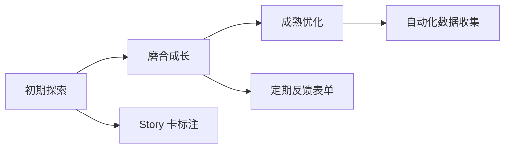

import { Callout, Steps } from 'nextra/components'

# 反馈收集机制

> 建立适合团队的反馈渠道，让数据驱动改进

## 分阶段的反馈收集

不同阶段的团队需要不同的反馈收集方式。从轻量开始，逐步完善。



## 初期探索阶段

### Story 卡片标注法

**适用场景**：刚开始尝试 AI 辅助开发的团队

**优点**：
- 零额外流程负担
- 与现有工作流自然融合
- 数据随工作自然积累

<Steps>

### 在 Story 卡上添加字段

在现有的任务管理系统中添加几个简单字段：

| 字段 | 类型 | 选项 |
|------|------|------|
| AI 辅助程度 | 单选 | 高 / 中 / 低 / 无 |
| 预估节省时间 | 数字 | 小时数 |
| AI 主要贡献 | 单选 | 代码生成 / 问题解答 / 重构建议 / 其他 |
| 主要痛点 | 文本 | 自由填写 |

### 开发完成时填写

任务完成时，开发者花 30 秒填写这些字段：

```markdown
## Task: 实现用户列表页面

- [x] 完成开发
- AI 辅助程度：高
- 预估节省时间：2 小时
- AI 主要贡献：代码生成
- 主要痛点：响应式布局需要多次调整
```

### 定期汇总分析

每周或每两周汇总数据，形成简单报告：

```markdown
## 本周 AI 辅助开发数据

- 任务总数：15
- 使用 AI 辅助的任务：12 (80%)
- 预估节省总时间：18 小时
- 常见贡献：代码生成 (8)、问题解答 (3)、重构建议 (1)
- 常见痛点：响应式布局、复杂状态管理
```

</Steps>

<Callout type="info">
**快速启动提示**：如果你使用 Jira、Linear 或 Notion，这些工具都支持自定义字段，5 分钟即可设置完成。
</Callout>

## 磨合成长阶段

### 定期反馈表单

**适用场景**：团队已经有一定 AI 辅助开发经验，需要更系统的反馈

**频率建议**：双周或月度

### 表单设计要点

**1. 保持简短**

问卷控制在 10 个问题以内，填写时间不超过 5 分钟。

**2. 结合定量和定性**

- 定量：评分、数值估算
- 定性：开放式问题收集具体案例

**3. 聚焦可行动的反馈**

每个问题都应该能指导后续改进。

### 推荐问题清单

#### 整体评估

```markdown
1. 你对当前 AI 辅助开发的整体满意度是多少？
   [1-10 分滑块]

2. 你会向同事推荐使用 Cursor 进行开发吗？
   [0-10 分 NPS 评分]

3. 本周期你使用 Cursor 的时间占比大约是？
   [0-30% / 30-50% / 50-70% / 70-90% / 90%+]
```

#### 效率评估

```markdown
4. 与不使用 AI 相比，你感觉编码效率提升了多少？
   [无提升 / 10-30% / 30-50% / 50-100% / 100%+ / 200%+]

5. AI 在哪些类型的任务中帮助最大？（多选）
   [ ] UI 组件开发
   [ ] API 接口开发
   [ ] 业务逻辑实现
   [ ] Bug 修复
   [ ] 代码重构
   [ ] 测试编写
   [ ] 文档编写
   [ ] 其他：_____
```

#### 质量评估

```markdown
6. 你对 AI 生成代码的质量评价如何？

   业务功能正确性：[1-5 分]
   代码可读性：[1-5 分]
   代码可维护性：[1-5 分]
   性能表现：[1-5 分]
   安全性：[1-5 分]
```

#### 痛点收集

```markdown
7. 你在使用 AI 辅助开发时遇到的最大挑战是什么？
   [开放式文本]

8. 有哪些场景你觉得 AI 表现不够好，不如手写？
   [开放式文本]
```

#### 改进建议

```markdown
9. 你认为最值得改进的方面是什么？（最多选 3 项）
   [ ] Prompt 质量和模板
   [ ] Cursor Rules 完善
   [ ] 上下文管理
   [ ] 团队知识共享
   [ ] 工作流程优化
   [ ] 培训和学习资源
   [ ] 其他：_____

10. 请分享一个本周期印象最深的 AI 辅助开发案例（好的或坏的）
    [开放式文本]
```

### 数据分析模板

收集数据后，用以下模板进行分析：

```markdown
## [月份] AI 辅助开发反馈分析

### 参与情况
- 反馈人数：X / 团队总人数 Y
- 响应率：Z%

### 核心指标
- 平均满意度：X.X / 10（变化：+/- X.X）
- NPS 得分：X（推荐者 X%，被动者 X%，贬损者 X%）
- 平均使用占比：XX-YY%

### 效率感知
- 认为效率提升 50%+ 的人数：X%
- 最有帮助的任务类型：UI 开发、API 接口
- 最没帮助的任务类型：复杂业务逻辑

### 质量评价
| 维度 | 平均分 | 变化 |
|------|--------|------|
| 功能正确性 | 4.2 | +0.3 |
| 代码可读性 | 3.8 | +0.1 |
| 可维护性 | 3.2 | -0.2 |

### 主要痛点
1. [痛点 1] - 提及次数：X
2. [痛点 2] - 提及次数：Y
3. [痛点 3] - 提及次数：Z

### 改进优先级
1. [改进 1] - 得票：X
2. [改进 2] - 得票：Y
3. [改进 3] - 得票：Z

### 行动项
- [ ] [具体行动] - 负责人：@xxx - 截止：日期
```

## 成熟优化阶段

### 自动化数据收集

**适用场景**：团队 AI 辅助开发实践成熟，需要更精准的数据

#### 代码提交关联分析

在 Git commit message 中添加 AI 辅助标记（如 `AI-Assisted: true`），然后通过脚本统计 AI 辅助提交的比例和趋势。

#### IDE 使用统计

通过 IDE 扩展被动收集使用数据：

- **WakaTime**：自动追踪编码时间
- **Code Time**：统计编码习惯

#### 质量指标自动追踪

将 AI 相关的质量指标集成到 CI/CD Pipeline，自动统计：
- PR 中的 AI 辅助标签
- 代码变更量
- 后续 Bug 关联追踪

## 反馈收集最佳实践

### 降低填写门槛

<Callout type="warning">
**常见失败原因**：问卷太长、太复杂，开发者不愿意填写。
</Callout>

- 问卷控制在 5 分钟内
- 提供默认选项
- 允许跳过非必填项
- 移动端友好

### 及时展示反馈价值

让团队看到反馈带来的改变：

```markdown
## 反馈驱动的改进记录

| 日期 | 反馈来源 | 问题 | 改进措施 | 效果 |
|------|----------|------|----------|------|
| 2024-01 | 月度问卷 | 组件嵌套过深 | 更新 Rules | 嵌套减少 40% |
| 2024-02 | Story 卡标注 | API 错误处理缺失 | 新增 Prompt 模板 | 返工率降低 25% |
```

### 建立反馈文化

- **领导示范**：技术负责人率先填写和分享
- **公开讨论**：在团队会议中讨论反馈结果
- **奖励参与**：感谢提供有价值反馈的成员

### 保护隐私

- 匿名选项（特别是对满意度等敏感问题）
- 汇总展示而非个人追踪
- 明确数据用途

## 工具推荐

| 工具 | 用途 | 特点 |
|------|------|------|
| **Google Forms** | 定期问卷 | 免费、易用、支持分析 |
| **Notion** | 任务标注 + 知识库 | 与工作流集成好 |
| **Linear** | 任务管理 + 自定义字段 | 开发者友好 |
| **Airtable** | 数据收集和分析 | 灵活的数据模型 |
| **WakaTime** | 自动时间追踪 | 被动收集，无需手动 |

## 下一步

开始收集反馈数据后，阅读[复盘实践指南](/zh/docs/5-feedback/retrospective-practice)学习如何分析和利用这些数据。

