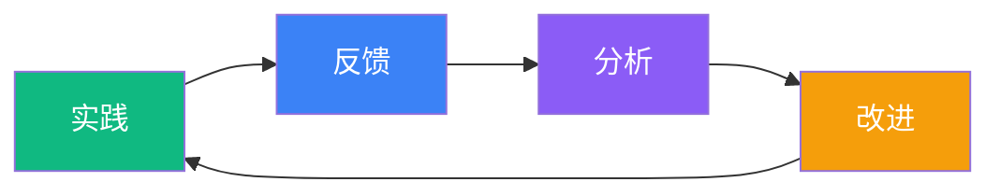

import { Cards } from 'nextra/components'

# 反馈与迭代

> 持续迭代，提升 AI 辅助效果

AI 辅助开发不是一劳永逸的事情。模型在进化，团队在成长，项目在变化。建立有效的反馈机制，才能让效果持续提升。

**没有反馈的团队**：
- 每个人各自摸索，重复踩坑
- 好的实践无法沉淀和传播
- Cursor Rules 越来越臃肿却效果不佳
- 不知道 AI 辅助到底带来了多少价值

**有反馈机制的团队**：
- 快速发现 AI 的能力边界
- 持续优化 Prompt 和 Rules
- 建立团队级别的最佳实践库
- 用数据说话，持续改进
## 章节内容

<Cards>
  <Cards.Card title="量化指标体系" href="/zh/docs/5-feedback/feedback-metrics" />
  <Cards.Card title="反馈收集机制" href="/zh/docs/5-feedback/feedback-collection" />
  <Cards.Card title="复盘实践指南" href="/zh/docs/5-feedback/retrospective-practice" />
  <Cards.Card title="我们的实践反馈" href="/zh/docs/5-feedback/our-feedback" />
</Cards>
