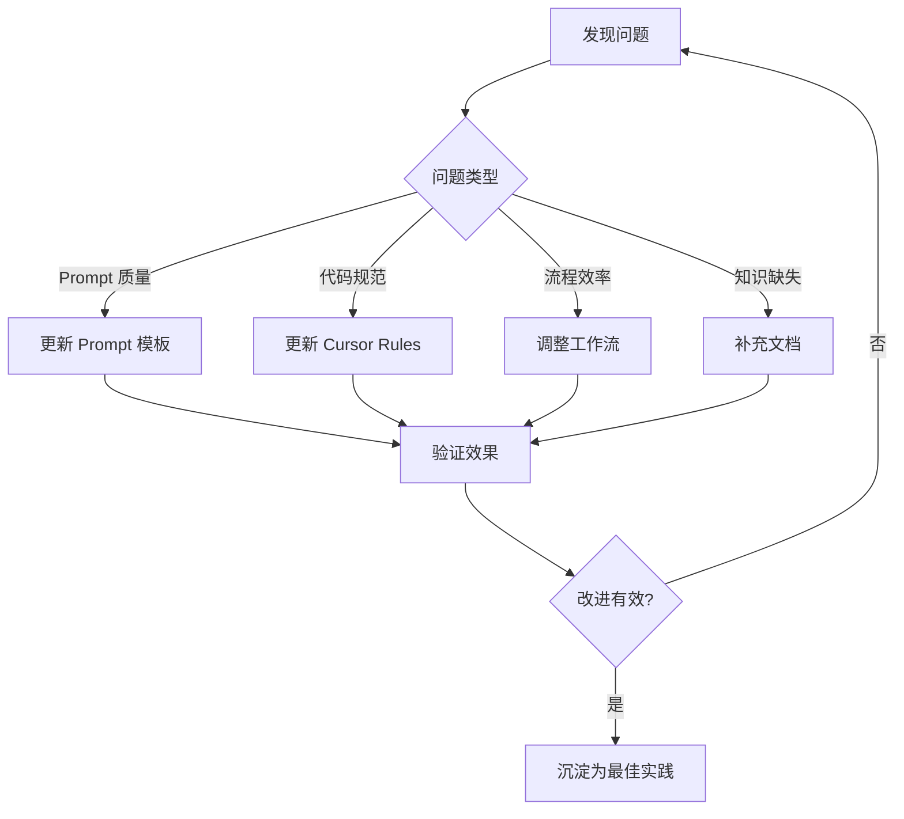

import { Callout, Steps } from 'nextra/components'

# 复盘实践指南

> 建立有效的复盘机制，持续改进 AI 辅助开发实践

## 为什么要复盘

AI 辅助开发是一个不断学习和优化的过程。复盘帮助你：

- **发现模式**：识别 AI 擅长和不擅长的场景
- **沉淀经验**：将个人经验转化为团队资产
- **持续改进**：不断优化 Prompt、Rules 和工作流
- **控制风险**：及时发现和修复 AI 引入的问题

## 复盘频率与形式

### Code Review 层面（高频）

**频率**：每次 PR / 每日

**目的**：快速识别 AI 生成代码的问题模式

<Steps>

### 标记 AI 生成的代码

在 Review 时识别哪些代码是 AI 生成的：

```typescript
// 可以通过注释标记
// AI-GENERATED: 以下代码由 Cursor 生成

// 或在 PR 描述中说明
// 🤖 AI 辅助生成的文件: src/components/UserCard.tsx
```

### 记录常见问题

建立问题清单，追踪 AI 的常见错误：

| 问题类型 | 频率 | 示例 | 解决方案 |
|----------|------|------|----------|
| 命名不规范 | 高 | `getData` vs `fetchUserData` | 更新 Rules |
| 缺少错误处理 | 中 | 未处理 API 异常 | 添加 Prompt 模板 |
| 过度抽象 | 中 | 不必要的工厂模式 | 明确简洁性要求 |

### 及时更新 Cursor Rules

发现重复问题后，立即更新 Rules：

```markdown
<!-- .cursor/rules/code-style.mdc -->
## 命名规范
- API 调用函数使用 `fetch` 或 `get` 前缀 + 资源名称
- 示例：fetchUserData, getUserProfile
- 禁止使用模糊的命名如 getData, handleClick
```

</Steps>

### 团队层面（定期）

**频率**：双周 / 月度

**形式**：团队回顾会议（15-30 分钟专项议题）

**议程模板**：

```markdown
## AI 辅助开发双周复盘

### 1. 数据回顾（5分钟）
- 本周期代码采纳率
- 主要问题类型分布
- 效率提升感知

### 2. 经验分享（10分钟）
- 优秀案例展示
- 踩坑经验分享
- 新发现的高效模式

### 3. 改进行动（10分钟）
- Rules 更新建议
- Prompt 模板补充
- 工作流优化建议

### 4. 行动项（5分钟）
- 确定负责人
- 设定完成时间
```

## 复盘要点

### AI 表现好的场景

识别并记录 AI 表现优秀的场景：

```markdown
## AI 高效场景清单

### UI 开发
- ✅ 静态页面布局
- ✅ 表单组件生成
- ✅ 样式调整和响应式

### 工具函数
- ✅ 日期格式化
- ✅ 数据验证
- ✅ 字符串处理

### 文档生成
- ✅ API 文档
- ✅ README 编写
- ✅ 代码注释
```

**行动**：这些场景可以更大胆地使用 AI，减少人工干预。

### AI 表现差的场景

同样记录需要谨慎的场景：

```markdown
## AI 需谨慎场景清单

### 数据库操作
- ⚠️ 复杂 JOIN 查询
- ⚠️ 事务处理
- ⚠️ 性能优化

### 业务逻辑
- ⚠️ 涉及金额计算
- ⚠️ 权限控制
- ⚠️ 状态机转换

### 安全相关
- ⚠️ 认证授权
- ⚠️ 数据加密
- ⚠️ 输入校验
```

**行动**：这些场景需要更详细的 Prompt、更严格的 Review，或直接手写。

### Cursor Rules 调整建议

复盘中发现的 Rules 优化点：

<Callout type="info">
**黄金法则**：如果同一个问题出现 3 次以上，就应该更新 Rules。
</Callout>

**调整清单模板**：

| 问题 | 当前 Rules | 建议调整 | 优先级 |
|------|-----------|----------|--------|
| 组件嵌套过深 | 无相关规则 | 添加：组件最多嵌套 3 层 | P1 |
| 变量命名不一致 | 有基础规则 | 补充：禁止单字母变量 | P2 |
| 缺少类型注解 | 有 TypeScript 规则 | 强调：所有函数必须有返回类型 | P1 |

### 工作流优化建议

基于实践反馈的流程改进：



## 案例分享机制

### 优秀 Prompt 案例库

建立团队共享的 Prompt 模板库：

**示例：prompts/ui-component.md**

| 字段 | 内容 |
|------|------|
| **场景** | 生成 React UI 组件 |
| **效果** | 采纳率 85%+，平均迭代 1.5 次 |

**Prompt 模板**：

```text
基于以下设计需求，生成 React 组件：
- 组件名称：[name]
- 功能描述：[description]
- 使用的 UI 库：[ui-library]

要求：
1. 使用 TypeScript
2. 组件必须支持 className prop
3. 包含基础的 loading 和 error 状态
4. 添加必要的 aria 属性
```

### 高效工作流模板

记录被验证有效的工作流：

**示例：workflows/figma-to-code.md**

**场景**：从 Figma 设计稿生成前端代码

**步骤**：
1. 导出 Figma 截图（建议 2x 分辨率）
2. 使用 Prompt："基于截图生成 React 组件，使用 Tailwind CSS"
3. 首次生成后，补充交互细节
4. Review 生成的代码，重点检查：
   - 响应式断点
   - 无障碍属性
   - 组件拆分粒度

**注意事项**：
- 复杂动画效果需要单独处理
- 图标建议使用项目已有的图标库

### 踩坑记录与解决方案

建立问题知识库：

**示例：pitfalls/database-query.md**

| 字段 | 内容 |
|------|------|
| **问题** | AI 生成的数据库查询在大数据量时性能差 |
| **症状** | 页面加载超时、数据库 CPU 飙升 |
| **原因** | AI 倾向于使用 ORM 便捷方法，忽略了 N+1 问题 |

**解决方案**：

1. 在 Prompt 中明确要求考虑性能
2. 添加 Rules（数据库查询必须）：
   - 使用 eager loading 避免 N+1
   - 复杂查询添加索引建议
   - 大数据量查询必须分页
3. Review 时重点检查数据库操作

**相关文件**：`.cursor/rules/database.mdc`

## 持续改进闭环

### 建立追踪机制

```markdown
## 改进追踪表

| ID | 问题 | 改进措施 | 负责人 | 状态 | 验证结果 |
|----|------|----------|--------|------|----------|
| 001 | 组件嵌套过深 | 更新 Rules | @张三 | ✅ 完成 | 嵌套减少 40% |
| 002 | API 错误处理缺失 | 添加 Prompt 模板 | @李四 | 🔄 进行中 | - |
| 003 | 测试覆盖率低 | 工作流增加测试步骤 | @王五 | 📋 待开始 | - |
```

### 技术债雷达

定期检查 AI 生成代码的技术债：

```bash
# 搜索标记为 AI 技术债的代码
grep -r "AI-DEBT" src/

# 统计数量趋势
echo "本月 AI 技术债: $(grep -r "AI-DEBT" src/ | wc -l)"
```

<Callout type="warning">
如果技术债持续增长，说明 Review 机制可能不够严格，或者某些场景不适合使用 AI 生成。
</Callout>

## 复盘检查清单

每次复盘时可以参考以下清单：

- [ ] 本周期的核心指标是否有变化？
- [ ] 有哪些优秀案例值得分享？
- [ ] 有哪些问题重复出现？
- [ ] Cursor Rules 需要更新吗？
- [ ] Prompt 模板需要补充吗？
- [ ] 工作流程需要调整吗？
- [ ] 上次的改进行动完成了吗？效果如何？

## 下一步

了解如何建立[反馈收集机制](/zh/docs/5-feedback/feedback-collection)，系统化地收集团队反馈数据。

